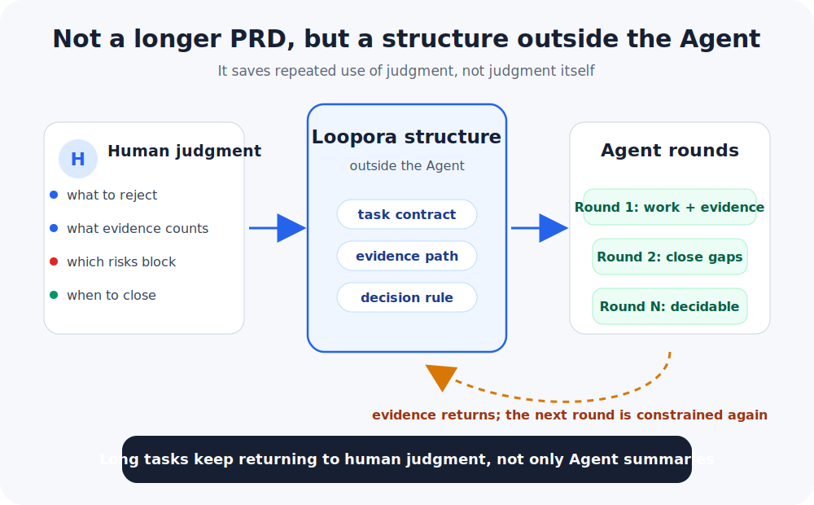
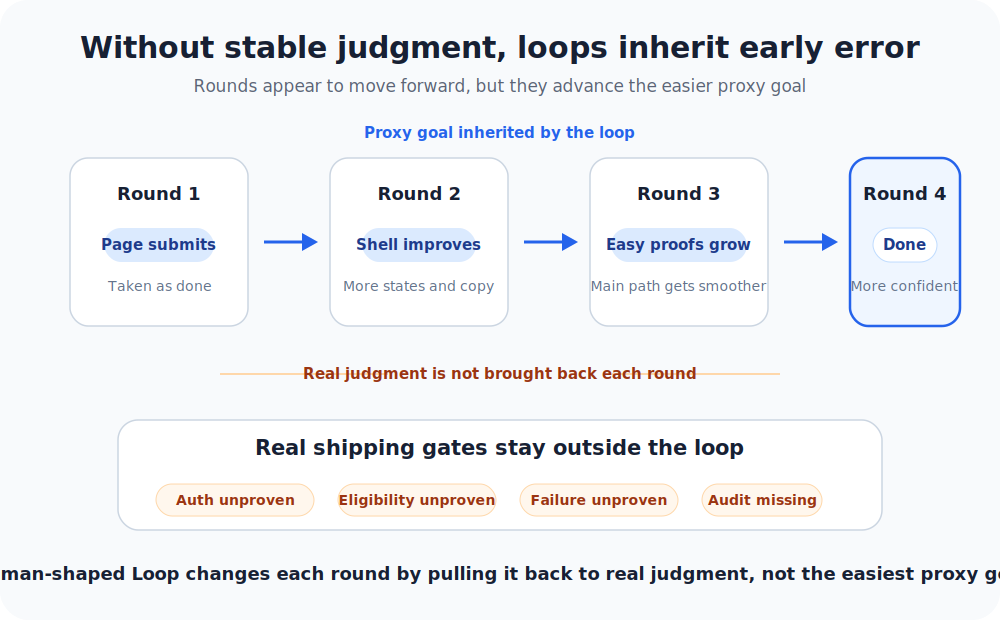
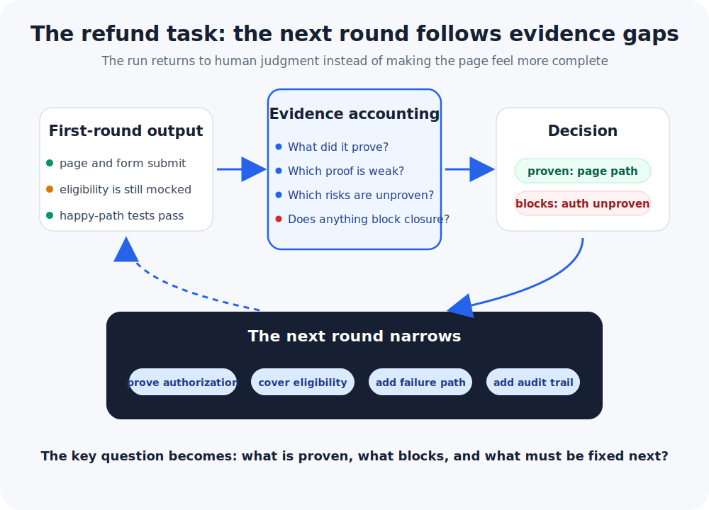
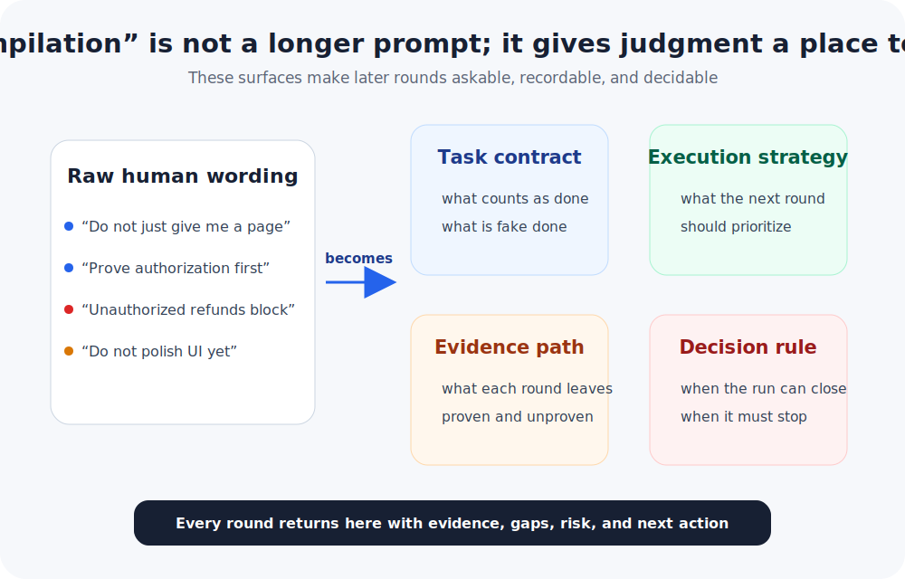

# Human-Shaped Loop: Why Long Agent Tasks Need the Shape of Human Judgment

[简体中文](./HUMAN-SHAPED-LOOP.zh-CN.md) | **English**

This is an engineering blog about Loopora's engineering thinking and collaboration philosophy. For installation and usage, start with the [README](./README.md).

Loopora begins from a plain desire: laziness.

More accurately, it begins from not wanting to sit at a desk, wait for an Agent to finish a round, point out what is wrong, and nudge it to fix the same kind of thing again.

The laziness here is not about avoiding judgment. It is about avoiding the repeated use of the same judgment a dozen times.

Here is the intuitive version: Loopora is not trying to write a longer PRD, and it is not asking the Agent to casually self-reflect for a few more rounds. It puts a long-task running structure outside the Agent: first make clear how this task should be judged, then make later rounds return to that judgment with evidence.

  

## 1. A Task That Looks Perfect For An Agent

Imagine a B2B SaaS company whose support team handles a large number of refund tickets every day.

The team decides to build a self-service refund flow: a customer admin opens the billing page, sees whether an order is eligible, submits a refund request, and gets a clear result. If an order looks risky, the flow hands it off to support.

This looks like a good task for a Coding Agent:

- there is a product surface to build.
- there are business rules to encode.
- there are tests to add.
- there are edge cases to discover.
- there is enough work that one pass may not be enough.

So the user says:

> Build a self-service refund flow: a customer admin can request refunds for eligible orders from the billing page; risky orders go to support. Make it safe, add tests, iterate until it is ready to ship.

Round one looks promising: a page, a form, a status message, a few mocked eligibility rules, and passing happy-path tests.

The Agent says:

> Done! I achieved the goal!

At first glance, the result looks complete. The page is there, the buttons are there, and the flow runs. If this were just a demo, the story might end here.

But if this is meant to ship as a real product, the real problems are only beginning:

- It does not prove that only authorized customer admins can request refunds.
- The eligibility check is mocked, not a reliable business path.
- Happy-path tests pass, but partial refunds, disputed orders, chargebacks, refunds past the window, and closed accounting periods are not covered.
- It does not say what happens when the payment provider fails: how the system records it, what the ledger state is, and how support takes over.
- It does not prove that the audit log is enough for support, finance, or compliance to reconstruct what happened.

Now the human reviewer is not facing an abstract concern. They face a concrete shipping decision: can this go live?

The answer is no.

So the human says:

> Not ready. Prove authorization, eligibility, payment failure, and the audit trail first. Only then polish the UI.

Round two looks more product-like. It adds more page states, more confirmation copy, more mock data, and more happy-path tests.

The trouble is exactly there: the Agent did a lot, but the main risk barely moved. It polished a completion story that could not stand. The danger did not disappear. It hid behind a more product-like interface and a more confident summary.

If the task keeps running in that direction, it may not suddenly go off the rails. Each round may drift a little further in a way that feels reasonable: round one treats "the page submits" as completion, round two polishes the page, round three adds tests around easy paths, round four writes a nicer README and a final summary. The result looks more and more real, while refund safety remains unproven.

The problem exposed by this story is not that the Agent is lazy, or that we did not run enough rounds. At the surface, the missing piece is a correct human judgment at the right moment. Deeper down, that intervention would recur throughout a long task.

Every time the human returns, they are not merely adding requirement detail. They are applying control signals to the system: what to reject, what to trust, what must block, what to change next, and when to close.

## 2. Why PRDs, Fixed Cases, And Plain Loops Are Not Enough

We should take the engineering alternatives seriously.

### A Better PRD Helps, But It Is a Map

If we asked better questions at the start, wrote a strong PRD, then asked the Agent to plan, execute, and self-review, the result would often improve a lot.

Up-front clarity reduces the chance of a bad first pass. A PRD can state goals, constraints, and boundaries. A checklist can remind the Agent not to miss common risks. Tests and benchmarks can turn part of the judgment into hard feedback. Multi-Agent review can add a skeptical angle.

All of those are useful. But they mainly improve the starting input or one class of hard validation. They reduce initial error, but they do not automatically become a correction mechanism during execution.

A PRD or prompt is more like a map at the start of the task. Even a good map does not guarantee the runner will take the right turn at every fork. It also does not guarantee that, after drifting, the system will expose the drift, gather missing evidence, and admit that it cannot close.

Once the refund task enters a multi-round run, every round creates new facts:

- What code and flow did it actually change?
- Which hard parts did it route around?
- Are the new tests proving core risk, or only proving easier paths?
- Did the summary turn "not proven" into "done"?

Those facts only exist after execution, so each round must answer runtime control questions:

- Did this round prove refund safety, or only that the page submits?
- Should provider failure, double refunds, and unauthorized refunds block the run?
- Which gaps can be carried as visible residual risk, and which cannot?
- Should the next round expand, add evidence, narrow scope, fix root cause, or stop?

**This is the difference between static input and runtime control:**

| PRD / prompt | Human-shaped Loop |
| --- | --- |
| Describes goals and constraints known before the task starts | Turns constraints into control structure that keeps acting during the run |
| Reminds the Agent what to care about | Requires each round to answer with evidence |
| Improves first-round quality | Controls multi-round error propagation |
| Can be selectively quoted or locally satisfied | Records gaps, blocking issues, and residual risk |
| Mainly answers "what should be done" | Keeps asking "was it proven, should we turn, can we close" |

### Fixed Cases Help, But They Guard Known Boundaries

In the refund task, some things absolutely should become fixed cases:

- only authorized admins can request refunds.
- refunds past the window are rejected.
- duplicate refunds are rejected.
- provider failure creates a record and a handoff path.

The harder those cases are, the better. Loopora does not replace them.

But fixed cases mainly guard known, stable, enumerable boundaries. Long tasks also have higher-level questions:

- If a case fails, what should the next round fix first?
- If no case covers an issue but evidence is clearly weak, can the run close?
- Are the new tests proving core risk, or routing around the hard part?
- Is a new gap blocking, or visible residual risk?
- When fixed cases are incomplete, how does the system force the Agent to expose what remains unproven?

> Fixed cases guard known boundaries; a human-shaped Loop governs the judgment, evidence, and redirection that keep appearing during a long task.

### Plain Automated Loops Amplify Early Error

There are already many ways to make an Agent run more rounds: call the same Agent again, ask the model to review itself, give it a checklist, run tests, then fix.

These methods work very well when external feedback is clear. Benchmarks, contract tests, schema checks, lint, type checks, and proof harnesses can all give hard feedback. When judgment has already been expressed through those tools, a simple loop is enough.

But the refund flow is harder. Its key judgment does not cleanly fit into one score. Tests matter, but passing happy-path tests does not prove business safety. A nice UI matters, but it can hide the fact that authorization, auditability, provider failure, and support handoff remain unproven.

An unguided loop is like opening blind boxes. It lets the Agent act many times, but it does not steadily answer:

- What counts as truly done?
- What is fake completion?
- Which evidence is strong enough?
- Which risks must block?
- Why should the next round change direction?
- When should the loop stop?

When these questions are not answered steadily, early error is inherited and refined by later rounds until it becomes a more complete and more coherent completion story.

  

This does not mean refund safety cannot be tested. Quite the opposite: the more important the area, the more it should become tests, audit records, simulated failures, support handoff drills, or other evidence.

The point is that part of the judgment is not a single score. It is a structure.

It can be decomposed:

- Ordering: a real refund path matters more than a polished page.
- Blocking rules: unauthorized refunds, double refunds, and missing audit trails cannot pass.
- Evidence demands: authorization, eligibility, provider failure, and support handoff must leave traceable material.
- Residual risk: a rare provider edge can remain, but only if it is visible, named, and owned.

That is what "hard to benchmark, but can be structured" means. It does not abandon proof. It admits that some proof is not a number; it is a set of judgments that constrain later action and final decisions.

## 3. The Same Refund Task, If Given To Loopora

Loopora's core move is to bring recurring future human correction before the run, then turn it into runnable control structure.

Human-shaped Loop is not "humans say more up front." More precisely, it lets human judgment keep acting during the run.

Return to the refund task. If it is given to Loopora, the run shape changes.

  

**Before the run: make recurring future corrections explicit.**

The user should not need to hand-write a large configuration, but the system should help reveal these judgments:

- A submitting page is not completion.
- Authorization, eligibility, provider failure, audit, and support handoff require evidence.
- Unauthorized refunds, double refunds, and missing audit trails must block.
- Rare provider edges may remain as residual risk, but only if visible, named, and owned.

**After the first round: the Agent cannot only say "done."**

Assume the first round still returns a page, a form, mocked eligibility rules, and happy-path tests. In an ordinary flow, the Agent may summarize:

> The page and refund request flow are complete, and tests pass.

Inside Loopora, that answer is not enough. The Agent has to account for evidence against the human judgment already made visible. It cannot swap in an easier set of questions. It has to answer:

- What did this round actually prove?
- Is there evidence for the authorized-admin path?
- Is refund eligibility a real business path, or still mocked rules?
- After provider failure, is there a record, ledger state, and support handoff?
- Can support, finance, or compliance reconstruct what happened from the audit material?

The first round might then be organized like this:

| Verdict surface | First-round reality |
| --- | --- |
| Proven | The page can submit, and happy-path tests pass |
| Weak evidence | Refund eligibility still mainly comes from mocked rules |
| Unproven | Authorized-admin path, provider failure handling, audit trail |
| Blocking risk | If unauthorized refund safety is unproven, the run cannot close |

**If evidence is weak: push the next round back to the gap.**

The next round is not free to continue in any direction, and it should not let the Agent keep polishing UI or adding more confirmation copy. It gets pulled back to harder questions:

- prove authorization first.
- cover refund eligibility boundaries first.
- add the provider failure path first.
- add audit records and human handoff first.

In other words, Loopora makes the Agent's "self-review" less arbitrary. It is not asking "what else could make this feel more complete?" It is asking "did I prove what the human judgment requires; if not, what must the next round repair?"

**At closure: do not promise perfection, but make the decision honest.**

A good result is not necessarily "all risk disappeared." It should clearly separate:

- Proven: which paths, boundaries, and failure cases have evidence.
- Unproven: which cases remain uncovered.
- Blocking: which findings prevent closure if present.
- Residual risk: which gaps can move forward, but only visibly, with an owner and follow-up path.

That is Loopora's character. It does not promise the automated artifact is absolutely correct. It changes how error is handled. Error should surface earlier and be harder to package as completion; if risk must be carried forward, it should be named, visible, and decided on.

## 4. After "Compilation," Where Does Judgment Live?

Loopora often uses the word "compile," but it cannot be only a nice metaphor.

Compilation is not translating human judgment into a longer prompt. It puts judgment into running surfaces so it keeps acting during the task.

  

| Human wording | Running surface | How it acts during the run |
| --- | --- | --- |
| "Do not just give me a clickable page" | Task contract | A clickable page is not completion; the real refund path must run |
| "Prove authorization and eligibility first" | Evidence path | Each round must say whether authorization, eligibility, and boundaries have evidence |
| "Unauthorized refunds are not acceptable" | Decision rule | Unauthorized refunds, double refunds, and missing audit trails block closure |
| "Do not polish UI yet" | Execution posture | The next round prioritizes evidence and root cause, not polish |
| "Some tails can remain" | Residual risk | Gaps can move forward only if explicit, visible, and owned |

In plain terms, judgment lives in four user-understandable running surfaces:

- **Task contract**: what counts as done, what is fake done, what must block.
- **Execution posture**: whether the next round should build, gather evidence, repair, or narrow.
- **Evidence path**: what each round must leave behind, what was proven, and what remains unproven.
- **Decision rule**: when the run can close, and when it must stop or continue with residual risk.

A prompt can remind the model. Loopora tries to turn the reminder into something the run can ask about, record, and decide from.

## 5. When Does Loopora Fit?

Loopora is not for every complex task. Complexity is not the reason. Repeated judgment is.

Ask in this order:

| Gate | If the answer leans yes | If the answer leans no |
| --- | --- | --- |
| Is one Agent pass plus one human review enough? | Skip Loopora; direct work is cheaper | Continue |
| Will later rounds create new evidence? | Continue | Do not open a Loop; it will only create longer narrative |
| Can the judgment be stably benchmarked? | Prefer benchmark or proof harness | Continue |
| Is fake completion likely? | Loopora is more valuable | Direct Agent work or a simple loop may be enough |
| Should this judgment survive one chat? | It may deserve a Loop | Direct chat is enough |

More concrete examples:

- **Usually skip**: generate 30 campaign ideas, fix a button crash with a clear stack trace, split a small helper with clear boundaries.
- **Better fit**: self-service refunds, billing permission refactors, intermittent cross-service payment callback loss, brand exploration that must avoid stale patterns across rounds.
- **Key difference**: not whether the task sounds complex, but whether humans would repeatedly return after key rounds to judge evidence, risk, direction, and closure.

## 6. Can Stronger Models Solve Judgment?

The model should learn general capability: language, coding, planning, tool use, reasoning patterns, and broad taste. Those abilities should transfer across users and tasks.

But judgment inside one task is often local, temporary, and debatable:

- this refund flow should be conservative; not every product task should be.
- this prototype can accept rough visuals; not every prototype can.
- this benchmark is trusted here; another benchmark may mislead.
- this residual risk is acceptable now; the same risk may block elsewhere.

These judgments should be explicit, previewable, editable, exportable, and disposable. They belong in the Loop layer outside the Agent, not silently in model weights or long-term memory.

> The model learns general capability. The Loop learns how this task should be judged.

## 7. The Philosophy: Laziness Comes From Trusted Autonomy

Future AI collaboration will not advance only by making models smarter.

Models will improve, but complex work will still need human judgment: what is worth doing, what counts as truly done, whether evidence can be trusted, which risks are acceptable, and when to continue, stop, or turn.

Higher-order collaboration is not pulling humans back at every step, and it is not pretending humans can disappear. It is letting human judgment participate in a better time shape.

Human-in-the-loop puts humans inside execution.

Human-shaped Loop turns human judgment into prior execution structure.

Loopora is not trying to increase the Agent's freedom. It is trying to increase trusted autonomy. Autonomy does not mean running without constraint. It means continuing inside the shape of human judgment.

When judgment, evidence, redirection, and closure have been externalized, humans can truly come back less often. That is Loopora's version of laziness: not sacrificing quality to save effort, but raising trusted autonomy so the same judgment does not have to be repeated by hand.

That is human-shaped Loop.

To install and run Loopora, return to the [README](./README.md). The README explains how to use it; this article explains why this layer exists.
