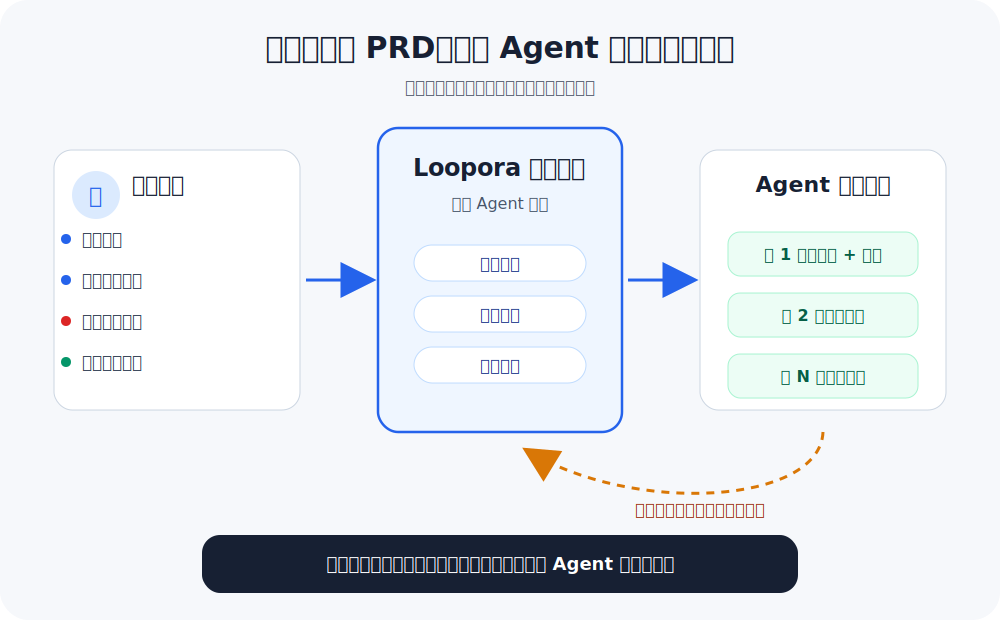
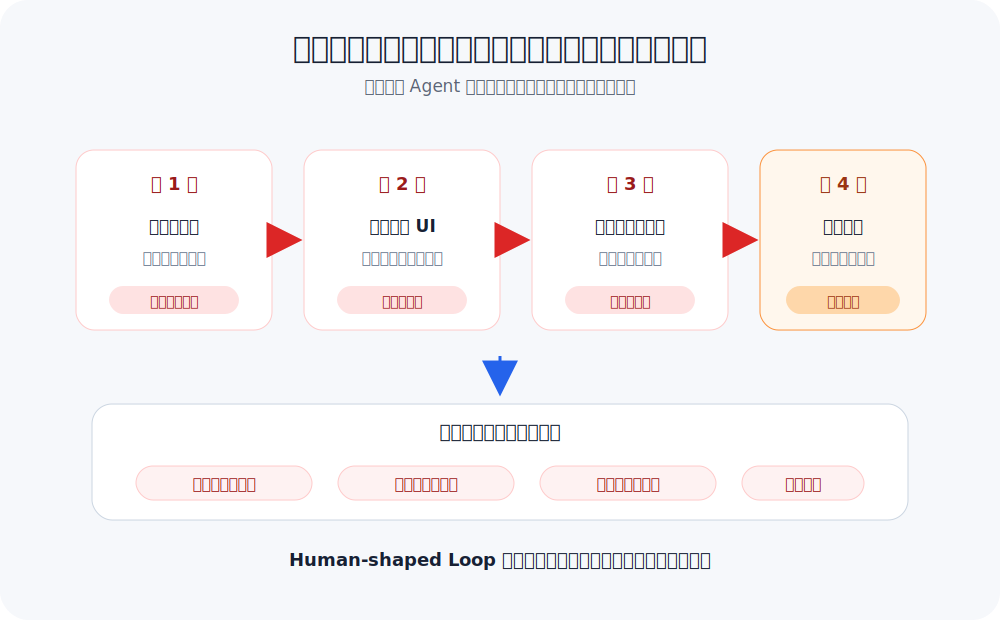
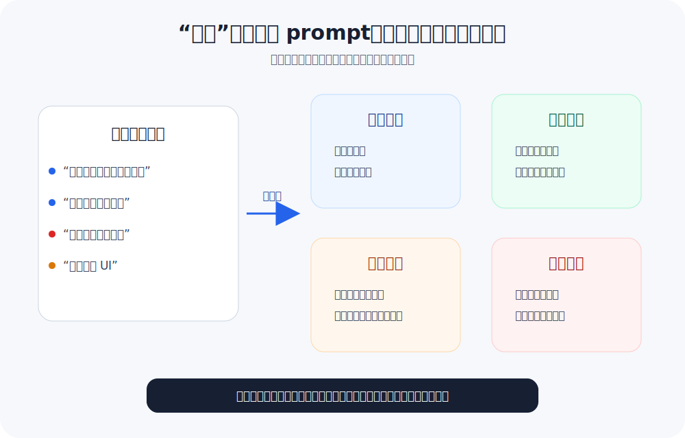
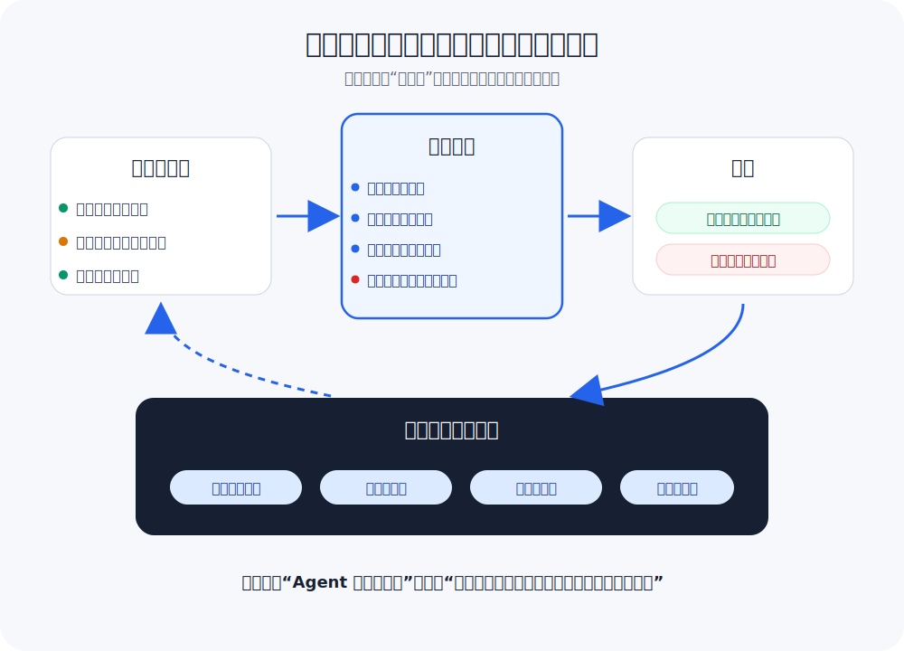

# Human-Shaped Loop：给 Agent 长任务注入人的判断力

**简体中文** | [English](./HUMAN-SHAPED-LOOP.md)

本文阐述 Loopora 背后的工程思考与协作理念。想安装、运行和使用 Loopora，请参见 [README](./README.zh-CN.md)。

---

Loopora 的出发点很朴素：偷懒。

不想一直守在电脑前，等 Agent 跑完一轮，再指出哪里不对、催它去改。

想要省下的不是判断本身，而是每轮都要重复说的那些话：
- "这还只是 demo，后台也要完整"
- "权限和审计到底补了没有"
- "测试都在主路径上，边界呢"
- "别美化 UI 了，先补失败路径"

这些话在不同任务里内容不同，但形态一样：把 Agent 从"看起来完成"拉回"真正交付"。同一类判断，一轮一轮被重复说出。

为什么？因为判断标准散落在每轮的提醒里，流失在轮次之间。Agent 看不到稳定的标准，产出就会漂移——误差传播，伪完成积累。这让长期任务像是开盲盒，付出了成倍的Token却可能一无所获。

能不能把判断整理成结构，让后续轮次自动继承？从而更稳，更健康地去运行长期任务。

这就是 Human-shaped Loop。

  

## 1. 一个看起来很适合 Agent 的任务

假如有一家 B2B SaaS 公司，客服团队每天处理大量退款工单。团队决定做一个退款自助流程：客户管理员打开账单页，看到某笔订单符合退款条件，即可提交退款请求并得到明确结果。若订单存在风险，流程就转交客服处理。

这个任务看起来很适合交给 Coding Agent：有界面要做、有业务规则要编码、有测试要补、有边界情况要发现，工作量也足够大，一轮很可能不够。

于是用户提出需求：

> 做一个退款自助流程：客户管理员可以在账单页申请符合条件的订单退款；有风险的订单转交客服。做得安全一点，补上测试，迭代到可以作为正式功能交付为止。

第一轮结果看起来不错：页面、表单、状态提示都有了，退款资格判断用了几组模拟规则，主路径测试也都通过了。Agent 回复："退款流程已经完全开发完毕，达成了所有目标。"

如果只是做个 demo 展示流程，故事到此结束。但如果要作为正式产品上线，开发者现在面对的是一个具体的抉择：这个功能能不能交付？

答案是还不能。因为：
- 它没有证明只有授权客户管理员可以发起退款。
- 退款资格判断用的是模拟规则，不是真正的业务路径。
- 主路径测试通过了，但部分退款、争议订单、拒付、超出退款窗口、财务关账等情形没有被覆盖。
- 支付服务商执行失败时，系统如何记录、账务状态如何变化、客服如何接管，都不清楚。
- 审计日志是否足以让客服、财务或合规在事后还原全过程，也没有证据。

开发者让 Agent 继续补。Agent 跑完第二轮，结果看起来更像正式产品：页面状态更多、确认流程更完整、边界规则也补了一些，总结里还出现了"权限""资格""审计"这些词。

这当然是进展。但问题又来了：这一轮到底证明了什么？哪些风险真的被解决了，哪些只是被提到了？下一轮应该补哪里？

Agent 容易补了 A 丢了 B，或者滑向更容易汇报的工作——把权限写进文案、继续用模拟规则、补更多主路径测试，然后说"安全性已加强"。它没有完全跑偏，但核心风险被更像产品的界面和更圆满的总结盖住了。

所以问题不是 Agent 不够勤奋。问题是：正确的判断要靠人一轮一轮手动施加，任务才能被不断拉回主航道。

## 2. 人反复做的事，其实只有几类

上一节的问题可以换个角度理解：长期 Agent 任务天然是一个循环——执行、汇报、判断、转向、再执行。

在普通对话里，这个循环的形状主要来自 Agent 当下的理解、聊天记忆和刚刚做过的事。判断标准没有固定位置，而是散落在每轮的提醒和纠偏里。人每次介入，其实是在临时改变循环的形状：拒绝什么、信任什么、拦截什么、下一步改什么、何时收尾。

把这些散落的动作抽象出来，人反复做的其实只有几类：

| 人反复做的事 | 稳定含义 | 工程里通常会变成 |
| --- | --- | --- |
| 说明"不算完成" | 这看起来完成，但不满足交付标准。 | 完成标准、反例、验收说明 |
| 判断"证据够不够" | 这类材料可信，那类只是自述。 | 测试结果、日志、审计记录、可追溯产物 |
| 要求"先补这里" | 下一轮不要继续铺开，先补关键缺口。 | 优先级、下一步计划、交接清单 |
| 设下"不能放行" | 某个风险存在时不能包装成完成。 | 上线门禁、回滚条件、阻断问题 |
| 决定"能否收尾" | 哪些已证明，哪些是显式残余风险。 | 验收记录、残余风险清单、后续负责人 |

这五类动作在不同任务里具体内容不同，但抽象形态一样：把 Agent 从"看起来完成"拉回"真正交付"。

既然形态稳定，关键问题就来了：这些动作能不能在任务开始前就提取出来，变成后续轮次会自动继承的结构？

这就是 Human-shaped Loop 的核心理念。

## 3. Human-shaped Loop 是什么

**Human-shaped Loop 把人的判断提前塑造成后续循环的执行结构。**

这个结构会决定：
- 什么结果会被接受
- 什么证据是充分的
- 什么风险必须拦截
- 下一轮怎么转向
- 任务如何正确收尾

它不是在开头写更多要求——那是更长的 PRD。它不是让模型多反省几轮——那是更强的自我检查。它也不是替人类做判断——那会脱离人的控制。

它要解决的是另一件事：让人的判断变成后续工作绕不开的材料，而不是每次都要人重新说一遍。

所以，Human-shaped Loop 关注的不是"模型会不会更努力"，而是"人的判断能否被预览、执行、取证、追溯和裁决"。

## 4. 为什么 PRD、测试和普通循环还不够

上一节自然会引出一个疑问：如果在任务开始前把 PRD 写得更细、测试设计得更全，Agent 不就能照着执行了吗？

当然应该这样做。前期澄清、详细的 PRD、完整的测试计划，都能显著改善第一轮的质量。

但它们改善的是开场质量，不是执行过程中的判断回调。

真实工程团队也不会因为设计文档写得很细，就取消代码评审、测试、上线门禁、监控和复盘。设计文档阐明意图，执行产生新事实。一旦进入多轮执行，每一轮都会产生新问题：
- 它实际改了哪些代码和流程？
- 它绕过了哪些难点？
- 它新增的测试是在证明核心风险，还是只证明更容易通过的路径？
- 它的总结是否把"尚未证明"写成了"已经完成"？

这些问题只有在执行后才会出现，无法在设计阶段穷尽。因此每一轮都必须回答：这一轮证明了什么？哪些缺口会阻断收尾？下一轮该扩展、补充证据、收窄、修复根因，还是停止？

PRD 和 prompt 回答的是"要做什么"。Human-shaped Loop 回答的是"是否已证明、是否该转向、能否收尾"。这是两个不同层面的问题。

| PRD / prompt | Human-shaped Loop |
| --- | --- |
| 描述任务开始前已知的目标与约束 | 将判断转化为执行中持续生效的控制结构 |
| 提醒 Agent 应注意哪些事项 | 要求每轮以证据回应这些事项 |
| 改善第一轮质量 | 控制多轮之间的误差传播 |
| 可能被选择性引用或局部满足 | 记录缺口、阻断问题与残余风险 |

能写成测试、类型检查、lint、证明脚本的判断，当然应该优先写。这些是硬证据，能自动裁决。但有些判断无法压缩成一个分数——优先级顺序、阻断条件、证据要求、残余风险策略。这些判断需要变成结构，约束后续行动和最终评估。

  

## 5. 为什么不是固定团队模板

还有一种思路：把人类团队的分工固化成 Agent 工作流——产品经理先分析需求，架构师做设计，工程师实现，QA 审查，最后由审核者签字。

这种方式有价值。当任务类型稳定、失败模式稳定、交付物也稳定时，固定流程能减少混乱，让 Agent 更有纪律。

但它解决的是另一层问题。固定团队模板回答的是：
> 谁先做，谁后做，谁审查谁？

Human-shaped Loop 回答的是：
> 这次任务里，什么不算完成？什么证据可信？什么风险必须阻断？下一轮被哪个缺口牵引？什么时候可以诚实收尾？

这两个问题不能互相替代。"QA" 如果只是通用角色名，它可能检查页面是否可用、测试是否通过、文案是否完整，却仍然没有证明授权路径、退款资格、支付失败和审计链路。数据迁移任务里的 QA 又完全不同——它更应该卡幂等性、回滚、数据对账和灰度边界。

同样叫审核者、测试者或产品经理，真正有价值的判断会随任务改变。固定模板只能提供通用分工，不能自动知道这次任务最怕哪种伪完成。

因此，Loopora 需要动态生成 Loop 结构。"动态"不是运行时随意改规则，而是在运行前根据当前任务生成一份可审查的 Loop，人确认后保持稳定执行。

这也是为什么 Loopora 不应退化成角色堆叠。多几个角色不会天然更稳；只有当新增角色承担了新的证据责任、交接边界或裁决输入时，它才有意义。否则只是更像团队的叙事，不是更可信的判断。

一句话概括：
> 固定团队模板模仿的是分工；Loopora 动态生成的是判断。前者回答"谁来做"，后者回答"这一轮凭什么算做对"。

## 6. 在 Loopora 中落地

把 Human-shaped Loop 落到 Loopora，首先表现为三个读者可直接感知的维度：

- **运行前可审查**：用户能看懂这套 Loop 会拒绝什么、信任什么、优先补什么、何时阻断、怎样收尾。
- **执行中可继承**：后续每一轮都拿到同一套判断、行动边界、证据缺口和输出要求。
- **收尾时可复盘**：结果能回答哪些已证明、哪些只是弱证据、哪些仍未证明、哪些问题阻断收尾、哪些风险可以明确保留。

判断不能只停在一段总结里，它必须变成后续工作会反复遇到的材料。

  

以退款任务为例。运行开始前，Loopora 把判断整理成可运行结构：
- 页面提交不是完成
- 权限、资格、支付失败、审计、客服接管必须有证据
- 越权退款、重复退款、审计缺失必须拦截
- 罕见支付服务商边界可作为残余风险，但必须可见、命名、有人接管

Agent 跑完第一轮，不能只汇报"我做完了"。它必须回到已明确的判断标准：
- 本轮证明了什么？
- 授权管理员路径有证据吗？
- 退款资格边界是真业务路径还是模拟规则？
- 支付失败后有记录、账务状态和客服接管吗？
- 审计材料能让客服、财务或合规事后还原吗？

结果被整理成证据桶：

| 证据桶 | 本轮实际情况 |
| --- | --- |
| 已证明 | 页面可提交，主路径测试通过 |
| 弱证据 | 退款资格仍主要来自模拟规则 |
| 未证明 | 授权管理员路径、支付失败处理、审计链路 |
| 阻断风险 | 越权退款路径没有证明安全时，不能收尾 |

证据桶和控制信号是一体两面：控制信号是人会反复做的判断动作，证据桶是这些动作落在每轮结果上的分类。人"判断证据够不够"，结果就被分到"已证明"或"弱证据"；人"设下不能放行"，结果就出现"阻断风险"。

  

证据不足时，下一轮不会自由发挥，而是被拉回关键缺口：先补权限证明、退款资格边界、支付失败路径、审计记录和人工接管。

收尾时不追求零风险，而是清楚区分：哪些已证明、哪些场景未覆盖、哪些问题阻断收尾、哪些风险可随行但必须可见且有人负责。

## 7. 这给系统提出了什么要求

Human-shaped Loop 不只是这篇文档的名字，而是 Loopora 必须满足的最低条件。

读者不需要先理解 Loopora 的内部名词，才知道一次 Loop 是否适合、是否可运行、是否已经被证据证明。

这些条件必须在产品体验中可见，否则 Human-shaped Loop 就只是漂亮说法：

- **Loop 不是任务摘要**：候选 Loop 不能只是任务摘要，必须携带本次任务的判断边界，包括完成标准、伪完成模式、证据要求、阻断风险和残余风险策略。
- **结构不是角色堆叠**：Loop 里的角色和流程必须承载本次任务的证据责任、交接边界和裁决输入，而不是套用通用分工。
- **判断不足时追问**：关键判断缺失时，系统应追问、审查或拒绝进入可运行状态，而不是替用户编造。
- **执行时继承判断**：运行开始后，每一步都应继承这些判断、行动边界和证据缺口。
- **每轮回到证据**：结果必须回到证据、覆盖情况、交接材料和缺口，而不是只保留一段总结。
- **通过依赖证据**：最终通过必须有支持证据；必需证据缺失时，任务不能被包装成通过。
- **系统与任务分开**：系统生命周期和任务语义必须分开——系统可以跑完，任务仍可能未被证明。

这也是 Loopora 与普通提示词的分界：提示词提醒模型，Loopora 把提醒变成执行过程中可追问、可记录、可裁决的东西。

## 8. 什么任务适合 Loopora

Loopora 不适合所有复杂任务。任务复杂与否不是决定因素，真正决定因素是：这套判断是否需要反复执行。

工程流程有成本。修改按钮文案不需要设计评审、灰度门禁和复盘；修复堆栈清晰的小 bug 通常也不需要。重流程套在轻任务上只会拖慢工作。

但退款、账单权限、支付回调、数据迁移这类任务不一样。风险会跨轮次积累，证据需要保留，完成不能只靠实现者自己说。设计要讲清风险，测试要证明关键边界，上线前要有人裁决，失败路径要可追踪。

判断顺序如下：

| 门槛 | 如果倾向"是" | 如果倾向"否" |
| --- | --- | --- |
| 一次 Agent 执行加一次人工审阅够不够？ | 无需 Loopora，直接做更划算 | 继续判断 |
| 后续轮次会不会产生新证据？ | 继续判断 | 无需 Loop，只会拉长叙事 |
| 判断能不能稳定变成自动检查？ | 优先上测试、基准评测或证明脚本 | 继续判断 |
| 有没有伪完成风险？ | Loopora 更值得 | 简单循环或直接 Agent 也许就够了 |
| 这套判断是否需要超出单次对话？ | 值得编译成 Loop | 直接聊就行 |

具体例子：
- **通常不需要**：生成 30 个活动主题、修堆栈清晰的按钮报错、拆边界明确的小函数
- **更适合**：退款自助流程、账单权限重构、跨服务支付回调丢失、需多轮探索但要避免套路化的品牌活动

关键差别不是任务听起来复杂，而是人类是否会在关键轮次后反复回来判断证据、风险、方向和收尾。

## 9. 更强的模型与可信自治

模型越强，很多事情自然会变简单——像更资深的工程师，能提前发现更多风险，写出更好的第一版方案。

但没人因为工程师资深就取消代码评审、测试、上线门禁、审计记录和事故复盘。这与是否信任个人能力无关。交付判断不只存在于个人能力之中：哪些风险可接受、哪些证据算充分、何时能带着残余风险上线——这些取决于具体任务、团队承诺和业务环境，必须亮出来供讨论和修改。

判断力因此无法一次性写进模型或全局记忆。它总是绑定在这次任务、这组风险、这个团队承诺和这批证据上。

一次任务中的判断是局部的、临时的、可争议的：
- 这次退款流程必须保守，不代表所有任务都保守
- 这个原型视觉粗糙可接受，不代表所有原型都这样
- 这次基准评测可信，不代表所有基准评测都可信
- 这次接受某个残余风险，不代表以后都接受

这些判断需要可见、可预览、可修改、可导出、可废弃。放在 Agent 外部的 Loop 层，比写进模型权重或长期记忆更合适。

> 模型学习通用能力，Loop 学习当前任务的判断方式。

Loopora 想提升的不是 Agent 的自由度，而是可信自治的程度。自治不等于无约束运行，而是在人类判断的结构中持续运行。

因此自治必须有边界。Loopora 不替 Agent 获取新权限，不绕过宿主工具的安全模型，也不把"任务通过"包装成人类最终批准。它只是把行动权限、证据缺口、阻断项和残余风险亮出来，让人少盯日常循环，但在关键判断处更清楚地介入。

判断、证据、转向、收尾都被外化后，人类才能真正减少介入次数。Loopora 意义上的偷懒，不是牺牲质量省事，而是提升可信自治度，让同一类判断不必被反复执行。

---

Human-in-the-loop 把人嵌入执行过程。

Human-shaped Loop 把人的判断提前塑造成执行结构。

这就是 Human-shaped Loop。

如需安装和运行 Loopora，请回到 [README](./README.zh-CN.md)。
