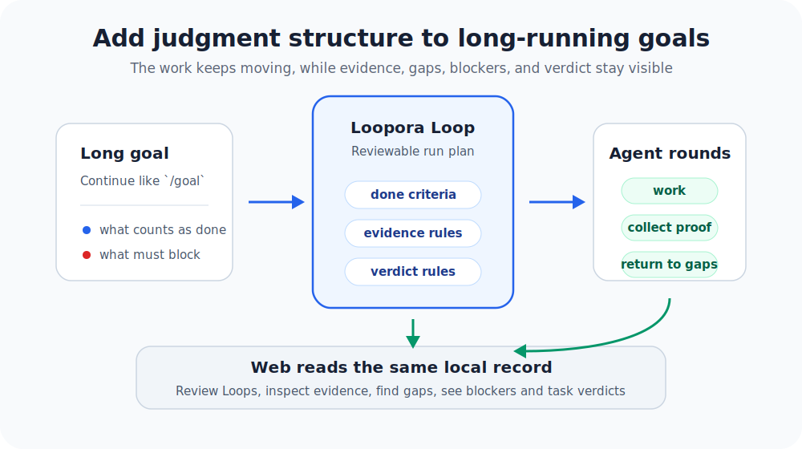
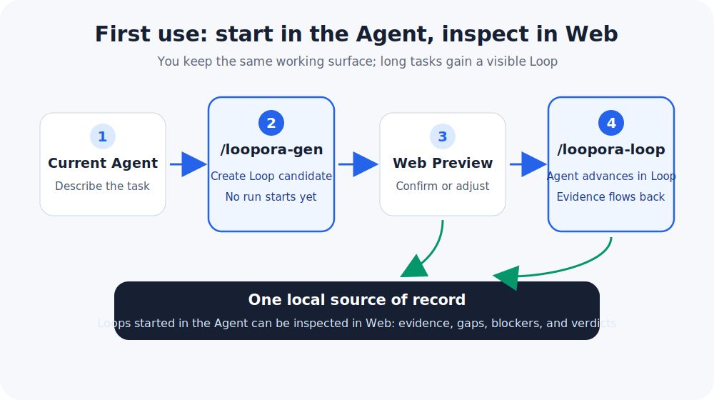
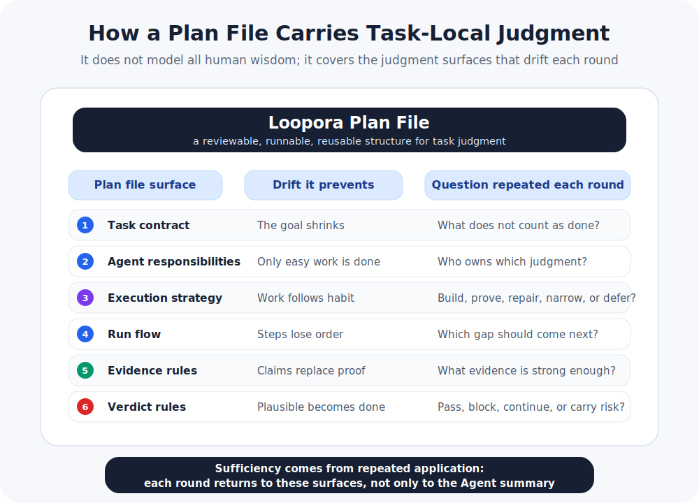

[简体中文](./README.zh-CN.md) | **English**

<p align="center">
  
</p>

<p align="center">
  <a href="https://www.python.org/">
    
  </a>
  <a href="https://fastapi.tiangolo.com/">
    
  </a>
  
  
  
</p>

# Loopora

**Turn a one-off Agent request into a long-running Loop with a plan, evidence, and a verdict.**

Loopora is a local runtime layer for long AI Agent tasks. It turns your task goal, judgment criteria, evidence requirements, and stopping conditions into a reviewable plan file, then lets the Agent advance through multiple rounds while the Web UI shows evidence, gaps, blockers, and the final verdict.

This README explains installation and usage. For the deeper argument behind this layer, read [Human-Shaped Loop](./HUMAN-SHAPED-LOOP.md).

<p align="center">
  
</p>

## What Does It Do?

Loopora is not a new chat UI, and it is not a prompt pack. It adds an engineering runtime surface to long Agent tasks:

| Capability | What it means |
| --- | --- |
| Externalize judgment | Capture what does not count as done, what evidence is trusted, and which risks must block. |
| Generate a plan | Produce a reviewable candidate Loop before the Agent starts running. |
| Advance across rounds | Keep the Agent tied to the plan; when evidence is weak, return to the gap. |
| Reconcile evidence | Show what is proven, weak, unproven, blocked, and residual. |
| Stay local | Keep task plans, run records, and evidence in your local environment. |

## When Should You Use It?

Loopora is not for every task. It is for work where one Agent response can look plausible, but you worry about fake completion, weak evidence, or judgment drift across rounds.

| Situation | Recommendation |
| --- | --- |
| One Agent pass + one human review is enough | Skip Loopora; direct Agent work is cheaper. |
| A stable test, benchmark, or proof harness can judge the task | Use that hard feedback first. |
| The task will take multiple rounds and each round creates new evidence | Loopora starts to help. |
| The result may look done while core risk remains unproven | Loopora is a strong fit. |
| The judgment should be retained, reviewed, reused, or managed in Web | Loopora is a strong fit. |

Typical examples: self-service refunds, billing permission refactors, cross-service payment callback issues, complex migrations, and product tasks that need exploration without losing judgment standards.

## Install

For now, install from source. You need:

- Python 3.11+
- `uv`
- at least one Coding Agent: Codex, Claude Code, or OpenCode

From the Loopora repository root:

```bash
uv tool install --editable .
```

If uv says the tool directory is not on `PATH`, run:

```bash
uv tool update-shell
```

Then restart your shell.

## Recommended Path: Slash Commands Inside Your Agent

Loopora's default entry point is the Coding Agent you already use. With Codex, switch to the project where the Agent will work, then install the Loopora project entry:

```bash
cd /path/to/your/project
loopora init codex
```

Claude Code and OpenCode can be connected too:

```bash
loopora init claude
loopora init opencode
```

Then return to your Agent and use two entries for the current task:

```text
/loopora-gen
/loopora-loop
```

<p align="center">
  
</p>

They have different jobs:

| Entry | What happens |
| --- | --- |
| `/loopora-gen` | Talks with you, clarifies task judgment, and generates a reviewable candidate Loop. It does not start the run. |
| `/loopora-loop` | Starts or resumes the long-running task with the reviewed Loop, so the Agent advances through evidence. |

For a first run, invoke `/loopora-gen` inside your Agent and describe the task plus the judgment that matters:

```text
I need to build a refund request admin:
- a clickable page is not enough
- admin authorization and refund eligibility must be proven
- payment failures must be traceable and handoff-ready
- the audit trail must reconstruct a refund
```

Loopora asks follow-up questions that affect the running structure, turns your judgment into a candidate plan, and returns a local Web URL for review. After you review or adjust it, run `/loopora-loop`; the current Agent enters the multi-round task under that Loop.

## What Does `/loopora-gen` Produce?

`/loopora-gen` does not start execution immediately. Its job is to create a reviewable task plan. For first-use readers, think of that plan as the portable form of the Loop.
In the Agent-first path, the candidate plan must do more than pass YAML shape checks: high-signal task objects, risks, and evidence expectations from the current session must appear in the runnable task contract, role responsibilities, and workflow. A short task summary alone is not judgment externalization.

The plan usually contains:

| Artifact | Purpose |
| --- | --- |
| Task contract | Captures goal, done criteria, fake-done patterns, and blocking risks. |
| Agent responsibilities | States what each round should focus on, avoid, and hand off. |
| Run flow | States what happens first, when to inspect, and where to return when evidence is weak. |
| Evidence rules | Separates strong proof from self-report or weak evidence. |
| Verdict rules | Decides when to pass, block, continue, or carry explicit residual risk. |
| Web preview | Lets you review, confirm, or adjust the plan before running. |

<p align="center">
  
</p>

The plan is not trying to encode all human judgment. It encodes the part of judgment that repeatedly affects this long-running task: what counts as done, what must be rejected, what evidence is strong enough, which gap comes next, and when the task can close.

## How Does `/loopora-loop` Run?

`/loopora-loop` starts or resumes a long-running task managed by Loopora. The Agent remains the main execution subject: it reads code, edits files, runs checks, and explains results. Loopora keeps each round tied back to the plan, evidence, and verdict rules.

A run roughly progresses like this:

1. Loopora finds the reviewed candidate Loop.
2. The Agent works from the current round's goal and boundaries.
3. The Agent returns work output, checks, explanations, and evidence references.
4. Loopora reconciles what was proven, what is weak evidence, and what remains unproven.
5. Blocking risk cannot be packaged as completion.
6. Weak evidence pulls the next round back to a concrete gap.
7. When the task can close, Loopora produces a reviewable task verdict and residual-risk summary.

That is the difference between Loopora and an ordinary prompt: a prompt mainly shapes the next answer; Loopora keeps the same judgment active across multiple rounds.

## What Can Web Do?

The Web UI is the fuller observation and management surface. You can start a Loop from inside the Agent, then open Web whenever you want to inspect or manage it.

Start the local Web service manually:

```bash
loopora serve --host 127.0.0.1 --port 8742
```

Open [http://127.0.0.1:8742](http://127.0.0.1:8742).

Web is useful for:

| Scenario | What you can see or do |
| --- | --- |
| Review a candidate Loop | Inspect task contract, Agent responsibilities, run flow, evidence rules, and verdict rules. |
| Observe a run | See where the Loop is and what happened in the latest round. |
| Inspect evidence | Separate proven work, weak evidence, unproven gaps, blockers, and residual risk. |
| Manage entries | Install or update Codex, Claude Code, and OpenCode project entries. |
| Adjust plans | Edit a candidate plan when needed, or create a Loop directly from Web. |

The Agent entry and Web entry are not separate worlds. Even if a Loop starts inside your Agent, it is recorded in the same local system and can be viewed and managed in Web.

## Technical Shape

Loopora is a local-first Python project with a FastAPI Web UI. It currently supports project-level entries for Codex, Claude Code, and OpenCode.

The stable mental model is:

```text
your task judgment -> candidate Loop plan -> Agent rounds -> evidence reconciliation -> task verdict
```

Loopora does not replace the everyday capabilities of your Coding Agent. The Agent still reads code, writes code, and runs tools; Loopora keeps the long task returning to the same plan, evidence, and verdict structure.

## Next Steps

- To start quickly, follow the install and `/loopora-gen` / `/loopora-loop` path above.
- To understand why this layer exists, read [Human-Shaped Loop](./HUMAN-SHAPED-LOOP.md).
- To explore Web first, run `loopora serve --host 127.0.0.1 --port 8742`.
