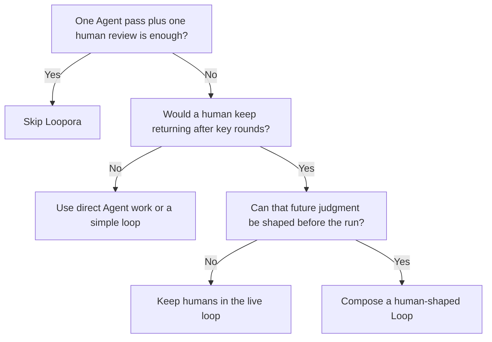
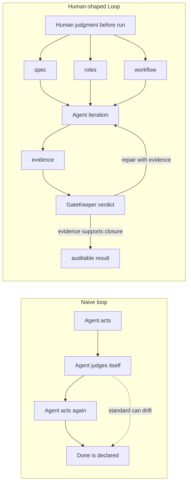
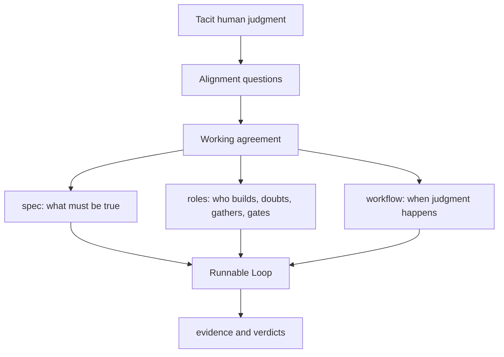
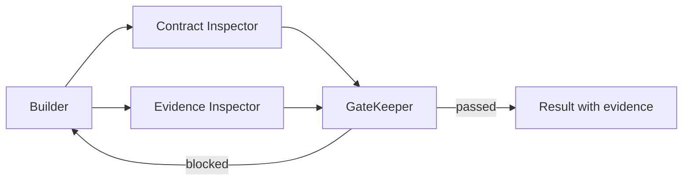
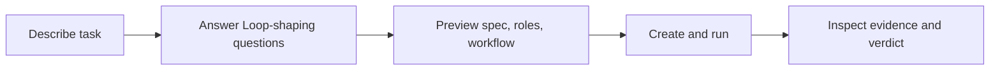

[简体中文](./README.zh-CN.md) | **English**

<p align="center">
  
</p>

<p align="center">
  <a href="https://www.python.org/">
    
  </a>
  <a href="https://fastapi.tiangolo.com/">
    
  </a>
  
  
</p>

New to Loopora? Start with the philosophy: [Human-Shaped Loop](./docs/human-shaped-loop.md).

Loopora is a local-first platform for composing **human-shaped Loops** for long-running AI Agent tasks.

Its core question is simple:

> Can the judgment a human would repeat later be shaped before the loop starts?

If yes, Loopora turns that judgment into a runnable Loop: a task contract, role responsibilities, workflow gates, evidence flow, and a verdict surface that an Agent can iterate inside.

## Do You Need Loopora At All?

Start with the negative question:

> Would one strong Agent pass plus one human review be enough?

If yes, do not use Loopora. Direct Agent work is cheaper.

Loopora is for the moment when "ask the Agent again" stops being the right abstraction. The missing piece is no longer effort. It is the repeated human judgment that decides whether each round is real progress, fake progress, acceptable risk, or a reason to redirect.



## What Are We Trying To Save?

Loopora does not try to save human judgment itself.

It tries to save the repeated moments where humans are pulled back into a long task to ask the same kinds of questions:

- Did this round prove the right thing?
- Is the result truly done, or only locally plausible?
- Did the Agent silently lower the acceptance standard?
- Which evidence should be trusted?
- Which risk is acceptable, and which risk must block?
- Should the next round build, inspect, repair, narrow scope, or stop?

When those questions repeat, the bottleneck is no longer generation. The bottleneck is repeatedly applying human judgment.

Loopora moves that judgment earlier:

> human-in-the-loop -> human-shaped loop

Humans do not disappear. They move from live per-round correction to Loop design and evidence audit.

## Why Is A Simple Loop Not Enough?

Simple loops extend time. They can be excellent when the task has hard external validation: benchmarks, contract tests, schema checks, lint, type checks, or a proof harness.

But without governance, a loop is a blind box. Early error can be inherited, amplified, and rationalized by later rounds. The result may become more complete, more coherent, and still wrong.

Loopora's goal is not "more rounds." Its goal is slower error accumulation.

> A loop without governance is a blind box. A governed Loop is an error decelerator.



## What Does Loopora Compile?

Loopora's user-facing object is a **Loop**.

A Loop is not a longer prompt. It is the runnable shape of how this task should be judged.

| Surface | Job |
| --- | --- |
| `spec` | Defines scope, success, fake done, guardrails, evidence preference, and residual risk |
| `roles` | Defines how each AI Agent role should build, inspect, gate, or redirect for this task |
| `workflow` | Defines order, handoff, evidence routing, automatic iteration, controls, and stop conditions |
| `evidence` | Records what each run changed, checked, proved, failed to prove, and decided |

Internally, Loopora can store or exchange a Loop as a YAML **bundle**. Users do not need to start there. The Web UI helps you describe the task, answer Loop-shaping questions, preview the governance surfaces, and create a run only after the candidate Loop validates.



## Why Not Let The Model Learn This?

The model should learn general capability: coding, reasoning, tool use, planning, language, and broad patterns.

But task judgment is often local, temporary, and debatable:

- this task should be strict; another task should explore
- this benchmark is trusted here; another benchmark may be misleading
- this residual risk is acceptable now; the same risk may block in another context
- this project should preserve public contracts; another prototype may optimize speed

Those judgments should be explicit, previewable, editable, exportable, and disposable. They belong in the Agent harness or Loop layer, not silently in model weights.

> The model learns general capability. The Loop learns how this task should be judged.

## What Changes In A Real Task?

Suppose you say:

> Build an English learning website.

A normal Agent may produce polished pages: a landing page, vocabulary cards, exercises, buttons, and attractive visuals. It can look finished before proving that a learner can complete one real learning cycle.

Loopora asks judgment questions first:

- Is the first version a real learning path or a product sketch?
- What is fake done: good-looking pages without a usable study loop?
- Which evidence proves the learner can choose a goal, study, practice, and see progress?
- Should GateKeeper reject UI polish if the learning loop is not real?

That may compile into:



The Agent can still create, inspect, and repair. The difference is that "done" is no longer whatever the last message can plausibly claim. Done must be supported by the evidence the Loop asked for.

## What Is The Five-Minute Path?

Loopora can become powerful, but first use must stay simple:

> describe the task, choose a workdir, confirm the Loop, run it, inspect evidence.

Advanced features such as parallel Inspectors, evidence routing, workflow controls, trigger rules, and provider-specific execution are compiled into the plan only when they help control long-task error. They are not concepts a new user must configure up front.



## When Should You Use It?

Ask the questions in order:

1. **Would one Agent pass plus one human review be enough?**
   If yes, skip Loopora.

2. **Would a human otherwise return after meaningful rounds to judge what happened?**
   If no, a simple loop or direct Agent work may be enough.

3. **Will the next round create new evidence?**
   If no, more looping only creates drift.

4. **Is the judgment hard to reduce to one stable benchmark?**
   If it can be benchmarked cleanly, use the benchmark first. Loopora can govern the benchmark path, but should not replace simple proof.

5. **Is fake done likely?**
   Loopora is most useful when a result can look done while the core loop, root cause, contract, evidence, or risk posture is not solid.

6. **Should this judgment survive one chat?**
   If the way of judging the task should be inherited by a run, exported, reused, or audited, it may deserve a Loop.

Loopora is not for "all complex tasks." It is for long tasks where human judgment would repeat, evidence changes across rounds, and fake completion is worth blocking.

## Quick Start

Until Loopora is published as a Python package, install the CLI from the repository root:

```bash
uv tool install --editable .
```

If uv says the tool bin directory is not on `PATH`, run `uv tool update-shell` once and restart the shell.

Start the local Web console:

```bash
loopora serve --host 127.0.0.1 --port 8742
```

Open [http://127.0.0.1:8742](http://127.0.0.1:8742), choose **Compose**, select a workdir, and describe the task.

## Web Flow

In the local Web UI:

1. **Loops** is the daily workspace for saved Loops, active Loop activity, and latest runs.
2. **Compose** opens the chat-first Loop composition workbench.
3. Loopora calls your local AI Agent CLI and asks only questions that change the Loop.
4. READY Loops show the task contract, roles, workflow diagram, and source file action.
5. **Create and run** materializes the Loop and starts the run.
6. **Library** keeps plan files, role definitions, and flow library entries for expert reuse.

Manual creation remains available for expert users who already know which `spec`, `roles`, or `workflow` surface they want to edit.

Importing YAML or asking an Agent to improve an existing bundle are also Loop composition scenarios. They are useful, but they are not the main product workflow; after a candidate Loop is validated, it still enters the same run, evidence, and verdict path.

## External AI Agent Path

The Web UI is the recommended path because it keeps Loop composition, validation, preview, execution, and evidence in one guided flow.

If you prefer to align outside the Web UI, open **Tools** and install the repo-local `loopora-task-alignment` Skill into Codex, Claude Code, OpenCode, or another compatible AI Agent CLI.

That Skill includes a Product Primer so the alignment Agent does not need prior Loopora knowledge. It produces the same YAML bundle, which you can import from the expert manual path when you want Loopora to run the Loop.

## CLI

The CLI remains available for automation and expert usage:

```bash
loopora run \
  --spec ./demo-spec.md \
  --workdir /absolute/path/to/project \
  --executor codex \
  --model <model> \
  --max-iters 8
```

When Loopora is published as a Python package, install it as a CLI tool with `uv tool install loopora` or `pipx install loopora`. Plain `python -m pip install loopora` is also valid inside an activated virtual environment, but tool installs give the cleanest always-available `loopora` command.

## Project Status

Loopora is experimental and local-first.

Stable commitments:

- Loopora compiles task-scoped human judgment into explicit, inspectable Loop surfaces
- long-running task orchestration should live outside a single AI Agent conversation
- Loops remain inspectable and file-backed
- bundle import/export stays explicit and local
- runs must produce evidence, not only logs
- bundle changes should stay explicit through import/export, not hidden prompt drift

## Development

Run the local checks:

```bash
uv sync
uv run ruff check .
uv build --out-dir tmp/package-check
uv run pytest -q
```
