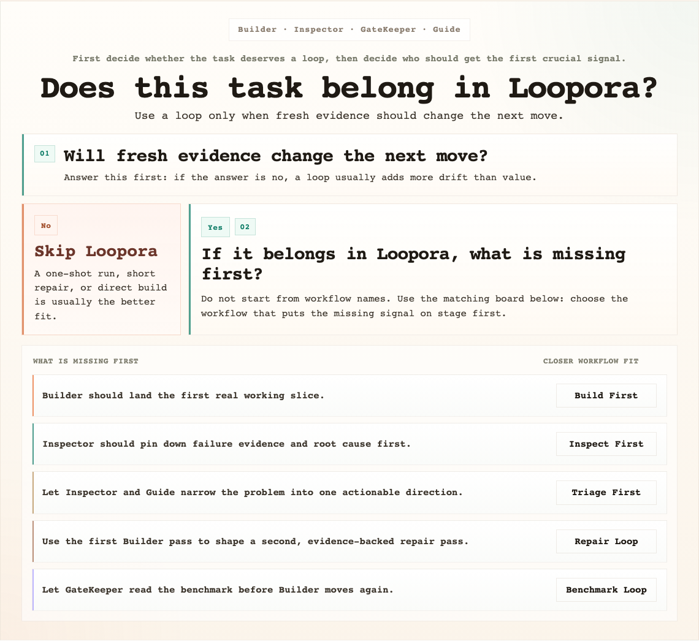

[简体中文](./README.zh-CN.md) | **English**

<p align="center">
  
</p>

<p align="center">
  <a href="https://www.python.org/">
    
  </a>
  <a href="https://fastapi.tiangolo.com/">
    
  </a>
  
  
</p>

## If a strong agent can already do the work, why use Loopora?

That is the first question Loopora should survive.

If the task is small, obvious, and reviewable in one pass, you probably should not use Loopora. Ask a strong agent to do it, review the result once, and move on.

But what if the hard part is not the first patch?

What if the hard part is that someone keeps needing to come back and ask:

- did this change prove the right thing?
- is the result truly done, or only locally plausible?
- should the next round build more, inspect first, narrow the slice, repair again, or stop?
- is this residual risk acceptable for this task, or is it a blocker?

When those questions repeat after every meaningful step, human attention becomes the bottleneck.

**Loopora exists for that moment: it compiles task-specific collaboration posture into a local evidence loop.**

## What are you really trying to save?

Are you trying to save the agent from doing work?

Usually not. The agent can often do plenty.

Are you trying to save humans from repeating the same judgment loop?

That is the real target.

Loopora does not replace human judgment with blind autonomy. It asks a narrower question:

> Which judgments would humans otherwise have to make again and again, and how can this task carry those judgments as a runnable contract?

That answer is the task's **collaboration posture**.

It includes things like:

- what counts as real evidence
- what "fake done" looks like
- how conservative the final gate should be
- when refactoring matters more than speed
- which role should act, inspect, decide, or redirect first

## If posture is the answer, why not just write a better prompt?

Because posture is not one prompt.

If you put it only in the `spec`, the roles stay generic.
If you put it only in role prompts, the pass/fail contract drifts.
If you put it only in a workflow, the system knows the order but not the judgment.

Loopora spreads posture across three runtime surfaces:

- `spec` freezes the task contract: success, guardrails, evidence, fake-done states, residual risk.
- role definitions shape the stance of `Builder`, `Inspector`, `GateKeeper`, `Guide`, or custom roles.
- workflow decides when each kind of judgment happens.

The loop then tests those surfaces against fresh evidence.

That is the fusion: posture says how to judge, orchestration says when judgment happens, and the loop makes every judgment answer to new evidence instead of self-report.

## Then why start from a bundle?

Because most users do not arrive with a clean `spec / roles / workflow` map.

They begin with a softer but important feeling:

- "this task cannot be sloppy"
- "I care more about evidence than speed here"
- "I can accept some risk if it is named clearly"
- "this keeps failing because we jump into building too early"

That is hard to hand-assemble into `spec / roles / workflow` directly.

So the recommended path is:

`task input -> Create Loop / Generate a Bundle by Chat -> READY bundle preview -> import and run -> feedback -> next bundle revision`

The working agreement is where you confirm, "yes, this is how I want this task supervised."

The YAML bundle is the durable artifact Loopora imports. It is both readable and runnable:

- readable enough to explain why this collaboration shape exists
- runnable enough to materialize the `spec`, roles, workflow, and loop
- revisable enough to absorb feedback like "too conservative" or "not enough refactoring"

Manual editing still exists. It is the expert path for when you already know which surface is wrong.

## When should you use Loopora?

Ask the negative question first:

Would one strong agent pass plus one human review be enough?

If yes, skip Loopora.

Now ask the positive question:

Would a human otherwise come back after each round to decide what the result means?

If yes, Loopora may fit.

Use it when the task is:

- long enough that one pass will not settle it
- stateful enough that every round changes the evidence
- uncertain enough that build, inspect, gate, and redirect should be separated
- important enough that "looks done" is not the same as "done"

Do not use it when another round will not create new evidence. A loop without new evidence is drift.

<p align="center">
  
</p>

## Which workflow shape should carry the posture?

Do not start by memorizing presets. Ask what humans would otherwise need to decide first.

- Need the first end-to-end path before anyone can judge? Use `Build First`.
- Need proof of the failing layer before more code? Use `Inspect First`.
- Need to narrow multiple symptoms into one repair slice? Use `Triage First`.
- Know one repair pass will not be enough? Use `Repair Loop`.
- Need the latest measurement to choose the next move? Use `Benchmark Loop`.

These are not five unrelated workflows. They are five common answers to the same question:

> What judgment should the loop surface before humans have to come back?

## How do you use it?

1. Install from the repository root

```bash
uv sync
```

`uv sync` creates the project `.venv`, installs Loopora in editable form, and syncs runtime plus development dependencies from `uv.lock`. For a runtime-only environment, use `uv sync --no-dev`.

2. Start the local web console

```bash
uv run loopora serve --host 127.0.0.1 --port 8742
```

Then open [http://127.0.0.1:8742](http://127.0.0.1:8742).

3. Generate the bundle in Web

Open **Create Loop**, choose a local Agent CLI, fill the target workdir, and describe the task in **Generate a Bundle by Chat**. Loopora embeds the same alignment Skill instructions in the backend prompt, writes the returned `bundle_yaml`, validates it, and shows READY only after the YAML passes the bundle contract.

4. Preview, import, and run

Review the generated task contract, role cards, workflow diagram, and source YAML. Then use **Import Bundle and Run**. Loopora materializes the `spec`, role definitions, workflow, and loop as one managed asset group.

5. Optional external Agent path

If you prefer to align outside the Web UI, open **Tools** and install the repo-local `loopora-task-alignment` Skill into Codex, Claude Code, or OpenCode. That path still produces the same YAML bundle, which you can paste or import on **Create Loop**.

6. Revise from evidence

If the run feels wrong, do not immediately hand-edit random fields. Ask what kind of judgment was wrong:

- task contract wrong? revise the `spec`
- role stance wrong? revise role posture
- judgment timing wrong? revise workflow
- whole collaboration shape wrong? produce the next bundle revision

## CLI

The Web UI is the recommended path because it keeps alignment, bundle import, run evidence, and revision in one place.

If you already know the loop you want, the CLI is still available:

```bash
uv run loopora run \
  --spec ./demo-spec.md \
  --workdir /absolute/path/to/project \
  --executor codex \
  --model gpt-5.4 \
  --max-iters 8
```

## Development

Run the tests:

```bash
uv run pytest -q
```
