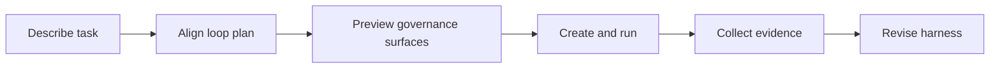

[简体中文](./README.zh-CN.md) | **English**

<p align="center">
  
</p>

<p align="center">
  <a href="https://www.python.org/">
    
  </a>
  <a href="https://fastapi.tiangolo.com/">
    
  </a>
  
  
</p>

Loopora is local-first task governance for long-running AI Agent work.

It takes the part that usually lives inside a fragile Agent conversation, the task contract, user judgment, evidence expectations, role boundaries, and stopping rules, and turns it into an external system that is persistent, inspectable, runnable, and revisable.

## If an AI Agent can already do the work, why use Loopora?

That is the question Loopora has to earn.

If the task is small, obvious, and reviewable in one pass, do not use Loopora. Ask your AI Agent, review once, and move on.

But what if the hard part is not the first answer?

What if the hard part is that you keep coming back to decide:

- did this round prove the right thing?
- is it actually done, or just locally plausible?
- should the next round build, inspect, repair, narrow the scope, or stop?
- what evidence would make the result trustworthy?
- what should change in the working system because this run exposed a weakness?

When those questions repeat, the bottleneck is no longer generation. The bottleneck is governance.

**Loopora exists to move task governance out of the Agent's context and into a durable error-control harness.**

## Why not just use a better Agent plugin?

Most Agent plugins improve the Agent from inside the conversation. They add skills, commands, roles, checklists, or expert collaboration patterns. That is useful, and for many tasks it is enough.

Loopora works at a different layer.

It does not only tell the Agent to behave better. It externalizes the control system around the Agent:

| Inside an Agent context | In Loopora |
| --- | --- |
| A prompt says what good means | A task contract freezes success, fake-done states, evidence, and residual risk |
| A role reminds the Agent to review | Separate roles build, inspect, gate, and redirect with explicit handoffs |
| A checklist depends on model discipline | Workflow gates decide when judgment happens and when a run may finish |
| Logs explain what happened after the fact | Evidence artifacts become the source for review and revision |
| Feedback becomes another prompt | Feedback revises the harness itself |

Other systems can make an Agent more disciplined. Loopora makes the task's control structure durable outside the Agent.

## What Loopora Actually Manages

Loopora's core unit is a **loop plan**.

A loop plan is not a longer prompt. It is a task governance contract with five surfaces:

| Surface | What it protects |
| --- | --- |
| `spec` | task scope, success surface, fake done, guardrails, evidence preferences |
| `roles` | how each AI Agent role should build, inspect, gate, or redirect for this task |
| `workflow` | when those judgments happen and what can end the run |
| `evidence` | what each run actually changed, checked, concluded, and failed to prove |
| `revision` | how feedback changes the next version of the harness |

Internally, Loopora stores the runnable plan as a YAML **bundle**. Users do not need to start there. The Web UI lets you describe the task, align the plan through conversation, preview the governance surfaces, and create a run only after the plan validates.

## The Five-Minute Rule

Loopora can become more powerful, but the first run must stay simple:

> describe the task, choose a workdir, confirm the loop plan, run it, inspect evidence, revise.

Advanced workflow controls, parallel reviewers, evidence routing, and trigger rules are compiled into the plan when they help control long-task error. They are not concepts a new user has to configure before getting value.

## A Concrete Example

Suppose you ask:

> Build an English learning website.

A normal AI Agent path may start building screens: a landing page, vocabulary cards, buttons, maybe polished visuals. It can look finished before proving that a learner can complete one real learning cycle.

Loopora slows down at the governance layer:

- What is the real first product: a runnable learning path or a product sketch?
- What is fake done: a pretty page with no real study loop?
- What evidence proves that a learner can choose a goal, study, practice, and see progress?
- Should a GateKeeper reject shallow polish even if the UI looks good?

The resulting loop plan might use:

```text
Builder -> [Contract Inspector + Evidence Inspector] -> GateKeeper
```

`Builder` implements the first end-to-end learning slice.
`Contract Inspector` checks whether it matches the learning-task promise and fake-done risks.
`Evidence Inspector` independently proves whether the learning path is real and repeatable.
`GateKeeper` fans in both evidence branches and decides whether the run can finish or must loop again.

If the result is still wrong, the next step is not random prompt editing. The next step is to revise the plan from run evidence.

## How the Web Flow Works



In the local Web UI:

1. **Workbench** shows current work and run state.
2. **New Task** opens the chat-first loop-plan alignment page.
3. Loopora calls your local AI Agent CLI and asks the questions needed to form a task-specific harness.
4. READY plans show the task contract, roles, workflow diagram, and source file action.
5. **Create and run** materializes the plan and starts the loop.
6. **Plans** stores reusable governance patterns and their runnable bundle files.

Manual creation remains available for expert users who already know which `spec`, `roles`, or `workflow` surface they want to edit.

## Quick Start

Install from the repository root:

```bash
uv sync
```

Start the local Web console:

```bash
uv run loopora serve --host 127.0.0.1 --port 8742
```

Open [http://127.0.0.1:8742](http://127.0.0.1:8742), choose **New Task**, select a workdir, and describe the long-running task.

## When Should You Use Loopora?

Ask the negative question first:

> Would one AI Agent pass plus one human review be enough?

If yes, skip Loopora.

Now ask the positive question:

> Would a human otherwise return after each meaningful round to judge what the result means?

If yes, Loopora may fit.

Use it when the task is:

- long enough that one pass will not settle it
- stateful enough that every round changes the evidence
- ambiguous enough that success is more than "tests passed"
- risky enough that fake done must be blocked
- reusable enough that the way of judging the task should survive one chat

Do not use it when another round will not create new evidence. A loop without new evidence is drift.

<p align="center">
  
</p>

## External AI Agent Path

The Web UI is the recommended path because it keeps alignment, validation, preview, execution, evidence, and revision in one guided flow.

If you prefer to align outside the Web UI, open **Resources -> Tools & Skill** and install the repo-local `loopora-task-alignment` Skill into Codex, Claude Code, OpenCode, or another compatible AI Agent CLI.

That path produces the same YAML bundle. Import it from the expert manual creation path when you want Loopora to run it.

## CLI

The CLI remains available for automation and expert usage:

```bash
uv run loopora run \
  --spec ./demo-spec.md \
  --workdir /absolute/path/to/project \
  --executor codex \
  --model gpt-5.4 \
  --max-iters 8
```

## Project Status

Loopora is experimental and local-first.

Stable commitments:

- task governance should live outside a single Agent conversation
- loop plans remain inspectable and file-backed
- bundle import/export stays explicit and local
- runs must produce evidence, not only logs
- future revisions should come from evidence and feedback, not hidden prompt drift

## Development

Run the tests:

```bash
uv run pytest -q
```
