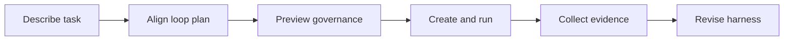

[简体中文](./README.zh-CN.md) | **English**

<p align="center">
  
</p>

<p align="center">
  <a href="https://www.python.org/">
    
  </a>
  <a href="https://fastapi.tiangolo.com/">
    
  </a>
  
  
</p>

Loopora is a local-first task-governance harness for long-running AI Agent work.

It is for the moment when "just ask the Agent again" stops being enough.

## Why Should This Exist?

If one AI Agent pass plus one human review is enough, you do not need Loopora.

But long tasks create a different bottleneck. You keep coming back to decide:

- Did the last round prove the right thing?
- Is the result truly done, or only locally plausible?
- What kind of fake progress should be rejected?
- Should the next round build, inspect, repair, narrow scope, or stop?
- Did this run expose a flaw in the task harness itself?

When those questions repeat, generation is not the bottleneck anymore. Governance is.

**Loopora moves task governance out of the Agent's context and into an external, persistent, inspectable, runnable, and revisable control system.**

## How Is This Different From an Agent Plugin?

Most Agent plugins improve behavior inside one Agent context: skills, commands, checklists, roles, or collaboration patterns. That can be very useful.

Loopora works at the layer around the Agent.

| In a plugin-style Agent context | In Loopora |
| --- | --- |
| A prompt says what good means | `spec` freezes the task contract, fake-done risks, evidence, and residual risk |
| A role reminds the Agent to review | `roles` separate build, inspect, gate, and redirect responsibilities |
| A checklist depends on model discipline | `workflow` decides when judgment happens, what evidence flows, and what can end the run |
| Logs explain what happened | `evidence` becomes the source for review and revision |
| Feedback becomes another prompt | `revision` changes the harness itself |

Loopora does not try to replace your AI Agent. It gives the Agent an external error-control harness.

## The Core Idea

Loopora's user-facing object is a **loop plan**.

A loop plan is a task-governance contract with five surfaces:

| Surface | Job |
| --- | --- |
| `spec` | Defines scope, success, fake done, guardrails, evidence preference, and residual risk |
| `roles` | Defines how each AI Agent role should build, inspect, gate, or redirect for this task |
| `workflow` | Defines order, handoff, evidence routing, parallel inspection, controls, and stop conditions |
| `evidence` | Records what each run changed, checked, proved, failed to prove, and decided |
| `revision` | Turns run evidence and user feedback into the next harness version |

Internally, Loopora stores the runnable plan as a YAML **bundle**. Users do not need to start there. The Web UI helps you describe the task, align the loop plan through conversation, preview the governance surfaces, and create a run only after the plan validates.

## A Concrete Example

Suppose you say:

> Build an English learning website.

A normal AI Agent may start producing screens: a landing page, vocabulary cards, exercises, buttons, and polished visuals. It can look finished before proving that a learner can complete one real learning cycle.

Loopora asks the governance questions first:

- Is the first version a real learning path or a product sketch?
- What is fake done: good-looking pages without a usable study loop?
- Which evidence proves the learner can choose a goal, study, practice, and see progress?
- Should the final GateKeeper reject UI polish if the learning loop is not real?

That may compile into:

```text
Builder -> [Contract Inspector + Evidence Inspector] -> GateKeeper
```

- `Builder` creates the first end-to-end learning slice.
- `Contract Inspector` checks the task promise and fake-done risks.
- `Evidence Inspector` independently proves whether the learning path is real and repeatable.
- `GateKeeper` closes only when the evidence supports the verdict.

If the run still feels wrong, the next move is not random prompt editing. The next move is to revise the harness from evidence.

## Five-Minute Rule

Loopora can become powerful, but first use must stay simple:

> describe the task, choose a workdir, confirm the loop plan, run it, inspect evidence, revise.

Advanced features such as parallel Inspectors, evidence routing, workflow controls, trigger rules, and provider-specific execution are compiled into the plan when they help control long-task error. They are not concepts a new user must configure up front.

## Web Flow



In the local Web UI:

1. **Workbench** shows current loops and run state.
2. **New Task** opens the chat-first loop-plan alignment flow.
3. Loopora calls your local AI Agent CLI and asks only questions that change the harness.
4. READY plans show the task contract, roles, workflow diagram, and source file action.
5. **Create and run** materializes the plan and starts the loop.
6. **Plans** stores reusable task-governance patterns and their bundle files.

Manual creation remains available for expert users who already know which `spec`, `roles`, or `workflow` surface they want to edit.

## Quick Start

Install from the repository root:

```bash
uv sync
```

Start the local Web console:

```bash
uv run loopora serve --host 127.0.0.1 --port 8742
```

Open [http://127.0.0.1:8742](http://127.0.0.1:8742), choose **New Task**, select a workdir, and describe the task.

## When Should You Use It?

Ask the negative question first:

> Would one AI Agent pass plus one human review be enough?

If yes, skip Loopora.

Then ask:

> Would a human otherwise return after each meaningful round to judge what the result means?

Loopora fits tasks that are:

- long enough that one pass will not settle them
- stateful enough that each round changes the evidence
- ambiguous enough that success is more than "tests passed"
- risky enough that fake done must be blocked
- reusable enough that the way of judging the task should survive one chat

Do not use a loop when another round will not create new evidence. A loop without evidence becomes drift.

<p align="center">
  
</p>

## External AI Agent Path

The Web UI is the recommended path because it keeps alignment, validation, preview, execution, evidence, and revision in one guided flow.

If you prefer to align outside the Web UI, open **Resources -> Tools & Skill** and install the repo-local `loopora-task-alignment` Skill into Codex, Claude Code, OpenCode, or another compatible AI Agent CLI.

That Skill now includes a Product Primer so the alignment Agent does not need prior Loopora knowledge. It produces the same YAML bundle, which you can import from the expert manual path when you want Loopora to run it.

## CLI

The CLI remains available for automation and expert usage:

```bash
uv run loopora run \
  --spec ./demo-spec.md \
  --workdir /absolute/path/to/project \
  --executor codex \
  --model <model> \
  --max-iters 8
```

## Project Status

Loopora is experimental and local-first.

Stable commitments:

- task governance should live outside a single AI Agent conversation
- loop plans remain inspectable and file-backed
- bundle import/export stays explicit and local
- runs must produce evidence, not only logs
- revision should come from evidence and feedback, not hidden prompt drift

## Development

Run the tests:

```bash
uv run pytest -q
```
