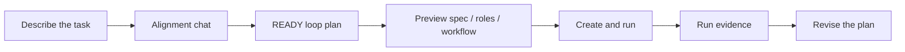

[简体中文](./README.zh-CN.md) | **English**

<p align="center">
  
</p>

<p align="center">
  <a href="https://www.python.org/">
    
  </a>
  <a href="https://fastapi.tiangolo.com/">
    
  </a>
  
  
</p>

Loopora turns a vague task into a local evidence loop for AI Agent work.

It helps you decide what should count as real progress, which AI Agent role should act next, what evidence is enough, and when a run should stop.

## If an AI Agent can already do the work, why use Loopora?

That is the first question Loopora should survive.

If the task is small, obvious, and reviewable in one pass, do not use Loopora. Ask an AI Agent to do it, review the result once, and move on.

But what if the hard part is not the first answer?

What if the hard part is that someone keeps needing to come back and ask:

- did this change prove the right thing?
- is the result truly done, or only locally plausible?
- should the next round build more, inspect first, narrow the slice, repair again, or stop?
- is this residual risk acceptable for this task, or is it a blocker?

When those questions repeat after every meaningful step, human attention becomes the bottleneck.

**Loopora exists for that moment: it turns task-specific judgment into a runnable local loop.**

## Quick Start

Install from the repository root:

```bash
uv sync
```

Start the local Web console:

```bash
uv run loopora serve --host 127.0.0.1 --port 8742
```

Open [http://127.0.0.1:8742](http://127.0.0.1:8742), click **New Task**, choose a workdir, and describe what you want Loopora to do.

The Web flow is the recommended path:

```text
describe task -> chat alignment -> READY loop plan -> preview -> create and run -> revise from evidence
```

## A Concrete Example

Imagine you type:

> Build an English learning website.

A normal AI Agent path may jump straight into screens: a landing page, vocabulary cards, a few buttons, maybe a polished UI. It can look finished before it proves that a learner can actually complete one learning cycle.

Loopora takes a different route. It asks what kind of work this task really needs:

- Is the first version a runnable learning path, or just a product sketch?
- What is fake done? A pretty page with no real study loop?
- What evidence proves that a user can choose a goal, study words, practice, and see progress?
- Should the final gate reject shallow UI polish even if the page looks good?

After alignment, Loopora produces a **loop plan**. You can preview it before running:

- `spec`: the task contract, success surface, fake-done states, evidence preferences, and guardrails.
- `roles`: task-shaped AI Agent roles such as `Builder`, `Inspector`, and `GateKeeper`.
- `workflow`: the order of judgment, for example `Builder -> Inspector -> GateKeeper`.

Only then does Loopora create and run the loop. `Builder` implements, `Inspector` checks the real learning path, and `GateKeeper` decides whether the evidence is good enough to finish.

## What Does Loopora Generate?

Loopora first generates a human-readable **loop plan**.

Internally, that plan is stored as a YAML **bundle**: a single importable file that contains the task contract, AI Agent role posture, workflow, and loop settings.

You do not need to hand-write the bundle to get started. The Web UI generates it through conversation, validates it, and shows READY only after the file passes Loopora's bundle contract.

The bundle matters because it is:

- readable: you can inspect why this collaboration shape exists
- runnable: Loopora can materialize it into local assets and start a run
- revisable: later feedback can generate the next version instead of random field edits

## How the Web Flow Works



In the Web UI:

1. **Workbench** shows current work and run state.
2. **New Task** opens the chat-first alignment page.
3. Loopora calls your local AI AI Agent CLI, asks clarifying questions, and keeps the session context across turns.
4. When the plan is READY, the page shows the task contract, role cards, workflow diagram, and source file actions.
5. **Create and run** imports the bundle through the normal lifecycle and starts the loop.
6. **Plans** stores reusable loop plans and bundle revisions.

Manual creation still exists, but it is the expert path for users who already know exactly which `spec`, `roles`, or `workflow` surface they want to edit.

## Why Not Just Write a Better Prompt?

Because the judgment is not one prompt.

If you put it only in the `spec`, the roles stay generic.  
If you put it only in role prompts, the pass/fail contract drifts.  
If you put it only in a workflow, the system knows the order but not the judgment.

Loopora spreads task posture across three runtime surfaces:

| Surface | What it carries |
|---------|-----------------|
| `spec` | Success criteria, evidence, fake-done states, guardrails, residual risk |
| `roles` | How each AI Agent role should build, inspect, gate, or redirect for this task |
| `workflow` | When each kind of judgment happens and how the run finishes |

The loop then tests those surfaces against fresh evidence instead of self-report.

## When Should You Use Loopora?

Ask the negative question first:

> Would one AI Agent pass plus one human review be enough?

If yes, skip Loopora.

Now ask the positive question:

> Would a human otherwise come back after each round to decide what the result means?

If yes, Loopora may fit.

Use it when the task is:

- long enough that one pass will not settle it
- stateful enough that every round changes the evidence
- uncertain enough that build, inspect, gate, and redirect should be separated
- important enough that "looks done" is not the same as "done"

Do not use it when another round will not create new evidence. A loop without new evidence is drift.

<p align="center">
  
</p>

## Workflow Shapes

Do not start by memorizing presets. Ask what humans would otherwise need to decide first.

| Shape | Use when... |
|-------|-------------|
| `Build First` | you need the first end-to-end path before anyone can judge |
| `Inspect First` | you need proof of the failing layer before more code |
| `Triage First` | multiple symptoms must be narrowed into one repair slice |
| `Repair Loop` | one repair pass will not be enough |
| `Benchmark Loop` | the next move should depend on the latest measurement |

These shapes answer the same question:

> What judgment should the loop surface before humans have to come back?

## External AI Agent Path

The Web UI is the default path because it keeps alignment, bundle validation, preview, import, run evidence, and revision in one place.

If you prefer to align outside the Web UI, open **Resources -> Tools & Skill** and install the repo-local `loopora-task-alignment` Skill into Codex, Claude Code, or OpenCode.

That path still produces the same YAML bundle. Import it from **Resources -> Manual creation** when you want to run it in Loopora.

## CLI

The CLI remains available for automation and expert usage:

```bash
uv run loopora run \
  --spec ./demo-spec.md \
  --workdir /absolute/path/to/project \
  --executor codex \
  --model gpt-5.4 \
  --max-iters 8
```

## Project Status

Loopora is experimental and local-first. Expect active iteration around the Web flow, bundle alignment quality, and long-running scenario coverage.

Core guarantees:

- bundle import/export stays file-based and inspectable
- Web alignment does not bypass the bundle lifecycle
- run evidence is stored locally under Loopora-managed artifacts
- expert routes for `spec / roles / workflow` remain available

## Development

Run the tests:

```bash
uv run pytest -q
```
