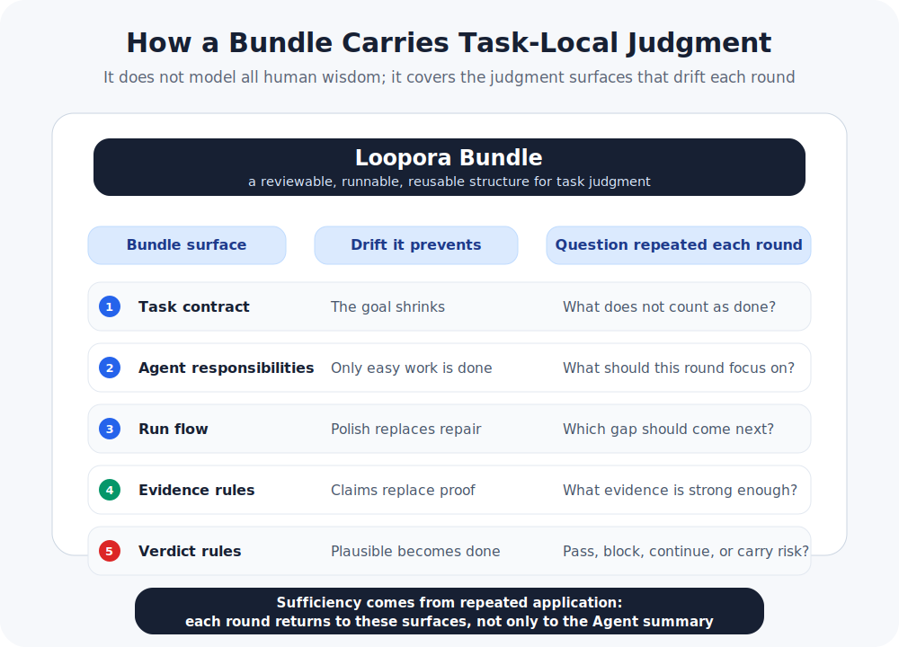

[简体中文](./README.zh-CN.md) | **English**

<p align="center">
  
</p>

<p align="center">
  <a href="https://www.python.org/">
    
  </a>
  <a href="https://fastapi.tiangolo.com/">
    
  </a>
  
  
  
</p>

# Loopora

**Start the Loop inside your Agent. Watch the evidence in the Web UI.**

Loopora adds a visible running structure to long AI Agent tasks: it captures the judgment, evidence requirements, and stopping conditions you would otherwise repeat later, then keeps the Agent returning to them across rounds.

This README is only the first-use path. For the deeper argument behind this layer, read [Human-Shaped Loop](./HUMAN-SHAPED-LOOP.md).

<p align="center">
  
</p>

## Start With a Task

Imagine you are asking a Coding Agent to build a refund admin:

> Build a refund request admin. Do not stop at a clickable page. Prove admin authorization, refund eligibility, payment failure handling, and auditability.

With a single prompt, the Agent may quickly produce a plausible page and a few happy-path tests. The hard part starts in the next round: did it prove the authorization boundary? Is eligibility real or mocked? What happens after a payment provider failure? Can an audit log reconstruct a refund?

Loopora does one simple thing: it turns the questions you would keep asking later into a Loop, so each Agent round comes back with evidence instead of only a nicer summary.

## Install

For now, install from source. From the repository root:

```bash
uv tool install --editable .
```

If uv says the tool directory is not on `PATH`, run:

```bash
uv tool update-shell
```

Then restart your shell.

## Recommended Path: Use It Inside Your Agent

Loopora's default entry point is the Coding Agent you already use. With Codex, switch to the project where the Agent will work, then install the Loopora project entry:

```bash
cd /path/to/your/project
loopora init codex
```

Claude Code and OpenCode can be connected too:

```bash
loopora init claude
loopora init opencode
```

Then return to your Agent and use two entries for the current task:

```text
/loopora-gen
/loopora-loop
```

They have different jobs:

| Entry | What happens |
| --- | --- |
| `/loopora-gen` | Turns the current task and your judgment into a reviewable candidate Loop. It does not start the run. |
| `/loopora-loop` | Starts or resumes the task with the confirmed Loop, so the Agent advances through evidence. |

For the first run, you can say:

```text
I need to build a refund request admin. Please generate a Loopora Loop:
- a clickable page is not enough
- admin authorization and refund eligibility must be proven
- payment failures must be traceable and handoff-ready
- the audit trail must reconstruct a refund
```

Then run `/loopora-gen`. Loopora returns a local Web URL where you can see what the task became. After you confirm it, run `/loopora-loop`; the current Agent continues under that Loop.

## What Gets Compiled?

You do not need to learn the internal format first. Think of it as a runtime whiteboard:

| What you would keep asking | What the Loop carries |
| --- | --- |
| "Do not just give me a clickable page." | A submit-ready page is not enough; the real refund path must be proven. |
| "Prove authorization and eligibility first." | Each round must account for authorization, eligibility, and boundary evidence. |
| "Unauthorized refunds are unacceptable." | Unauthorized, duplicate, or unauditable refund paths block completion. |
| "Do not polish the UI yet." | The next round prioritizes business-path evidence over polish. |
| "Some loose ends can remain." | Residual risk may remain, but it must be explicit, visible, and owned. |

That is the difference between Loopora and an ordinary prompt: a prompt mainly tells the Agent what to do now; Loopora keeps later rounds tied to the same judgment and evidence.

## Web Entry

The Web UI is the fuller observation and management surface. You can start a Loop from inside the Agent, then open Web whenever you want to inspect or manage it.

Start the local Web UI:

```bash
loopora serve --host 127.0.0.1 --port 8742
```

Open [http://127.0.0.1:8742](http://127.0.0.1:8742).

Web is useful when you want to:

- see running and completed Loops.
- inspect evidence, gaps, blockers, and final verdicts.
- install or update Codex, Claude Code, and OpenCode Agent entries.
- edit a candidate Loop, or create one directly from Web.

The Agent entry and Web entry are not separate worlds. Even if a Loop starts inside your Agent, it is recorded in the same local system and can be viewed and managed in Web.

## Technical Shape: How the Bundle Carries Judgment

<p align="center">
  
</p>

Loopora compiles a reviewable Bundle. It does not try to encode all human judgment; it encodes the part of judgment that will repeatedly affect this long-running task.

The Bundle is sufficient because five surfaces work together: the task contract prevents the goal from shrinking, Agent responsibilities keep each round focused, run flow says where to return when evidence is weak, evidence rules separate claims from proof, and verdict rules decide whether to pass, block, continue, or carry explicit residual risk.

At the end of each round, Loopora does not only ask whether the Agent said "done." It reconciles the output against the Bundle: what was proven, what is weak evidence, what remains unproven, which risk blocks closure, and which gap the next round should repair.
