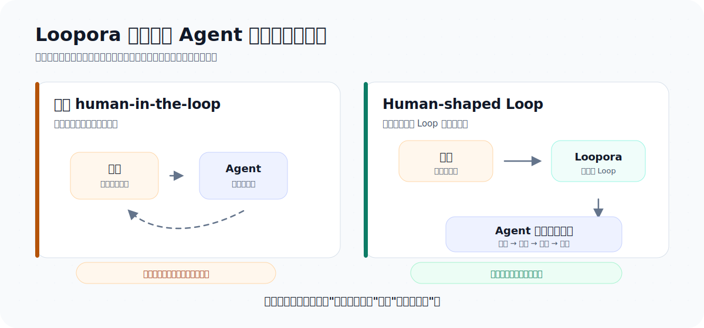
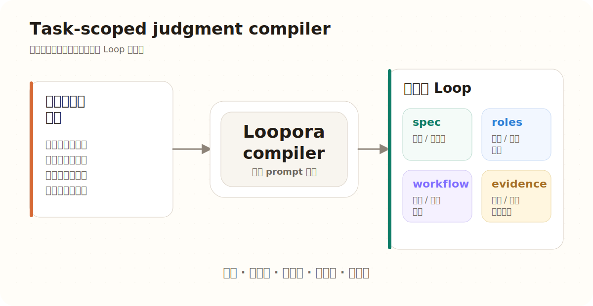

**简体中文** | [English](./README.md)

<p align="center">
  
</p>

<p align="center">
  <a href="https://www.python.org/">
    
  </a>
  <a href="https://fastapi.tiangolo.com/">
    
  </a>
  
  
</p>

第一次了解 Loopora，建议先读：[Human-Shaped Loop：Loopora 的判断力哲学](./docs/human-shaped-loop.zh-CN.md)。

Loopora 是面向长期 AI Agent 任务的本地任务平台，用来编排 **human-shaped Loop**。

它的核心问题很简单：

> 原本未来才会反复发生的人类判断，能不能在 Loop 开始前先被塑形？

如果可以，Loopora 就把这份判断编译成可运行的 Loop：任务契约、角色责任、workflow gate、证据流和裁决面，让 Agent 在里面自动迭代。

## 你真的需要 Loopora 吗？

先问一个反问题：

> 一次强 Agent 执行加一次人工 review 够不够？

如果够，就不要用 Loopora。直接让 Agent 做更便宜。

Loopora 适合的是另一种时刻：只是“再问一次 Agent”已经不是正确抽象。缺的已经不是努力，而是人类反复回来判断每一轮到底是真进展、假进展、可接受风险，还是应该改方向。

先用文字判断：

1. 如果一次 Agent 执行加一次 review 就够，跳过 Loopora。
2. 如果人类不会在关键轮次后反复回来，直接 Agent 或简单循环通常够用。
3. 如果未来判断无法提前塑形，那就让人继续留在实时循环里。
4. 如果未来判断会重复，而且可以提前塑形，就编排 human-shaped Loop。

## 我们到底想省掉什么？

Loopora 不想省掉人类判断本身。

它想省掉的是：人类在长任务里反复被拉回来问同一类问题的时刻：

- 这一轮证明了正确的东西吗？
- 结果是真的完成，还是只是局部看起来合理？
- Agent 有没有悄悄降低验收标准？
- 哪些证据应该被信任？
- 哪些风险可以接受，哪些风险必须阻断？
- 下一轮应该构建、检查、修复、收窄范围，还是停止？

当这些问题反复出现，瓶颈就不再是生成，而是反复应用人类判断力。

Loopora 把这些判断提前：

> human-in-the-loop -> human-shaped loop

人类没有消失，而是从“每轮实时纠偏者”变成“Loop 设计者”和“证据审计者”。

## 为什么简单循环不够？

简单循环延长的是时间。当任务有硬外部校验时，它们非常好用：benchmark、contract test、schema、lint、type check 或 proof harness 都能明确纠偏。

但如果没有治理结构，loop 就是开盲盒。早期误差会被后续轮次继承、放大、合理化。结果可能越来越完整、越来越自洽，但仍然是错的。

Loopora 的目标不是“多跑几轮”，而是降低误差累积速度。

> 没有治理结构的 loop 是开盲盒；有治理结构的 Loop 是误差减速器。

<p align="center">
  
</p>

## Loopora 到底编译什么？

Loopora 面向用户的核心对象是 **Loop**。

Loop 不是更长的 prompt，而是“这次任务应该如何被判断”的可运行形状。

| Surface | 职责 |
| --- | --- |
| `spec` | 定义范围、成功面、假完成、guardrails、证据偏好和残余风险 |
| `roles` | 定义每个 AI Agent 角色在本任务中如何构建、检查、裁决或纠偏 |
| `workflow` | 定义顺序、handoff、证据路由、自动迭代、controls 和停止条件 |
| `evidence` | 记录每次 run 改了什么、检查了什么、证明了什么、没证明什么、如何裁决 |

在内部，Loopora 可以把可运行 Loop 保存或交换为 YAML **bundle**。用户不需要一开始理解这个格式。Web UI 会让你描述任务、回答会改变 Loop 的问题、预览治理结构，并且只有在候选 Loop 通过校验后才创建 run。

<p align="center">
  
</p>

## 为什么不让模型自己学？

模型应该学习通用能力：写代码、推理、使用工具、规划、语言能力和广泛模式。

但一次任务里的判断通常是局部的、临时的、可争议的：

- 这次要严格，另一次也许要探索。
- 这个 benchmark 在这里可信，另一个 benchmark 也许会误导。
- 这个 residual risk 现在可以接受，换个场景可能必须阻断。
- 这个项目要保护公开契约，另一个原型可能优先速度。

这些判断应该显式、可预览、可修改、可导出、可废弃。它们更适合存在于 Agent harness / Loop 层，而不是静默写进模型权重。

> 模型学习通用能力，Loop 学当前任务的判断方式。

## 放到真实任务里会发生什么？

假设你说：

> 做一个英语学习网站。

普通 Agent 很可能直接做页面：落地页、单词卡片、练习题、按钮和漂亮视觉。它可能看起来完成，但没有证明学习者真的能完成一轮学习。

Loopora 会先问判断问题：

- 第一版到底是可运行学习路径，还是产品草图？
- 什么是假完成？只是页面好看但没有真实学习闭环？
- 什么证据能证明用户可以选择目标、学习、练习并看到进度？
- 即使 UI 好看，GateKeeper 是否也应该拒绝没有学习闭环的结果？

这可能被编译成：

```text
Builder
-> Contract Inspector + Evidence Inspector
-> GateKeeper
-> 带证据修复，或带证据收束
```

Agent 仍然可以创建、检查、修复。区别在于，“完成”不再等于最后一条消息看起来说得通。完成必须被 Loop 要求的证据支撑。

## 五分钟路径是什么？

Loopora 可以越来越强，但第一次使用必须保持简单：

> 描述任务，选择 workdir，确认 Loop，运行，看证据。

并行 Inspector、证据路由、workflow controls、触发规则和 provider 执行差异，只有在它们确实能控制长期任务误差时，才由 Loopora 编译进方案。它们不是新用户开始前必须手动配置的概念。

实际体验应该保持文字化、低负担：描述任务，回答少量会改变 Loop 的问题，预览 `spec`、`roles` 和 `workflow`，创建 run，然后查看证据与裁决。

## 什么时候该用？

按顺序问：

1. **一次 Agent 执行加一次人工 review 够不够？**
   如果够，跳过 Loopora。

2. **如果不用 Loopora，人类会不会在关键轮次后反复回来判断发生了什么？**
   如果不会，简单循环或直接 Agent 可能够用。

3. **下一轮会不会产生新证据？**
   如果不会，更多循环只是在制造漂移。

4. **判断是否难以压成一个稳定 benchmark？**
   如果可以稳定 benchmark 化，先用 benchmark。Loopora 可以围绕 benchmark 做治理，但不要用复杂 Loop 替代简单 proof。

5. **是否存在假完成风险？**
   如果结果很容易“看起来完成”，但核心闭环、根因、契约、证据或风险没有站住，Loopora 更有价值。

6. **这套判断方式是否应该活过一次聊天？**
   如果它应该被 run 继承、导出复用或审计，就可能值得编译成 Loop。

Loopora 不是“复杂任务都该用”。它适合那些人类判断会重复出现、证据会逐轮变化、假完成风险值得阻断的长期任务。

## 快速开始

在 Loopora 发布为 Python 包之前，先在仓库根目录安装 CLI：

```bash
uv tool install --editable .
```

如果 uv 提示工具 bin 目录不在 `PATH`，执行一次 `uv tool update-shell`，然后重启 shell。

启动本地 Web 控制台：

```bash
loopora serve --host 127.0.0.1 --port 8742
```

打开 [http://127.0.0.1:8742](http://127.0.0.1:8742)，选择顶栏 **编排**，选择工作目录，然后描述这次 Loop。

## Web 流程

在本地 Web UI 中：

1. **Loop** 展示已有 Loop、最近运行状态和继续运行入口。
2. **编排** 打开对话优先的 Loop 编排工作台，并保留导入方案文件和手动编排入口。
3. Loopora 调用本机智能体命令行，只追问会改变 Loop 的问题。
4. READY Loop 会展示 Loop 契约、角色、流程图和源文件操作。
5. **创建并运行** 会物化 Loop 并启动运行。
6. **资源库** 管理方案文件、角色定义和流程编排，供专家复用。

手动编排仍然存在，但它是专家路径，适合你已经明确知道要改哪个 `spec`、`roles` 或 `workflow` 运行面。方案包仍可导入导出，但它是专家交换格式，不再是日常查看已有 Loop 的主入口。

导入 YAML，或从已有方案包 / 运行证据发起对话改进，也是编排 Loop 的场景。它们很有用，但不是主工作流；候选 Loop 通过校验后，仍然进入同一条运行、证据和裁决路径。

## 外部 AI Agent 路径

Web UI 是推荐路径，因为它把 Loop 编排、校验、预览、运行和证据放在同一条引导流程里。

如果你更喜欢在 Web 之外做对齐，可以打开 **工具 -> 对齐技能安装**，把 repo-local `loopora-task-alignment` 技能安装到 Codex、Claude Code、OpenCode 或其他兼容智能体命令行。

这个 Skill 内置 Product Primer，所以 alignment Agent 不需要预先知道 Loopora 是什么。它产出的仍是同一种 YAML bundle，需要运行时从 expert 手动路径导入为 Loop 即可。

## CLI

CLI 仍然保留，适合自动化和 expert usage：

```bash
loopora run \
  --spec ./demo-spec.md \
  --workdir /absolute/path/to/project \
  --executor codex \
  --model <model> \
  --max-iters 8
```

未来 Loopora 发布为 Python 包后，推荐用 CLI tool 方式安装，例如 `uv tool install loopora` 或 `pipx install loopora`。在已激活虚拟环境里使用 `python -m pip install loopora` 也可以，但 tool install 更符合“一次安装，随处直接运行 `loopora`”的体验。

## 项目状态

Loopora 仍处于实验阶段，并坚持 local-first。

稳定承诺：

- Loopora 把 task-scoped human judgment 编译成显式、可检查的 Loop 运行面
- 长期任务编排应该存在于单次 AI Agent 对话之外
- Loop 保持可检查、文件化
- bundle 导入 / 导出保持显式、本地
- run 必须产生证据，而不只是日志
- bundle 改动应通过导入 / 导出显式发生，而不是隐藏的 prompt 漂移

## 开发

运行本地检查：

```bash
uv sync
uv run ruff check .
uv build --out-dir tmp/package-check
uv run pytest -q
```
