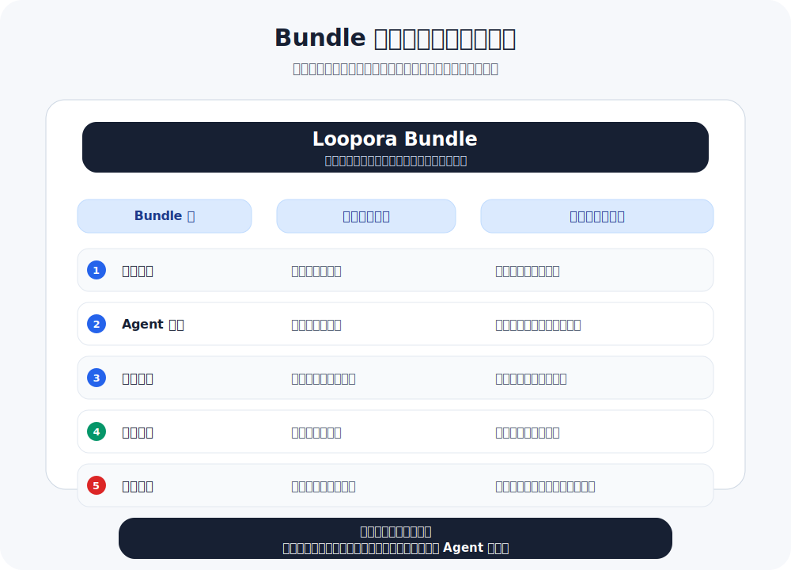

**简体中文** | [English](./README.md)

<p align="center">
  
</p>

<p align="center">
  <a href="https://www.python.org/">
    
  </a>
  <a href="https://fastapi.tiangolo.com/">
    
  </a>
  
  
  
</p>

# Loopora

**在 Agent 里启动 Loop，在 Web 里看证据。**

Loopora 给长期 AI Agent 任务加一层可见的运行结构：先把这次任务里反复会用到的判断、证据要求和停止条件整理出来，再让 Agent 带着这些约束一轮轮推进。

README 只讲第一次怎么用。想理解为什么需要这一层，读 [Human-Shaped Loop](./HUMAN-SHAPED-LOOP.zh-CN.md)。

<p align="center">
  
</p>

## 先看一个任务

比如你正在让 Coding Agent 做一个退款后台：

> 帮我实现退款申请后台。不要只做一个能点的页面，必须证明管理员权限、退款资格、支付失败处理和审计链路。

如果只是一次 prompt，Agent 可能很快给你一个看起来完整的页面和几条 happy-path 测试。真正麻烦的是下一轮：它有没有证明权限边界？资格判断是不是模拟的？支付失败后有没有记录和人工交接？审计日志能不能还原一次退款？

Loopora 做的事很朴素：把这些“后面一定会反复追问的问题”提前整理成 Loop，让 Agent 每轮都带着证据回来，而不是只给一个更漂亮的总结。

## 安装

目前先从源码安装。在仓库根目录运行：

```bash
uv tool install --editable .
```

如果 uv 提示工具目录不在 `PATH`，执行一次：

```bash
uv tool update-shell
```

然后重启 shell。

## 推荐路径：在 Agent 里用

Loopora 的默认入口是你已经在使用的 Coding Agent。以 Codex 为例，切到你要让 Agent 工作的项目目录，然后安装 Loopora 入口：

```bash
cd /path/to/your/project
loopora init codex
```

Claude Code 和 OpenCode 也可以接入：

```bash
loopora init claude
loopora init opencode
```

之后回到你的 Agent，对当前任务使用两个入口：

```text
/loopora-gen
/loopora-loop
```

它们的分工很清楚：

| 入口 | 发生什么 |
| --- | --- |
| `/loopora-gen` | 把当前任务和你的判断整理成一个可审查的候选 Loop，不启动运行。 |
| `/loopora-loop` | 用已经确认的 Loop 启动或继续任务，让 Agent 按证据推进。 |

第一次使用时，你可以这样说：

```text
我要实现退款申请后台。请用 Loopora 生成一个 Loop：
- 页面能提交不算完成
- 必须证明管理员权限和退款资格
- 支付失败必须可追踪、可交接
- 审计链路必须能还原一次退款
```

然后运行 `/loopora-gen`。Loopora 会返回一个本地 Web URL，让你看到这次任务被整理成了什么。确认后运行 `/loopora-loop`，当前 Agent 就会在这个 Loop 下继续工作。

## 编译后是什么样？

你不需要先理解内部格式。把它想成一张运行时白板：

| 你原本会反复追问的话 | Loop 中变成什么 |
| --- | --- |
| “别只给我一个能点的页面。” | 页面可提交不算完成，真实退款路径必须被证明。 |
| “先证明权限和资格。” | 每轮都要说明权限、资格和边界证据在哪里。 |
| “越权退款绝对不行。” | 发现越权、重复退款或审计缺失时不能收口。 |
| “先别美化 UI。” | 下一轮优先补业务链路证据，而不是继续 polish。 |
| “有些尾巴可以留。” | 残余风险可以留下，但必须显式、可见、有人接管。 |

这就是 Loopora 和普通 prompt 的区别：prompt 主要告诉 Agent “这次怎么做”；Loopora 让任务在后续轮次里持续回到同一组判断和证据上。

## Web 入口

Web 是更完整的观察和管理界面。你可以从 Agent 里启动 Loop，也可以随时打开 Web 查看和管理它们。

启动本地 Web：

```bash
loopora serve --host 127.0.0.1 --port 8742
```

打开 [http://127.0.0.1:8742](http://127.0.0.1:8742)。

Web 适合做这些事：

- 查看正在运行和已经完成的 Loop。
- 查看每轮留下的证据、缺口、阻断和最终裁决。
- 安装或更新 Codex、Claude Code、OpenCode 的 Agent 入口。
- 在需要时编辑候选 Loop，或者从 Web 直接创建一个 Loop。

Agent 入口和 Web 入口不互斥。即便 Loop 是从 Agent 里生成的，也会进入同一套本地记录，并能在 Web 上看到和管理。

## 技术概览：Bundle 如何表达判断

<p align="center">
  
</p>

Loopora 编译出来的是一份可审查的 Bundle。它不试图表达人的全部判断力，只表达这次长期任务里每轮都会影响结果的那部分判断。

Bundle 的充分性来自五个面一起工作：任务契约防止目标被悄悄缩小；Agent 责任让每轮知道该关注和避免什么；运行流程决定证据不足时回到哪里；证据规则把自述和证明分开；裁决规则决定通过、阻断、继续，还是显式留下残余风险。

所以每轮结束时，Loopora 不只看 Agent 有没有说“完成”。它会把产物放回 Bundle 对账：哪些已证明，哪些只是弱证据，哪些还没证明，哪个风险会阻断，下一轮应该补哪个缺口。
