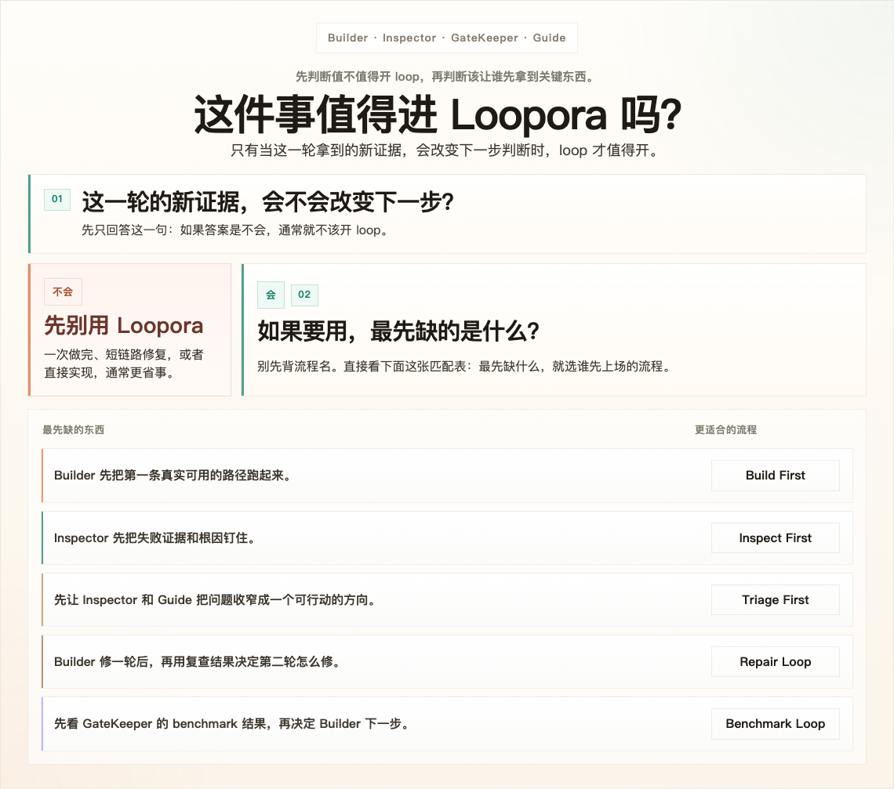

**简体中文** | [English](./README.md)

<p align="center">
  
</p>

<p align="center">
  <a href="https://www.python.org/">
    
  </a>
  <a href="https://fastapi.tiangolo.com/">
    
  </a>
  
  
</p>

## 强 Agent 已经能做，为什么还要用 Loopora？

这是 Loopora 必须先回答的问题。

如果任务很小、很明确、一轮就能 review 完，那大概率不该用 Loopora。让强 Agent 做一次，人类 review 一次，然后结束。

但如果难点不是第一版补丁呢？

如果真正麻烦的是，总有人要反复回来问：

- 这次改动证明了正确的东西吗？
- 结果是真的完成了，还是只是局部看起来合理？
- 下一轮应该继续写、先检查、收窄切口、再修一轮，还是停止？
- 这个残余风险在这次任务里能接受，还是必须卡住？

当这些问题在每个关键阶段反复出现，人类注意力就会变成瓶颈。

**Loopora 就是为这个时刻存在的：把任务级协作姿态编译成本地证据循环。**

## 你真正想省下的是什么？

你是在替 Agent 省力吗？

通常不是。Agent 往往已经能做很多。

你是在替人类省下反复判断吗？

这才是核心。

Loopora 不是用盲目自治替代人的判断。它问的是一个更窄的问题：

> 哪些判断本来会被人类一遍遍重复做，而这次任务能不能把这些判断变成可运行的契约？

这个答案，就是这次任务的 **协作姿态**。

它包括：

- 什么算真实证据
- 什么是假完成
- 最终放行应该多保守
- 什么时候重构比速度更重要
- 哪个角色应该先行动、先取证、先裁决或先纠偏

## 如果姿态是答案，为什么不只写一段更好的 prompt？

因为姿态不是一段 prompt。

如果只放进 `spec`，角色仍然是泛化角色。
如果只放进角色 prompt，通过标准会漂移。
如果只放进 workflow，系统知道顺序，却不知道如何判断。

Loopora 把姿态拆到三种运行面：

- `spec` 冻结任务契约：成功、边界、证据、假完成、残余风险。
- 角色定义塑造 `Builder`、`Inspector`、`GateKeeper`、`Guide` 或自定义角色的工作姿态。
- workflow 决定每种判断什么时候发生。

loop 再用新证据检验这些运行面。

融合点就在这里：姿态说明如何判断，编排说明判断何时发生，loop 让每次判断基于新证据，而不是基于自我报告。

## 那为什么要从 bundle 开始？

因为多数用户一开始并没有一张可直接运行的 `spec / roles / workflow` 地图。

他们一开始通常只有一种很重要、但还没结构化的感觉：

- “这件事不能糊弄”
- “这次我更在乎证据，不在乎快”
- “只要风险说清楚，我可以接受一部分”
- “这个任务总失败，是因为太早进入 build 了”

这些感觉很难直接手工拆成 `spec / roles / workflow`。

所以推荐路径是：

`任务输入 -> 外部 Agent + loopora-task-alignment Skill -> working agreement -> YAML bundle -> 创建循环 -> 运行 -> 反馈 -> 下一版 bundle`

working agreement 用来确认：“对，这就是我希望这次任务被监督的方式。”

YAML bundle 才是 Loopora 导入的稳定产物。它同时可读、可运行、可修订：

- 人能读懂为什么这次要这样协作
- Loopora 能把它物化成 `spec`、角色、workflow 和 loop
- 之后可以吸收“太保守”“不够重视重构”这类反馈，生成下一版

手动编辑仍然保留。它是 expert path，适合你已经知道哪个运行面出了问题的时候。

## 什么时候该用 Loopora？

先反过来问：

一位强 Agent 加一轮人工 review 够不够？

如果够，就别用 Loopora。

再正着问：

如果不用 Loopora，人类会不会在每轮之后都回来判断结果意味着什么？

如果会，Loopora 可能适合。

适合的任务通常是：

- 足够长，一轮无法定案
- 足够有状态，每轮都会改变证据
- 足够不确定，需要把 build、inspect、gate、redirect 拆开
- 足够重要，不能把“看起来完成”当成“完成”

如果再跑一轮也不会产生新证据，就不要开 loop。没有新证据的 loop 只会漂移。

<p align="center">
  
</p>

## 该让哪种流程承载这次姿态？

别先背 preset。先问：人类原本最先要回来判断什么？

- 需要第一条端到端路径，才谈得上判断？用 `Build First`。
- 需要先证明失败层，再写更多代码？用 `Inspect First`。
- 多个症状混在一起，先要收窄成一个修复切片？用 `Triage First`。
- 已经知道一轮修复不够？用 `Repair Loop`。
- 下一步应该由最新评测结果决定？用 `Benchmark Loop`。

这不是 5 条互不相关的流程。它们都在回答同一个问题：

> 哪种判断应该先被 loop 暴露出来，避免人类再回来补做？

## 怎么用？

1. 在仓库根目录安装

```bash
uv sync
```

`uv sync` 会创建项目 `.venv`，以 editable 形式安装 Loopora，并从 `uv.lock` 同步运行依赖与开发依赖。只需要运行环境时，可以使用 `uv sync --no-dev`。

2. 启动本地 Web 控制台

```bash
uv run loopora serve --host 127.0.0.1 --port 8742
```

然后打开 [http://127.0.0.1:8742](http://127.0.0.1:8742)。

3. 安装对齐 Skill

打开 **工具** 页，把 repo-local `loopora-task-alignment` Skill 安装到外部 Agent 工具里。

4. 让外部 Agent 编译任务姿态

围绕任务沟通，确认 working agreement，并产出 YAML bundle。

5. 导入并运行

打开 **创建循环**，导入 bundle 并运行。Loopora 会把 `spec`、角色定义、workflow 和 loop 作为一组资产物化出来。

6. 从证据继续修订

如果 run 的结果不对，不要马上随机手改字段。先问是哪种判断错了：

- 任务契约错了，改 `spec`
- 角色姿态错了，改角色定义
- 判断时机错了，改 workflow
- 整体协作形状错了，生成下一版 bundle

## CLI

Web UI 是推荐入口，因为它把对齐、bundle 导入、run 证据和 revision 放在同一个地方。

如果你已经很清楚要跑哪条 loop，也可以直接走 CLI：

```bash
uv run loopora run \
  --spec ./demo-spec.md \
  --workdir /absolute/path/to/project \
  --executor codex \
  --model gpt-5.4 \
  --max-iters 8
```

## 开发

运行测试：

```bash
uv run pytest -q
```
