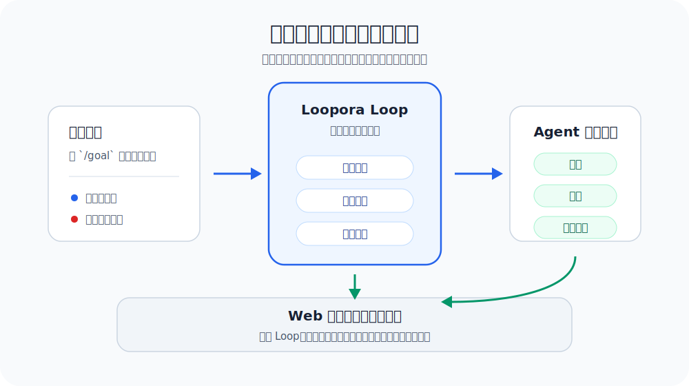
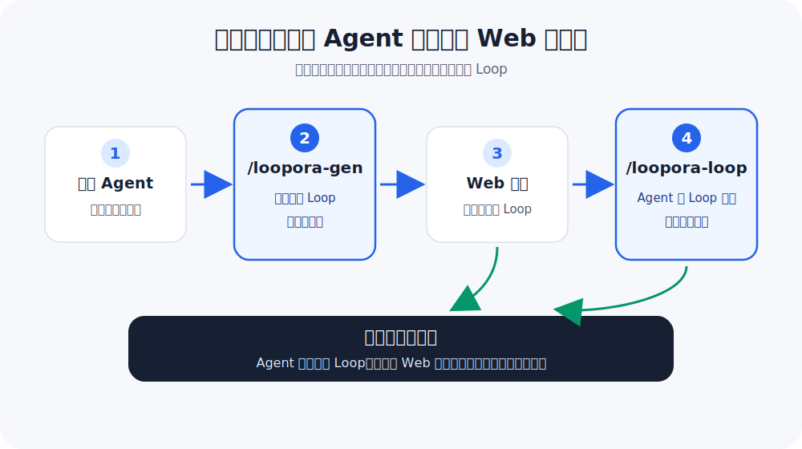
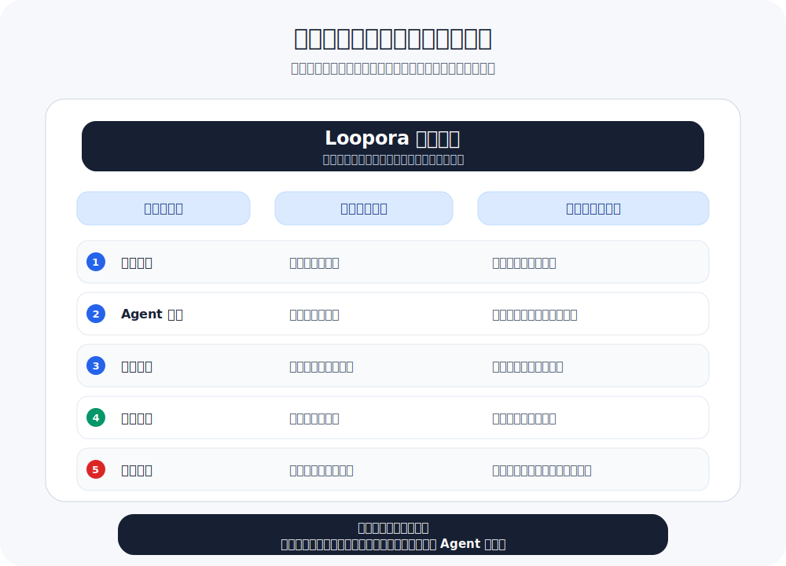

**简体中文** | [English](./README.md)

<p align="center">
  
</p>

<p align="center">
  <a href="https://www.python.org/">
    
  </a>
  <a href="https://fastapi.tiangolo.com/">
    
  </a>
  
  
  
</p>

# Loopora

**让一次性的 Agent 请求转化为可持续推进的长期任务，具备方案、证据与可裁决的结论。**

Loopora 是面向长期 AI Agent 任务的本地运行层。它将任务目标、判断标准、证据要求和终止条件整理为可审查的方案，驱动 Agent 按方案分多轮推进，并在 Web 界面中持续呈现证据、缺口、阻断项与最终结论。

README 介绍如何安装和使用。若想理解为什么需要这一层，请阅读 [Human-Shaped Loop](./HUMAN-SHAPED-LOOP.zh-CN.md)。

<p align="center">
  
</p>

## 它能做什么？

Loopora 不是新的聊天界面，也不是 prompt 模板库。它为长期 Agent 任务增加了一层工程化的运行支持：

| 能力 | 说明 |
| --- | --- |
| 外化判断标准 | 明确"什么不算完成""什么证据可信""哪些风险必须拦截"。 |
| 生成方案 | 在 Agent 启动前，先输出一份可审查的候选 Loop 方案。 |
| 多轮推进 | 让 Agent 始终遵循方案执行；证据不足时，回到具体缺口补齐。 |
| 证据梳理 | 在 Web 中区分已证明、弱证据、未证明、阻断项与残余风险。 |
| 本地优先 | 任务方案、运行记录和证据均保存在本地环境。 |

## 什么时候适合用？

Loopora 并非适用于所有任务。它适合那些"单次 Agent 回复看似顺利，但你担心后续会出现伪完成、证据不足或判断漂移"的任务。

| 场景 | 建议 |
| --- | --- |
| 一次 Agent 执行配合一次人工审阅即可 | 无需 Loopora，直接让 Agent 执行成本更低。 |
| 已有稳定测试、benchmark 或 proof harness 可直接判定 | 优先使用这些硬性反馈。 |
| 任务需要多轮执行，且每轮都会产生新证据 | Loopora 开始有价值。 |
| 结果可能"看起来已完成"，但核心风险尚未证明 | 非常适合 Loopora。 |
| 这套判断需要保留、审查、复用或通过 Web 管理 | 非常适合 Loopora。 |

典型示例：退款自助流程、账单权限重构、跨服务支付回调问题、复杂迁移、需要多轮探索但需保留判断标准的产品任务。

## 安装

当前仅支持源码安装。需要：

- Python 3.11+
- `uv`
- 至少一个 Coding Agent：Codex、Claude Code 或 OpenCode

在 Loopora 仓库根目录执行：

```bash
uv tool install --editable .
```

若 uv 提示工具目录不在 `PATH` 中，执行一次：

```bash
uv tool update-shell
```

然后重启 shell。

## 推荐用法：在 Agent 中使用斜杠命令

Loopora 的默认入口即为你正在使用的 Coding Agent。以 Codex 为例，切换到 Agent 将要工作的项目目录，然后安装 Loopora 入口：

```bash
cd /path/to/your/project
loopora init codex
```

Claude Code 与 OpenCode 同样可以接入：

```bash
loopora init claude
loopora init opencode
```

然后回到 Agent，使用以下两个命令处理当前任务：

```text
/loopora-gen
/loopora-loop
```

<p align="center">
  
</p>

二者分工如下：

| 入口 | 作用 |
| --- | --- |
| `/loopora-gen` | 与你对话，澄清任务判断，生成可审查的候选 Loop，但不启动运行。 |
| `/loopora-loop` | 用已审查的 Loop 启动或继续长期任务，驱动 Agent 按证据推进。 |

首次使用时，可在 Agent 中运行 `/loopora-gen`，然后描述任务和关键判断：

```text
我要实现退款申请后台：
- 页面能提交不算完成
- 必须证明管理员权限和退款资格
- 支付失败必须可追踪、可交接
- 审计链路必须能还原一次退款
```

Loopora 会继续追问影响运行结构的问题，将你的判断整理为候选方案，并返回本地 Web URL 供你审查。审查或调整后运行 `/loopora-loop`，当前 Agent 即进入该 Loop 下的多轮任务执行。

## `/loopora-gen` 会产出什么？

`/loopora-gen` 的目的不是立即执行，而是生成一份可审查的任务方案。首次使用时，可将其理解为 Loop 的可迁移形态。

在 Agent-first 路径中，候选方案不仅要通过 YAML 结构校验，还需将当前会话中的高信号任务对象、风险与证据预期写入可执行的任务契约、Agent 职责与工作流。仅有一句简短的任务摘要，不足以完成判断的外化。

这份方案通常包含：

| 产物 | 作用 |
| --- | --- |
| 任务契约 | 明确目标、完成标准、伪完成模式与阻断风险。 |
| Agent 职责 | 明确 Agent 每轮应关注什么、避免什么、交付什么。 |
| 运行流程 | 明确先做什么、何时检查、证据不足时回到哪里。 |
| 证据规则 | 明确哪些材料算强证据，哪些只是自述或弱证据。 |
| 裁决规则 | 明确何时通过、何时阻断、何时继续、何时留下残余风险。 |
| Web 预览 | 让你在运行前审查、确认或调整方案。 |

<p align="center">
  
</p>

方案文件并不试图涵盖人的全部判断能力。它只编码那些会在本次长期任务中反复影响结果的判断：什么算完成，什么必须拒绝，什么证据足够，下一轮应补哪里，何时可以收尾。

## `/loopora-loop` 如何运行？

`/loopora-loop` 启动或继续一个由 Loopora 管理的长期任务。Agent 仍是主要执行者：读代码、改文件、运行检查、解释结果。Loopora 负责将每轮工作对齐到方案中的判断与证据要求。

单次运行大致遵循以下流程：

1. Loopora 找到已审查的候选 Loop。
2. Agent 根据当前轮次的目标和边界执行任务。
3. Agent 提交工作产物、检查结果、说明和证据引用。
4. Loopora 进行核对：哪些已证明，哪些只是弱证据，哪些仍未证明。
5. 存在阻断风险时，运行不能被包装为完成。
6. 证据不足时，下一轮将被拉回具体缺口。
7. 可以收尾时，Loopora 给出可审查的任务裁决与残余风险说明。

这就是 Loopora 与普通 prompt 的区别：prompt 主要影响下一次回答；Loopora 让同一组判断在多轮任务中持续生效。

## Web 能做什么？

Web 是更完整的观察和管理界面。你可以从 Agent 中启动 Loop，也可以随时打开 Web 查看和管理。

手动启动本地 Web 服务：

```bash
loopora serve --host 127.0.0.1 --port 8742
```

打开 [http://127.0.0.1:8742](http://127.0.0.1:8742)。

Web 适合以下场景：

| 场景 | 可查看或操作的内容 |
| --- | --- |
| 审查候选 Loop | 查看任务契约、Agent 职责、运行流程、证据规则与裁决规则。 |
| 观察运行 | 查看当前 Loop 执行到何处、最近一轮发生了什么。 |
| 查看证据 | 区分已证明、弱证据、未证明、阻断项与残余风险。 |
| 管理入口 | 安装或更新 Codex、Claude Code、OpenCode 的项目级入口。 |
| 调整方案 | 在需要时编辑候选方案，或从 Web 直接创建 Loop。 |

Agent 入口与 Web 入口并不互斥。即使 Loop 从 Agent 中生成，也会进入同一套本地记录，可在 Web 上查看和管理。

## 技术形态

Loopora 是 local-first 的 Python 项目，本地 Web 基于 FastAPI。当前支持 Codex、Claude Code 与 OpenCode 的项目级入口。

核心逻辑：

```text
你的任务判断 -> 候选 Loop 方案 -> Agent 多轮执行 -> 证据核对 -> 任务裁决
```

Loopora 不替代 Coding Agent 的日常能力。Agent 继续负责读代码、写代码、运行工具；Loopora 负责让长期任务始终回到同一套方案、证据和裁决结构。

## 下一步

- 想快速开始：按上述步骤安装，然后使用 `/loopora-gen` / `/loopora-loop`。
- 想理解为何需要这一层：阅读 [Human-Shaped Loop](./HUMAN-SHAPED-LOOP.zh-CN.md)。
- 想先通过 Web 探索：启动 `loopora serve --host 127.0.0.1 --port 8742`。
