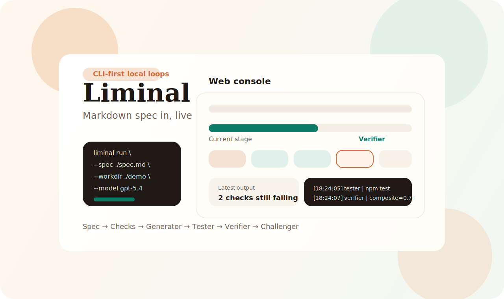
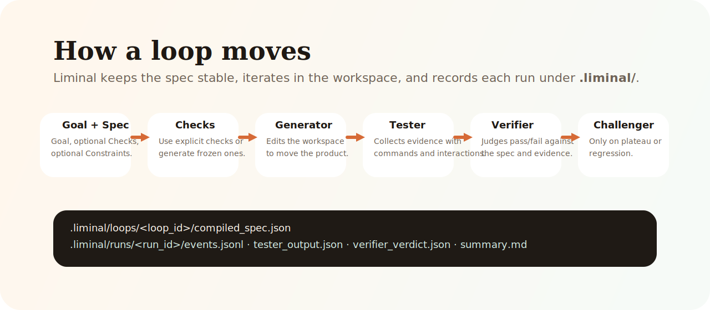

**简体中文** | [English](./README.md)

<p align="center">
  
</p>

<p align="center">
  <a href="https://www.python.org/">
    
  </a>
  <a href="https://fastapi.tiangolo.com/">
    
  </a>
  
  
</p>

<p align="center">
  Loopora 是一个面向 agentic 构建循环的本地优先编排工具。
  你给它一个 Markdown 版 <code>spec</code> 和一个工作目录，它会运行
  <strong>Generator → Tester → Verifier → Challenger</strong>
  的循环，并提供实时 Web 控制台。
</p>



## 为什么是 Loopora

- 让目标保持稳定，同时让每次 run 围绕具体 checks 持续迭代。
- 同时支持显式 checks 和探索模式下的自动生成 checks。
- 把运行产物写进 `.loopora/`，方便回放、排查和比较。
- 用本地 Web 控制台统一查看进度、控制台输出、时间线和关键产物。
- 同一套 loop 定义可以切换由 Codex、Claude Code 或 OpenCode 执行，并自动适配各自的模型/推理选项。
- 支持独立的角色定义与流程编排，让步骤级模型覆盖和角色复用都进入一等资产层。

## 它是怎么工作的



每次 run 都会先把 Markdown spec 编译成一份冻结快照，然后修改工作区、收集证据、做通过裁决；只有在停滞或退化时才会触发 Challenger。

## 功能特性

- 本地 FastAPI 控制台支持创建循环、监控运行、查看关键产物、安装 skill
- 流程编排支持步骤级模型覆盖；角色定义支持把 archetype-backed prompt 模版录入成可复用资产
- loop 支持 GateKeeper 收敛模式，也支持按最大轮数推进的 rounds 模式；非零轮次间隔可以把循环改成“每隔一段时间再跑下一轮”
- 创建循环页会记住浏览器里未提交完的草稿，并给出最近使用过的 workdir，底层 loop 模型本身不变
- 每次 run 都会产出结构化文件，例如 `compiled_spec.json`、`tester_output.json`、`verifier_verdict.json`、`events.jsonl`、`summary.md`
- CLI 支持 `run`、`serve`、`loops create`、`loops list`、`loops status`、`loops stop`、`loops rerun`、`loops delete`、`spec init`、`spec validate`
- 支持 fake executor，方便本地 smoke test 和演示
- 内置 `loopora-spec` skill，帮助你生成符合要求的 `spec.md`

## 安装

```bash
python3 -m pip install -e .
```

如果要走真实执行链路，请确保你要使用的 CLI 已经在环境里可用：

- `codex`
- `claude`
- `opencode`

## 推荐入口：Web UI

1. 如果你还没安装项目：

```bash
python3 -m pip install -e .
```

2. 启动本地 Web 控制台：

```bash
loopora serve --host 127.0.0.1 --port 8742
```

然后打开 [http://127.0.0.1:8742](http://127.0.0.1:8742)。

如果你想把 Web UI 暴露到局域网里，可以绑定公网地址，并顺手加上访问令牌：

```bash
loopora serve --host 0.0.0.0 --port 8742 --auth-token your-secret
```

然后先用 `http://<server-ip>:8742/?token=your-secret` 打开一次页面，浏览器后面就会记住这个会话。网络模式下请直接填写服务端机器上的绝对路径，因为原生文件选择弹窗会被故意禁用，避免远程操作时搞混。

3. 创建一个 spec 模板：

```bash
loopora spec init ./demo-spec.md
```

4. 把它改成具体需求：

```md
# Goal

做一个有用的英语学习网站首页。

# Checks

### 主路径清晰
- When: 新用户打开页面并尝试开始学习
- Expect: 主行动路径清楚，第一步容易开始
- Fail if: 页面意图模糊，用户不知道下一步做什么

# Constraints

- 先做前端原型
- 保留现有项目文件，优先原地小改
```

5. 在 Web UI 里创建 loop，选择工作目录和 `spec.md`，配置执行工具，然后直接启动 run。

推荐优先使用 Web UI，因为它会把实时进度、控制台输出、时间线和关键产物放在同一个界面里，排查和理解都更顺手。

## CLI 补充

如果你更习惯直接从终端启动 run，也可以继续这样用：

```bash
loopora run \
  --spec ./demo-spec.md \
  --workdir /absolute/path/to/project \
  --executor codex \
  --model gpt-5.4 \
  --max-iters 8
```

如果你想换工具，可以用 `--executor claude` 或 `--executor opencode`。其中 Claude Code 的 effort 是 `low/medium/high/max`。如果底层 CLI 参数变化更快，也可以直接在 Web UI 里切到“直接命令”模式。
现在 CLI 和 Web UI 的 loop 创建能力也已经对齐：可以用 `--executor-mode command` 和重复的 `--command-arg` 直接给出 argv 模板；如果你只想先保存 loop、不立即执行，可以用 `loops create`；如果只想先检查 spec 结构，可以用 `spec validate`。

## Spec 模型

Loopora 使用 Markdown spec，顶层结构如下：

- `# Goal` 必填
- `# Checks` 选填
- `# Constraints` 选填

如果省略 `# Checks`，Loopora 会在 run 开始时自动生成一组冻结 checks。  
如果显式提供 checks，则每条 check 应该使用 `###` 标题，并包含 `When`、`Expect`、`Fail if`。
如果目标是现有项目，建议在 `# Constraints` 里明确写出哪些内容不能动，并说明需要保留现有用户文件。

如果是长时间运行的 benchmark / evaluation loop，spec 最好把“项目自带的评估流程”写得更明确：

- `# Goal` 里写真正的成功条件，而不只是“跑一下 benchmark”；最好直接点名项目自带 harness 和停止条件。
- `# Checks` 里写可判定的结果，比如新的 score/report 产物、明确的分数阈值，或者有硬证据支撑的架构性阻塞。
- `# Constraints` 里写禁止的 shortcut、必须保留的目录，以及唯一合法的提分来源。
- 如果流程会跑很久，最好把等待期间应该观察的项目自带状态文件或报告产物写进去，这样就不会只把“控制台没输出”当成唯一信号。

## Web 控制台

本地控制台包括：

- 循环列表页：查看状态、模型、最近运行和常用操作
- 创建循环页：校验 spec、推荐最近使用过的 workdir、配置 completion mode / iteration interval，并支持恢复浏览器本地草稿
- 角色定义页：维护可复用的角色模版
- 运行详情页：实时进度、阶段说明、控制台流、时间线和关键产物
- 工具页：安装内置的 `loopora-spec` skill

## 存储结构

全局状态默认位于 `~/.loopora/`。如果需要隔离目录或适配受限环境，可以设置 `LOOPORA_HOME=/custom/path` 覆盖位置。为了平滑升级，Loopora 仍然兼容 `LIMINAL_HOME`，并且在发现已有 `~/.liminal/` 状态目录时继续沿用：

其中 `settings.json` 被视为可自愈状态：如果文件缺失、损坏、混入未知字段，或者字段值越界，Loopora 会回退到安全默认值，并在下一次加载时把文件重写成规范化后的内容。

`recent_workdirs.json` 属于 best-effort 的界面辅助状态：Loopora 只会把其中非空的路径字符串重新投影成建议项，遇到损坏内容或非字符串条目时会直接忽略。

- `app.db`
- `settings.json`
- `logs/service.log`
- `recent_workdirs.json`

项目内状态位于 `<workdir>/.loopora/`。如果老项目已经在使用 `.liminal/`，当前版本也会继续识别并复用它：

- `loops/<loop_id>/spec.md`
- `loops/<loop_id>/compiled_spec.json`
- `runs/<run_id>/events.jsonl`
- `runs/<run_id>/tester_output.json`
- `runs/<run_id>/verifier_verdict.json`
- `runs/<run_id>/iteration_log.jsonl`
- `runs/<run_id>/stagnation.json`
- `runs/<run_id>/summary.md`

## Fake Executor

如果你只是想做 smoke test 或演示，可以切换到 fake executor：

```bash
LOOPORA_FAKE_EXECUTOR=success loopora run --spec ./demo-spec.md --workdir /tmp/project
```

支持的场景：

- `success`
- `plateau`
- `role_failure`

也可以人为加一点延迟：

```bash
LOOPORA_FAKE_EXECUTOR=success LOOPORA_FAKE_DELAY=0.5 loopora serve
```

## 项目结构

- `src/loopora/`：正式产品代码、模板、静态资源、内置 skills、logo 资产
- `tests/`：解析、运行、恢复、Web 和浏览器测试
- `pyproject.toml`：打包配置、CLI 入口和测试配置

## 开发

运行测试：

```bash
python3 -m pytest -q
```
