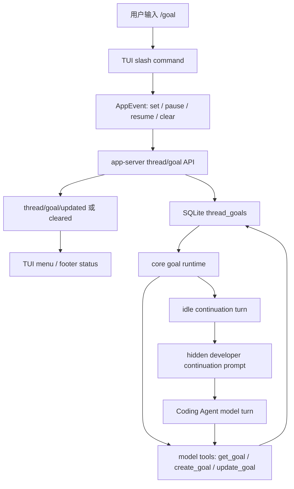

# Codex Goal Mechanism Reference

## 1. 文档定位

本文是 `agent-first-loopora.md` 的参考资料，用来记录 Codex `/goal` 机制给 Agent-first Loopora 的产品和架构启发。

本文不是 Loopora 的产品契约，不要求 Loopora 复刻 Codex 内部实现，也不把 Codex 的字段、API 或 UI 文案升格为 Loopora 的稳定边界。它只回答一个参考问题：

> 一个 Coding Agent 如何把 slash command、持久状态、受限模型工具、自动续跑 runtime 和 UI 状态面组合成“长期目标”能力？

资料基于公开 `openai/codex` 仓库源码，采样 commit 为 `9183503b972c5b7aebd58dd3cc0c69e81c0d4631`，记录日期为 2026-05-09。

## 2. 一句话结论

Codex `/goal` 不是单纯 prompt injection。它更接近：

```text
持久 thread goal + 用户/系统拥有的生命周期 + 模型可见但受限的 goal tools + runtime 自动续跑 + TUI 状态面
```

这证明了一个关键图景是可行的：

```text
用户仍从 Coding Agent 入口工作；
长期任务语义由宿主 runtime 或外部治理层持有；
模型只在受控边界内读取和回填状态；
UI 只展示和操作状态，不把聊天文本当作唯一事实源。
```

## 3. 机制总览



核心链路是：

1. `/goal` 入口只负责把用户意图转成 thread goal 状态操作。
2. app-server 把 goal 写入持久状态，并向 UI 和 runtime 广播更新。
3. core runtime 在 turn 生命周期中做计时、计 token、预算限制、暂停、恢复和自动续跑。
4. 模型通过工具读取 goal 或在确实完成时标记 complete，但不能随意暂停、恢复或伪造预算状态。
5. TUI 展示当前状态，让用户能暂停、恢复、清除或查看摘要。

## 4. 分层机制

### 4.1 Feature Flag

`/goal` 是实验能力，需要 `goals` feature 开启。源码中 `Feature::Goals` 的语义是启用持久 thread goals 和自动 goal continuation，默认未开启。

这说明 `/goal` 被设计为 runtime 能力，而不是普通命令别名。

### 4.2 Slash Command Entry

TUI 中 `/goal` 有两类入口语义：

| 用户输入 | 语义 |
| --- | --- |
| `/goal <objective>` | 设置当前 thread 的 active goal |
| `/goal` | 打开当前 goal 摘要或提示用法 |
| `/goal pause` | 暂停当前 goal |
| `/goal resume` | 恢复当前 goal |
| `/goal clear` | 清除当前 goal |

slash command 自身不完成长期任务，也不靠自然语言提醒模型“你要继续”。它只进入 app event / app-server / state 这条正式状态通道。

### 4.3 Persistent Thread Goal

Codex 为每个 thread 持久化一个 goal。状态表包含：

| 字段 | 语义 |
| --- | --- |
| `thread_id` | goal 绑定的 thread |
| `goal_id` | 当前逻辑 goal 的标识 |
| `objective` | 用户给出的目标 |
| `status` | `active`、`paused`、`budget_limited`、`complete` |
| `token_budget` | 可选 token 预算 |
| `tokens_used` | 已计入 goal 的 token |
| `time_used_seconds` | 已计入 goal 的运行时间 |
| `created_at_ms` / `updated_at_ms` | 生命周期时间戳 |

这个状态不依赖模型记忆。thread 恢复、UI 重绘、runtime 续跑都以持久状态为事实源。

### 4.4 App-Server API

app-server 暴露实验 API：

| API | 语义 |
| --- | --- |
| `thread/goal/set` | 设置 objective、status 或预算 |
| `thread/goal/get` | 读取当前 thread goal |
| `thread/goal/clear` | 清除当前 thread goal |
| `thread/goal/updated` | goal 更新通知 |
| `thread/goal/cleared` | goal 清除通知 |

这层把 UI 操作、运行中 thread、状态数据库和通知顺序连接起来。关键点不是 API 名称，而是 goal 状态被一个 runtime-facing 服务边界管理，而不是散落在聊天消息中。

### 4.5 Model Tools

core 给模型暴露三个 goal tools：

| Tool | 模型能力 |
| --- | --- |
| `get_goal` | 读取当前 goal、状态、预算、已用 token 和时间 |
| `create_goal` | 仅在用户或系统明确要求时创建新 goal；已有 goal 时失败 |
| `update_goal` | 只能把现有 goal 标记为 `complete` |

最重要的约束是：模型不能通过 `update_goal` 暂停、恢复或设置 budget-limited。暂停、恢复、预算耗尽和清除属于用户或系统/runtime 权限。

这是一条很强的设计信号：

```text
模型可以声明“目标完成”；
但模型不能拥有整个生命周期控制权。
```

### 4.6 Core Runtime

core runtime 负责把 thread goal 变成持续工作的系统行为。它观察 turn 生命周期事件，例如：

| Runtime event | 语义 |
| --- | --- |
| turn started / finished | 开始或结束一次模型回合，做用量基线和结算 |
| tool completed | 工具完成后更新 token accounting，并检查预算 |
| maybe continue if idle | 当没有用户输入或其他待处理工作时，启动下一次 continuation turn |
| task aborted | 中断时暂停 active goal |
| external set / clear | UI 或 app-server 修改 goal 时同步 runtime |
| thread resumed | 恢复 thread 后重新装载 goal runtime 状态 |

自动续跑不是模型自己“记得继续”，而是 runtime 在空闲条件满足时发起新的 turn，并注入 hidden developer continuation prompt。

续跑会被这些情况抑制：

| 情况 | 原因 |
| --- | --- |
| Plan mode active | 规划模式不自动执行 continuation |
| 已有 active turn | 避免并发续跑 |
| 用户输入排队中 | 用户输入优先于自动续跑 |
| trigger mailbox 有待处理输入 | 避免插队 |
| ephemeral thread | 没有稳定持久线程时不续跑 |
| 没有 active goal | 无目标不续跑 |

### 4.7 Hidden Continuation Prompt

当 runtime 决定继续 active goal 时，它注入一个 hidden developer prompt。这个 prompt 的核心不是“继续努力”，而是要求模型做 completion audit：

| 要求 | 作用 |
| --- | --- |
| 将 objective 拆成具体交付物或成功标准 | 防止目标漂移 |
| 把每项要求映射到文件、命令、测试、PR 状态等真实证据 | 防止只凭叙事判断完成 |
| 检查 manifest、verifier、测试套件是否真的覆盖 objective | 防止代理信号冒充完成 |
| 把不确定视为未完成 | 防止提前 complete |
| 只有真正完成且无剩余工作时才能调用 `update_goal complete` | 保持完成状态可信 |

这里与 Loopora 的目标很接近：长期任务不能只靠模型自信，必须把完成判断落到证据。

### 4.8 Budget Limit Steering

如果 goal 达到 token budget，runtime 会把状态推进到 `budget_limited`，并注入预算限制 steering prompt。

预算限制时，模型被要求停止新实质工作，尽快总结进展、剩余工作和阻塞。模型仍然不能因为预算耗尽就调用 `update_goal complete`，除非目标确实已完成。

这体现了另一个稳定原则：

```text
预算耗尽是运行约束，不是完成证据。
```

### 4.9 TUI Status Surface

TUI 负责把 goal 状态投影到用户可见表面：

| 状态 | 用户可见语义 |
| --- | --- |
| active | 正在 pursuing goal，可显示 token 或时间用量 |
| paused | goal 暂停，可提示 resume |
| budget-limited | goal 未达成但预算耗尽 |
| complete | goal achieved |

bare `/goal` 可以展示摘要和可用控制命令。恢复已暂停 thread 时，TUI 可以提示用户是否 resume paused goal。

## 5. 权限边界

Codex `/goal` 最值得借鉴的是权限拆分，而不是具体字段。

| 动作 | 权限拥有者 | 设计意义 |
| --- | --- | --- |
| 创建或替换用户目标 | 用户入口 / app-server；模型仅在明确要求时可创建 | 避免普通任务被模型擅自升级成 goal |
| 暂停、恢复、清除 | 用户或系统 | 生命周期控制不交给模型 |
| 预算计量与 budget-limited | runtime | 防止模型伪造成本与停止条件 |
| 标记 complete | 模型可调用受限工具 | 让模型能结束任务，但必须通过 runtime 记录 |
| 自动续跑 | runtime | 防止依赖模型自我提醒 |
| 状态展示 | UI 订阅状态通知 | 避免把聊天文本当作唯一状态源 |

## 6. 对 Agent-First Loopora 的启发

Codex `/goal` 给 Loopora 的直接启发是：

1. Slash command 应是入口，不应承载全部语义。
2. 长期任务状态必须在 Loopora CLI/Core 中持久化，而不是只藏在宿主 Agent 对话里。
3. 宿主 Agent 可以是执行主体，但 Loopora 必须拥有 Loop 生命周期、证据、裁决和上下文注入的事实源。
4. 模型可见接口应是受限工具或受限动作：可以读当前上下文、提交 handoff/evidence/verdict，但不能任意改写生命周期。
5. 自动推进应由 Loopora runtime 决定，再把当前 Loop 上下文胶囊注入 Coding Agent。
6. Web 应订阅同一份 Loopora 状态，而不是从 Agent 输出文本里还原状态。
7. 用户输入、暂停、阻断和专家修改必须优先于自动续跑。

用 Loopora 的语言改写就是：

```text
Codex /goal = persisted objective + continuation runtime
Loopora agent-first = persisted Loop protocol + context capsule + evidence ledger + verdict governance
```

## 7. 可以借鉴与不应照搬

| 可以借鉴 | 不应照搬 |
| --- | --- |
| slash command 只做入口和状态操作 | 把 Loopora 降级成一个 `/goal` 风格的单 objective |
| 状态由 runtime / Core 持有 | 把宿主聊天上下文当唯一事实源 |
| 模型工具只暴露受限动作 | 让模型随意改写 Loop、workflow、evidence 或 verdict |
| 自动续跑由 runtime 在 idle 时触发 | 让模型靠自然语言承诺“我会继续” |
| 用户输入优先于 continuation | 自动 loop 抢在用户修改 bundle 或阻断之前执行 |
| budget-limited 与 complete 分离 | 把运行约束、失败、完成裁决混成一个状态 |
| UI 订阅状态通知并展示摘要 | 让 Web 或 CLI 解析 Agent 文本来猜状态 |

## 8. 与 Loopora 图景的差异

Codex `/goal` 是一个很好的参考，但它比 Loopora 轻很多：

| 维度 | Codex `/goal` | Agent-first Loopora |
| --- | --- | --- |
| 任务结构 | 一个 objective | bundle / spec / roles / workflow / evidence |
| 生命周期 | active / paused / budget-limited / complete | gen / READY / running / blocked / verdict 等更丰富投影 |
| 执行主体 | Codex 自身 | 宿主 Coding Agent |
| 编排深度 | 自动续跑同一个目标 | 多 step、多 role posture、多轮 evidence-backed Loop |
| 证据模型 | continuation prompt 要求 audit | 独立 evidence ledger、artifact refs、coverage、GateKeeper verdict |
| UI | TUI 状态与菜单 | Web 观察台、专家编辑器、历史与控制台 |
| 运行前审查 | `/goal <objective>` 可直接开始 | 必须 `/loopora-gen` 后再 `/loopora-loop` |

所以，Codex `/goal` 对 Loopora 的价值不是提供一个可直接复制的方案，而是证明：

```text
Agent-first 长期任务治理不能只做 prompt。
它需要 runtime-owned state、受限模型工具、续跑调度、状态 UI 和用户控制权。
```

## 9. 参考源

- OpenAI Codex public repo: <https://github.com/openai/codex>
- Sampled commit: <https://github.com/openai/codex/tree/9183503b972c5b7aebd58dd3cc0c69e81c0d4631>
- Feature flag: <https://github.com/openai/codex/blob/9183503b972c5b7aebd58dd3cc0c69e81c0d4631/codex-rs/features/src/lib.rs>
- Persistent state: <https://github.com/openai/codex/blob/9183503b972c5b7aebd58dd3cc0c69e81c0d4631/codex-rs/state/migrations/0029_thread_goals.sql>
- App-server protocol: <https://github.com/openai/codex/blob/9183503b972c5b7aebd58dd3cc0c69e81c0d4631/codex-rs/app-server-protocol/src/protocol/common.rs>
- App-server goal processor: <https://github.com/openai/codex/blob/9183503b972c5b7aebd58dd3cc0c69e81c0d4631/codex-rs/app-server/src/request_processors/thread_goal_processor.rs>
- Model tool specs: <https://github.com/openai/codex/blob/9183503b972c5b7aebd58dd3cc0c69e81c0d4631/codex-rs/core/src/tools/handlers/goal_spec.rs>
- Core runtime: <https://github.com/openai/codex/blob/9183503b972c5b7aebd58dd3cc0c69e81c0d4631/codex-rs/core/src/goals.rs>
- Continuation prompt: <https://github.com/openai/codex/blob/9183503b972c5b7aebd58dd3cc0c69e81c0d4631/codex-rs/core/templates/goals/continuation.md>
- Budget limit prompt: <https://github.com/openai/codex/blob/9183503b972c5b7aebd58dd3cc0c69e81c0d4631/codex-rs/core/templates/goals/budget_limit.md>
- TUI slash dispatch: <https://github.com/openai/codex/blob/9183503b972c5b7aebd58dd3cc0c69e81c0d4631/codex-rs/tui/src/chatwidget/slash_dispatch.rs>
- TUI goal actions: <https://github.com/openai/codex/blob/9183503b972c5b7aebd58dd3cc0c69e81c0d4631/codex-rs/tui/src/app/thread_goal_actions.rs>
- TUI footer status: <https://github.com/openai/codex/blob/9183503b972c5b7aebd58dd3cc0c69e81c0d4631/codex-rs/tui/src/bottom_pane/footer.rs>
- PR stack: <https://github.com/openai/codex/pull/18073>, <https://github.com/openai/codex/pull/18074>, <https://github.com/openai/codex/pull/18075>, <https://github.com/openai/codex/pull/18076>, <https://github.com/openai/codex/pull/18077>
