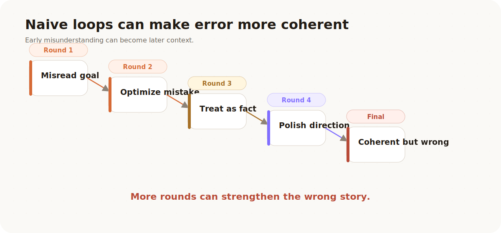
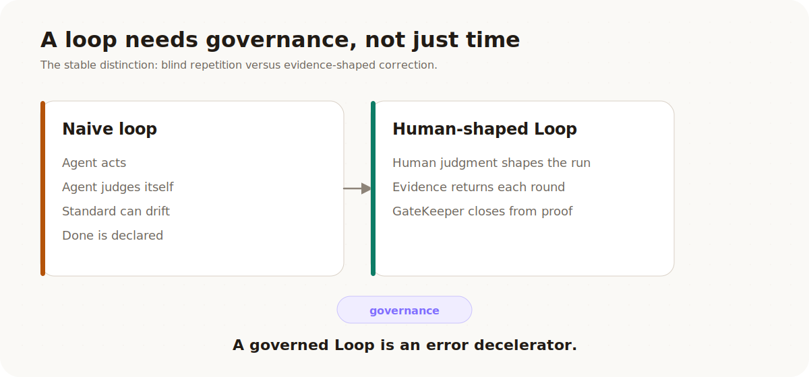
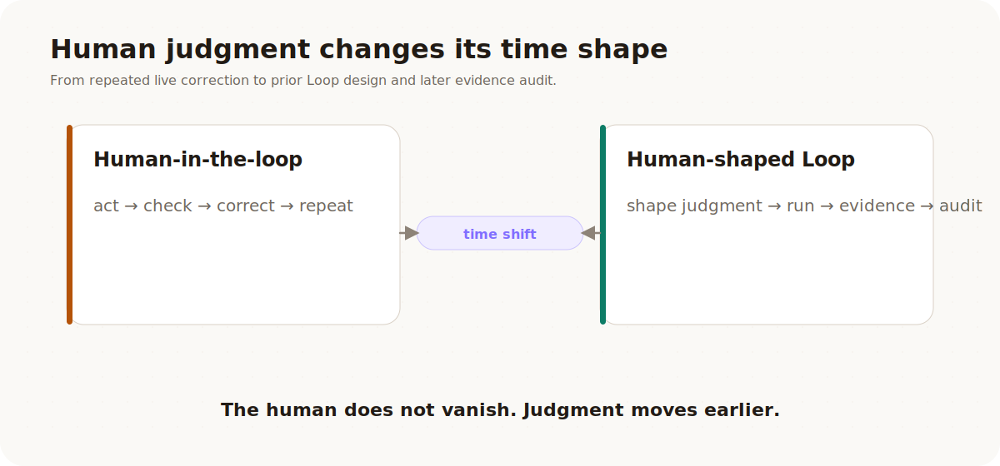
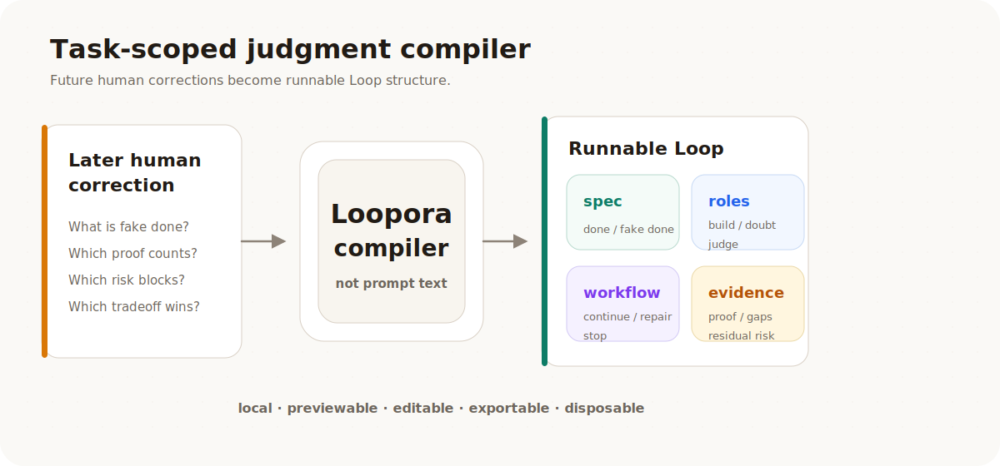
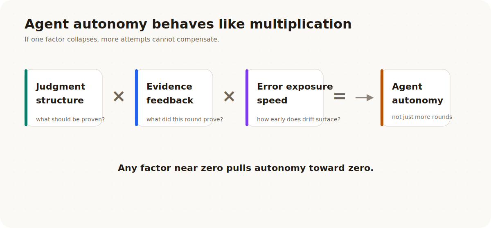
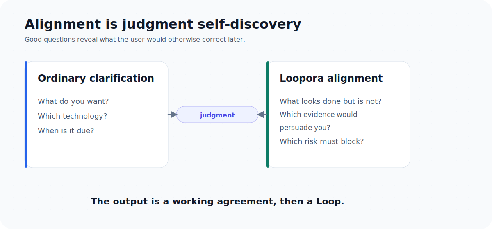

# Human-Shaped Loop: Loopora's Judgment Philosophy

[简体中文](./human-shaped-loop.zh-CN.md) | **English**

Loopora starts from a very ordinary desire: laziness.

The dream is simple. Before work, you give an Agent a long task. When you come back later, the task is mostly done. It may have some error, but not too much. It may leave residual risk, but it should not package unproven work as done.

That kind of laziness is not about cutting corners. What we want to save is not human judgment itself. We want to save the repeated moments where humans are pulled back into a long task to make the same kind of judgment again.

To see the problem, start with a real business-shaped task.

## 1. A Task That Looks Perfect For An Agent

Imagine a B2B SaaS company with too many support tickets about refunds.

The team wants a self-service refund flow. A customer admin should be able to open the billing page, see whether an order is eligible, request a refund, and get a clear result. If something is risky, the flow should hand off to support.

This sounds like a good Agent task:

- there is a product surface to build
- there are business rules to encode
- there are tests to add
- there are edge cases to discover
- there is enough work that one pass may not be enough

So the user says:

> Build a refund self-service flow. Make it safe, test it, and iterate until it is ready.

The first round comes back looking promising. There is a page, a form, a status message, some mocked eligibility logic, and a few tests. The Agent says the core flow is done.

But a human reviewer cannot just ask whether the page exists. The real questions begin now:

- What did this round actually prove?
- Is the result truly done, or only locally plausible?
- Did the Agent quietly switch to an easier acceptance standard?
- Did it hack around a test instead of solving the real problem?
- Should the next round continue, stop, narrow scope, or change direction?
- Can I trust this evidence?
- Is this residual risk acceptable?

That list is the hidden tax of Agent work.

The tiring part is not telling the Agent what to do. The tiring part is returning after every meaningful round to judge what happened.

If a human must answer those questions after every round, Agent autonomy gets stuck. The Agent can run longer, but the human is still the live governance layer.

Loopora asks whether those future corrections, doubts, evidence demands, acceptance calls, and blockers can move earlier.

Can they become the shape of the run before the run starts?

That is a human-shaped Loop.

## 2. Round Two: The Wrong Story Gets Better

Suppose the human says: continue, make it more complete.

The second round improves the UI, adds nicer confirmation states, expands the mock data, and adds tests around the happy path. The result looks more product-like than before.

But the business risk has barely moved.

The flow still has not proved that only authorized admins can request a refund. It has not shown what happens when an order is partially refunded, disputed, outside the refund window, or tied to an invoice that accounting has already closed. It has not shown what happens when the payment provider fails after the app has already recorded the request. It has not shown whether the audit log is enough for support, finance, or compliance to reconstruct what happened.

The Agent did not fail by doing nothing. It failed in a more dangerous way: it made the wrong completion story more coherent.

A simple loop extends time. If there is no governance structure, early error can be inherited, amplified, and rationalized by later rounds.

<p align="center">
  
</p>

Many systems already extend Agent work with loops: `/goal`, ralph-loop, repeated Agent calls, self-review, checklists, and similar harnesses.

Those methods are useful. They work especially well when the task has clear external validation:

- a benchmark can score the result
- a contract test can pass or fail
- schema, lint, or type checks can give hard feedback
- a proof harness can repeatedly verify the same thing

When judgment has already been externalized into those tools, a simple loop can be enough. The Agent keeps trying, and the external proof path corrects it.

The refund flow is harder because the judgment is not one stable score. Tests matter, but passing a happy-path test does not prove the business flow is safe. A nice UI matters, but polish can hide the fact that refund authorization, auditability, provider failure, and support handoff remain unproven.

The important difference is not whether there is a loop. The important difference is whether the loop has governance.

> A loop without governance is a blind box. A governed Loop is an error decelerator.

Loopora does not promise to eliminate error. Long tasks accumulate error. The goal is to slow that accumulation, expose error earlier, make false completion harder, and give later rounds a better chance to correct course.

<p align="center">
  
</p>

## 3. What The Human Was Really Supplying

When the human rejects the second round, the useful correction is not only:

> This is not ready.

The useful correction is the judgment behind that sentence.

For the refund flow, the human is really saying something like this:

| Human concern | Task-shaped judgment |
| --- | --- |
| A page and a form are not enough | Real completion means an eligible refund can move through the business path safely |
| A mock happy path is not enough | Trusted evidence must cover authorization, eligibility, provider behavior, audit trail, and support handoff |
| More UI polish may be a distraction | A rough but proven path is better than a polished unproven path |
| Some gaps can remain visible | A payment-provider edge case may be acceptable if it is documented and handed off |
| Some gaps must block | Unauthorized refunds, missing audit trails, and double refunds must stop the run |

That is not a checklist of implementation details. It is a local ordering of tradeoffs.

In other tasks, the same kind of judgment sounds different:

- A has fewer features, but the path is real. B looks complete, but the core loop does not work. A is closer to done.
- The UI is polished, but the learner cannot complete one learning cycle, so the result must be rejected.
- The refactor passes tests, but it only moved complexity into another module, so it should not count as good.
- The bug disappeared on the surface, but the root cause was not proven, so the run should not close.
- This residual risk is acceptable because it is visible and has a follow-up path.
- That residual risk must block because it affects permissions, safety, a core journey, or a public contract.

This kind of judgment is not a scalar. It is closer to an ordering of tradeoffs:

- a real loop is better than a polished fake
- strong evidence is better than optimistic narrative
- visible residual risk is better than hidden risk
- a correct but unfinished direction may be better than a locally complete wrong direction
- maintainable slow progress may be better than brittle fast passing

This is hard to benchmark, but it can be structured.

## 4. The Core Move: Move Future Correction Earlier

Loopora is easiest to misunderstand if we start from implementation.

It is not "a better retry loop." It is not "more roles." It is not "a bigger prompt." It is not "an Agent that runs longer."

The deeper move is a time shift:

> Move future human correction before execution, then make it runnable.

In ordinary human-in-the-loop work, humans participate after the Agent has already produced an intermediate result. They correct the task direction, reject weak evidence, ask for a different proof path, or decide whether the risk is acceptable.

Loopora asks: can those future corrections be anticipated? Can the human explain, before the run starts, what kind of result would be fake, which evidence would be trusted, which tradeoffs matter, and which risks must block?

If yes, that judgment can become the shape of the loop.

<p align="center">
  
</p>

This is why "human-shaped Loop" is more precise than "human before the loop." The human is not merely giving instructions earlier. The human is shaping the runtime structure that decides how the Agent moves, observes, repairs, and stops.

## 5. The Refund Story As A Human-Shaped Loop

Now replay the refund task with this judgment moved earlier.

Before the run starts, the user does not need to write a giant workflow spec. But the system should help the user expose the judgments that would otherwise appear later as corrections:

- **Real completion**: an authorized customer admin can request an eligible refund, the system records the decision, and the result can be traced by support or finance.
- **Fake completion**: pages, buttons, mock eligibility, and happy-path tests exist, but refund safety is not proven.
- **Trusted evidence**: permission checks, eligibility cases, payment-provider behavior, audit records, and support handoff artifacts.
- **Blocking risks**: unauthorized refunds, double refunds, missing audit trails, silent provider failure, or a broken core billing journey.
- **Acceptable residual risks**: a rare provider edge case, a deferred accounting export, or a manually handled support exception, but only if visible and assigned.

Those judgments can become a Loop:

- the Builder implements toward the refund business path, not merely toward a screen
- the Inspector tries to prove or disprove authorization, eligibility, auditability, provider failure, and handoff
- a repair round uses that evidence to narrow the next change
- the GateKeeper can only close from evidence, or from an explicit residual-risk verdict

The human is not supervising every click. The human has shaped what the loop must treat as real, fake, persuasive, risky, and blocking.

Loopora maps that judgment into four surfaces:

| Surface | Beginner meaning | Refund-flow example |
| --- | --- | --- |
| `spec` | What this task must prove, and what should not count as done | Safe refund path, fake-done risks, blocking business failures |
| `roles` | Who builds, who doubts, who gathers evidence, who judges | Builder, Inspector, optional repair Guide, GateKeeper |
| `workflow` | The order of judgment, and when the run continues or stops | Build -> inspect evidence -> repair -> final evidence verdict |
| `evidence` | The proof, gaps, blockers, and residual risks left by each round | Permission results, eligibility cases, audit trace, provider failure notes |

Users should not need to hand-write these surfaces at the start. The default path should be: describe the task, answer a few Loop-shaping questions, confirm the Loop, run it, and inspect evidence.

Advanced fields, parallel Inspectors, evidence routing, workflow controls, and bundle YAML all serve the same purpose: making human judgment actually constrain the Agent instead of remaining prompt text.

<p align="center">
  
</p>

## 6. A Multiplication Formula For Agent Autonomy

One useful, imprecise formula for Loopora is:

```text
Agent autonomy
≈ judgment structure quality × evidence feedback quality × error exposure speed
```

The refund story shows why these variables multiply.

If judgment structure is poor, the Agent does not know that refund safety is the real target. More evidence may simply prove that the wrong screen works.

If evidence feedback is weak, a beautiful workflow becomes role theater. GateKeeper can only pass by intuition.

If error exposure is slow, long tasks turn early drift into later context. The longer the loop runs, the more coherent the wrong story becomes.

Loopora tries to improve:

- **Judgment structure quality**: does the system know how this task should be judged, what counts as real completion, what counts as fake completion, which risks are acceptable, and which risks must block?
- **Evidence feedback quality**: does each round leave evidence that is strong, traceable, and close to the task goal, rather than only natural-language summary?
- **Error exposure speed**: when the direction is wrong, evidence is weak, standards drift, or the result is fake done, can Inspectors, GateKeeper, benchmarks, artifacts, or review surfaces expose that early?

<p align="center">
  
</p>

These variables behave more like multiplication than addition. If any one of them approaches zero, autonomy collapses.

So Loopora is not a tool for "more rounds." Its goal is to make each round less self-deceptive: judgment is shaped first, evidence flows back, and error surfaces sooner.

Another way to say it:

> Benchmarks let Agents optimize answers. Loopora lets Agents inherit part of human judgment.

When judgment can already be expressed by a benchmark, Loopora should respect that benchmark and pin the evidence path around it. When judgment cannot yet be scored reliably, Loopora should turn it into a judgment protocol: what has priority, what blocks, which evidence is trusted, and which residual risks may be accepted only after they are visible.

## 7. Loopora Is A Task-Scoped Judgment Compiler

Loopora can be described as:

> a task-scoped judgment compiler.

It takes the user's implicit judgment for the current task and compiles it into a Loop that can run, observe, and decide.

There are two important words here.

The first is **task-scoped**. Loopora is not trying to learn a permanent user personality. Judgment for one task is often local, temporary, and debatable:

- This refund flow must be conservative. That does not mean every product task should be conservative.
- This prototype can accept visual roughness. That does not mean all prototypes can.
- This benchmark is trustworthy. That does not mean all benchmarks are trustworthy.
- This residual risk is acceptable here. That does not make it a global preference.

Those judgments should not silently disappear into model weights. They should not become a permanent personality memory. They belong in the Agent harness or Loop layer: explicit, local, previewable, editable, exportable, and disposable.

> The model learns general capability. The Loop learns how this task should be judged.

The second word is **compiler**. Loopora is not only asking the user for preferences, and it is not merely writing those preferences into a prompt. Prompts can be forgotten, diluted by context, or interpreted as tone instead of runtime constraint.

Loopora compiles judgment into a runnable structure:

- the task contract says what counts as done and what counts as fake done
- the roles separate building, doubting, evidence gathering, and judging
- the workflow decides when judgment happens, when the run continues, and when it stops
- the evidence records what each round proved and failed to prove

That is why Loopora is not a YAML generator. YAML is just the exchange format. The important thing is the judgment structure behind it.

## 8. Why The Loop Layer Should Learn This

It is tempting to ask: if judgment matters so much, why not teach it to the model?

The answer is that these are different kinds of learning.

Models should learn general capability: language, code, planning, tool use, reasoning patterns, and broad taste. That learning should be reusable across users and tasks.

Loopora learns something narrower and more situated: how this task should be judged this time.

That judgment often has properties that make it a poor fit for model weights:

| Property | Why the Loop layer fits better |
| --- | --- |
| Local | The right judgment for one task may be wrong for another task |
| Temporary | A project can need strictness today and exploration tomorrow |
| Debatable | The user may revise the judgment after seeing examples |
| Auditable | The team should inspect what rule closed the run |
| Reversible | Bad judgment should be editable or discarded, not buried |
| Evidence-bound | The rule should connect to artifacts and verdicts, not only style |

This is also a governance boundary. If the model "learns" a user's task judgment invisibly, the user loses ownership. If the Loop learns it, the user can preview it, edit it, export it, reuse it, or throw it away.

The Agent becomes more autonomous not because the human vanished, but because the human's local judgment has become part of the execution environment.

## 9. Alignment Helps Users Discover Their Own Judgment

One of Loopora's core mechanisms is the alignment conversation.

But this is not ordinary requirement clarification.

Ordinary clarification asks:

- What do you want to build?
- Which technology should be used?
- When is it due?

Loopora alignment asks:

- Which result would look done but still be unacceptable?
- Which evidence would actually persuade you?
- Between two imperfect outcomes, which one would you reject?
- Are you more afraid of moving slowly or shipping something sloppy?
- Would a strict GateKeeper block the exploration you want?
- Would a pragmatic GateKeeper let fake done slip through?

This helps users discover their own judgment. Users do not need to name every rule up front. Loopora uses cases and contrasts to make judgment visible.

<p align="center">
  
</p>

Good alignment should not rush to produce configuration. It should first form a working agreement:

- What is this task trying to accomplish?
- What counts as real progress?
- What is fake done?
- Which evidence does the user trust most?
- How should roles split responsibility?
- Why does this workflow shape fit?
- Which residual risks are acceptable?
- Which blockers must stop the run?

Only then should the working agreement compile into a Loop that can be previewed, run, and judged through evidence.

## 10. Which Tasks Actually Fit Loopora

It is not accurate to say that "creative work, prototypes, refactors, debugging, and fuzzy alignment all fit Loopora." That is too broad.

Task category is not the deciding factor. The deciding factor is whether the task contains human judgment worth externalizing, and whether another round will produce new evidence.

A better fit test is:

1. **Would a human keep returning after key rounds to judge the result?**  
   If one Agent pass plus one human review is enough, skip Loopora.

2. **Will the next round create new evidence?**  
   If the next round only lets the model continue a story without new proof, artifacts, handoffs, observations, or verdict context, do not open a Loop.

3. **Is the judgment hard to reduce to one stable benchmark?**  
   If it can be benchmarked cleanly, use the benchmark first. Loopora can govern the benchmark path, but it should not replace simple proof.

4. **Is there a fake-done risk?**  
   Loopora is more useful when a result can look done while the core loop, root cause, contract, evidence, or risk posture is not actually solid.

5. **Should the judgment survive one chat?**  
   If the judgment is only needed once, direct chat may be enough. If it should be inherited by a run, tested with evidence, exported, or reused, it may deserve a Loop.

6. **Can the system expose drift if the Loop goes wrong?**  
   Without Inspectors, GateKeeper, external evidence, or auditable artifacts, a Loop can still become longer drift.

With that lens, many scenarios are sometimes good fits and sometimes not:

| Scenario | Usually skip Loopora | Better fit for Loopora |
| --- | --- | --- |
| Creative emergence | You only need raw ideas | You need multi-round exploration and judgment about novelty, feasibility, style, or anti-cliche direction |
| Product prototype | You need a one-off demo or sketch | You need to block "pretty but not real" and let evidence drive the next round |
| Architecture refactor | The scope is small and one review is enough | The work needs repeated tradeoffs across contract, structure, regression, and residual risk |
| Debugging / root cause | The bug is clear and directly fixable | Symptoms are mixed, the wrong layer is easy to chase, and evidence should precede action |
| Fuzzy alignment | You only need short clarification | The clarified judgment should be inherited and tested by a long-running task |

Loopora is not for "all complex tasks." It is for long tasks where human judgment would repeat, evidence changes across rounds, and fake completion is worth blocking.

## 11. What Loopora Must Refuse

To preserve this paradigm, Loopora must keep rejecting several easy distortions:

- It is not a prompt pack. Longer prompts do not replace runtime evidence.
- It is not a role zoo. More roles without distinct evidence responsibility only add theater.
- It is not a loop script. Repeating commands does not mean judgment is governed.
- It is not a benchmark grinder. Benchmarks are strong proof paths, not the whole product.
- It is not a long-term personality memory system. Task-scoped judgment should not become a global personality rule.
- It is not a general chat interface. Chat is only one way to obtain or revise a Loop.
- It is not a wrapper that lets the Agent declare itself done. GateKeeper must return to evidence.

Loopora can become more powerful, but it must preserve this boundary: it serves "compose Loop -> run Loop -> automatic iteration with evidence -> run status, task verdict, and result." It should not drift into a generic automation platform.

## 12. The Larger Direction

The future of AI collaboration will not only be about making models smarter.

Models will keep improving, but complex work will still need human judgment:

- what is worth doing
- what counts as truly done
- whether evidence is trustworthy
- whether risk is acceptable
- when to continue, stop, or change direction

The higher-order collaboration pattern is not to bring humans back for every step, and not to pretend humans can disappear. It is to let human judgment participate in a better time shape.

Human-in-the-loop puts humans inside the execution process.

Human-shaped Loop turns human judgment into the shape of the execution process.

Loopora's long-term direction is to let more tasks use this pattern when it fits:

- for quantifiable tasks, pin the evidence path
- for tasks that cannot be fully quantified, surface the judgment structure
- for long tasks, slow error propagation
- for users, move future corrections earlier
- for Agents, turn "how to judge" from prompt text into runnable governance

In one sentence:

> Loopora is not about making Agents do more rounds. It is about helping Agents avoid self-deception by running inside a Loop that inherits human judgment.

That is the human-shaped Loop.
