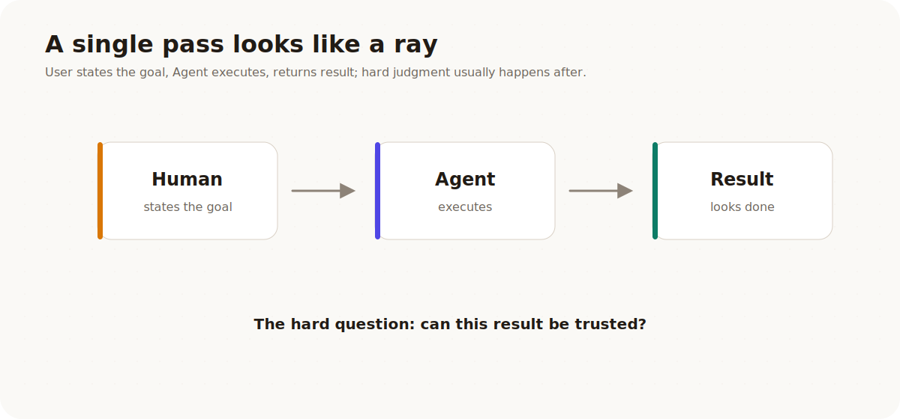
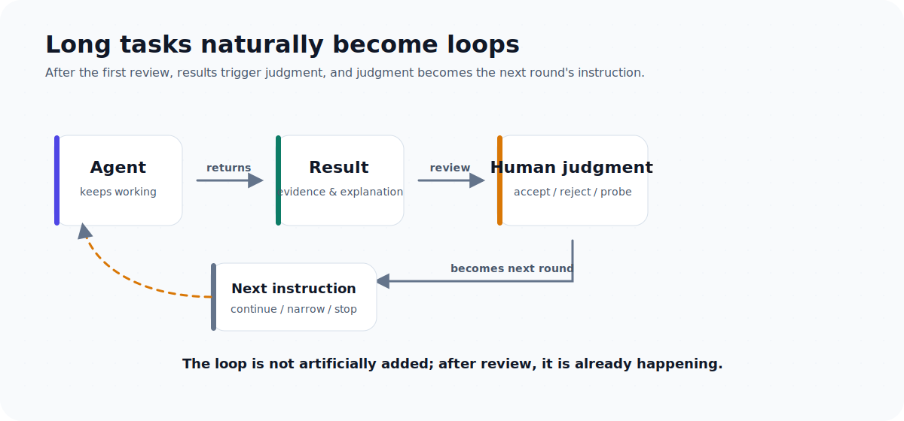

# Human-Shaped Loop: Loopora's Judgment Philosophy

[简体中文](./human-shaped-loop.zh-CN.md) | **English**

Loopora starts from a very ordinary desire: laziness.

More precisely, it's the unwillingness to sit at your desk, wait for an Agent to finish one round, point out what's wrong, and nudge it to fix it.

The ideal is simple: before work, you hand a long task to an Agent. When you come back, the result is mostly there. It should do a bit more on its own, consider a few more edge cases. It can have error, but it shouldn't drift too far. It can leave residual risk, but it must not package unproven work as done.

The "laziness" here is not about avoiding judgment. It's about not making the same kind of judgment a dozen times over.

What we actually want to save are those recurring moments in a long task when a human has to come back, round after round, to correct, verify, accept, or block.

To understand this, don't start with Loopora. Start with a story.

## 1. A Case Study: Looks Done, Still Can't Ship

### 1.1 A Task That Looks Perfect For An Agent

Imagine a B2B SaaS company whose support team is drowning in refund tickets.

The team decides to build a self-service refund flow: a customer admin opens the billing page, sees whether an order is eligible, submits a refund request, and gets a clear result. If an order looks risky, the flow hands it off to support.

This sounds like a good fit for a Coding Agent:

- there is a product surface to build.
- there are business rules to encode.
- there are tests to add.
- there are edge cases to discover.
- there is enough work that one pass may not be enough.

So the user says:

> Build a self-service refund flow: a customer admin can request refunds for eligible orders from the billing page; risky orders go to support. Make it safe, add tests, iterate until it's ready to ship.

### 1.2 Round One Returns a Page, a Form, and Some Tests

The first round looks promising: a page, a form, a status message, a few mocked eligibility rules, and passing happy-path tests.

The Agent says:

> Done! I've achieved the goal!

Open the app and you see a polished interface, buttons that look clickable, and a workflow that looks legitimate.

If this were just a demo, the story might end here.

But if this is supposed to ship as a real product, the real problems are only beginning.

### 1.3 The Gaps Hide Behind the Surface

At first glance, the result looks complete. The page is there, the buttons are there, the flow runs.

But treat it as a real product, and the gaps surface quickly:

- It doesn't prove that only authorized customer admins can request refunds.
- The eligibility check is just mocked rules, not a reliable business path.
- Happy-path tests pass, but partial refunds, disputed orders, chargebacks, refunds past the window, and closed accounting periods are not covered.
- It doesn't say what happens when the payment provider fails: how the system records it, what the ledger state is, and how support takes over.
- It doesn't prove that the audit log is enough for support, finance, or compliance to reconstruct what happened.

Now the human reviewer is not facing an abstract problem. They are facing a concrete shipping decision: can we ship this?

The answer is no.

### 1.4 Round Two Looks More Product-Like, and the Real Problems Are Harder to Spot

So the human says:

> Not ready. Prove authorization, eligibility, payment failure, and the audit trail first. Only then polish the UI.

Round two adds richer confirmation states, expands mock data, adds more happy-path tests, and improves the UI. The result looks more like a product than before.

But the business risk has barely moved. Many edge cases are still unconsidered:

The flow still doesn't prove that only authorized admins can request refunds. It doesn't say what happens when an order is partially refunded, disputed, charged back, past the refund window, or tied to an invoice that accounting has already closed. It doesn't say what happens when the payment provider fails after the app has already recorded the request. It doesn't prove that the audit log is enough for support, finance, or compliance to reconstruct what happened.

The Agent didn't "do nothing." It did a lot: a more complete page, more states, more tests.

The problem is right here: it polished a completion story that couldn't stand on its own. The danger didn't go away. It just hid behind a more product-like interface and a more confident summary.

### 1.5 The Completion Illusion After More Rounds

If the human doesn't spot these issues and lets the Agent keep running in this direction, it may not suddenly go off the rails. Instead, each round "reasonably" drifts a little further off.

Round one treats "the page submits" as the core completion. Round two polishes the UI along the same misunderstanding. Round three adds more tests, still around the easy happy path. In the end, the result looks more complete, but refund safety is still unproven.

By round three, the Agent may add more page states, more confirmation copy, more happy-path tests. By round four, it may start refactoring code, adding a README, and writing a prettier final summary.

The result looks more and more like a real feature. But on safety, it still hasn't produced enough evidence.

Let's pause the story here. This is not because the Agent isn't diligent, or because we didn't run enough rounds. It's because long Agent workflows hit a deeper bottleneck.

**That bottleneck is not the loop itself, but the missing judgment structure inside it that the Agent can inherit.** Without that structure, more rounds only repeat the same error.

## 2. The Problem Is Not the Loop, but the Missing Judgment Inside It

### 2.1 When Does a Straight Line Become a Loop?

Look back: before round one, things really were a straight line. The user states the goal, the Agent executes, the result comes back.

<p align="center">
  
</p>

But as soon as the first result needs human review, that straight line closes. The first result triggers human judgment; human judgment becomes the second round's instruction; the second result triggers new judgment, which becomes the third round's instruction. From the first review onward, a long Agent task naturally becomes a loop:

<p align="center">
  
</p>

So the question is not "should we loop?" Loops are already built into long Agent workflows.

The real question is: inside this loop, where must human judgment sit, and where can the Agent run autonomously?

### 2.2 When Humans Step Away, Standards Drift

In ordinary loops, judgment lives in the human's live review of each round. When the human steps away or gets distracted, the Agent fills that gap with its own easier-to-meet standard. It keeps working, keeps explaining why it's doing well, but it's no longer advancing along the standard the human actually cares about.

In the refund story, what the human really needs to judge each round is:

- Is the task actually done?
- Does it prove refund safety, or only that the page submits?
- Do tests cover key risks, or only the easiest path?
- Did the Agent hack around a test instead of solving the real problem?
- Which risks are acceptable, and which must block and close?
- Should the next round expand, add evidence first, narrow scope, or stop?

These judgments are the human's most important contribution to the workflow. They decide which direction the Agent should take next, and whether a result can be trusted.

If a human has to come back and answer these questions after every round, the Agent workflow's autonomy stalls. The Agent can explore deeper and run longer, but the human still has to stand by, correcting and ruling.

This is the classic human-in-the-loop workflow: human judgment is irreplaceable, so the human is forced to stay in the loop.

### 2.3 An Ordinary Loop Is Just Opening Blind Boxes

There are already many ways to make an Agent run more rounds: `/goal`, ralph-loop, repeated Agent calls, self-review, checklists, and so on.

Those methods have value. They work especially well when the task has clear external validation:

- a benchmark can score the result.
- a contract test can pass or fail.
- schema, lint, and type checks can give hard feedback.
- a proof harness can repeatedly verify the same thing.

When judgment has already been externalized into these tools, a simple loop is enough. The Agent keeps trying; the external system corrects it.

But the refund flow is harder because its judgment is not a stable score. Tests matter, but passing happy-path tests does not prove the business flow is safe. A nice UI matters, but it can mask the fact that refund authorization, auditability, provider failure, and support handoff remain unproven.

So the key is not the loop itself, but whether the loop has a judgment and evidence structure that can govern it.

A loop without governance is a blind box. It lets the Agent act many times, but it does not reliably answer:

- What counts as truly done for this task?
- What looks done but is actually fake?
- Which evidence is strong enough?
- Which risks can be carried forward, and which must block?
- If the next round can only change one thing, what should it be?
- When should the loop continue, and when should it stop?

When these questions are not answered consistently, early error is inherited and refined by later rounds, eventually becoming a more complete, more coherent completion story.

<p align="center">
  
</p>

Note: these questions are not "requirements details." They are the judgment structure that determines whether a loop can run reliably.

**To see what judgment the loop is missing, go back to the refund story and look at what the human reviewer is actually rejecting each time.**

### 2.4 What Humans Actually Hand to the Agent Is a Way of Judging

When the human rejects round two, the valuable thing is not just the sentence:

> This is not ready.

The valuable thing is the judgment behind that sentence.

For the refund flow, the human is really saying:

| What the human is pushing back on | The judgment applied to this task |
| --- | --- |
| Don't just give me a clickable page | A qualifying order should move safely through the full refund business path, from request through validation, execution, and recording |
| Don't paper over risk with mock data | Authorization, eligibility, provider failure, audit trail, and support handoff all need evidence |
| Don't keep polishing the UI yet | A rough but proven path is better than a polished but unproven one |
| Some tails can be left | A rare provider edge case can be residual risk, but it must be visible and owned |
| Some gaps must not be left | Unauthorized refunds, double refunds, and missing audit trails must block the run |

This is not an implementation checklist. It is a local way of judging: what to trust first, what to fear first, which evidence counts as hard, and which risks cannot be let through.

In other tasks, the same kind of judgment takes different shapes:

- A prototype with fewer features but a real core loop is closer to done than one full of fake entry points.
- A course tool with beautiful pages is not done if a learner cannot complete one learning cycle.
- A refactor that passes tests but only moved complexity into another module is not good.
- A bug that disappears on the demo path but whose root cause was not proven should not close.
- A small performance tail, if already quantified, with a fallback and a follow-up owner, is acceptable.
- Risks around permissions, security, payments, and data migration must block if there is no evidence.

Tradeoff ordering is only the most visible layer of this way of judging. Humans are not always saying "option A scores 82, option B scores 79." Humans are often saying:

- Truly running through, not just looking good.
- Hard evidence, not a pleasant summary.
- A visible tail, not a hidden problem.
- Right direction but unfinished, sometimes better than locally complete but wrong direction.
- Maintainable slow progress, sometimes better than a one-time pass that relied on luck.

This kind of judgment is hard to benchmark, but it can be structured.

## 3. Loopora: Move Future Correction Earlier

### 3.1 Put Judgment Before Execution

Now Loopora finally deserves the stage.

It is not "a better retry loop," not "more roles," not "a longer prompt," and not "an Agent that runs longer."

The deeper move is shifting when judgment happens:

> Move future human correction before execution, then make it runnable.

In traditional human-in-the-loop, the human usually only steps in after the Agent has produced intermediate results: correcting direction, rejecting weak evidence, asking for a different proof path, or deciding whether a risk is acceptable.

Loopora asks: can those corrections be anticipated? Can the human explain, before the run starts, what kind of result would be fake, which evidence would be trusted, which tradeoffs matter more, and which risks must block?

If yes, that judgment can shape the loop.

<p align="center">
  
</p>

So "human-shaped Loop" is more precise than "human before the loop." The human is not merely giving instructions earlier. The human is shaping the runtime structure itself: how the Agent moves, observes, repairs, and stops.

The key is not placing the human at a specific point in time, but letting human judgment enter the structure before the run starts. Loopora does not promise to eliminate error. What it does is make error surface earlier, make false completion harder to fake, and let the next round's evidence constrain it.

### 3.2 The Same Refund Task, Now as a Human-Shaped Loop

Replay the refund task, but with that judgment moved earlier.

By this point, the loop is not a circle that suddenly appears. It is the real shape of the multi-round human-machine workflow described earlier: Agent acts one round, system or human checks one round, then decides the next. What Loopora changes is the positional relationship inside the loop: the human no longer needs to be pulled back each round to supply judgment. Instead, the human hands judgment to Loopora before the run starts, and Loopora compiles it into a structure the Agent must follow in every subsequent round.

<p align="center">
  
</p>

Before the run starts, the user doesn't need to hand-write a giant workflow spec. But the system should help the user expose the judgments that would otherwise appear later as corrections:

- **Real completion**: an authorized customer admin can request an eligible refund; the system records the decision; support or finance can trace the result.
- **Fake completion**: pages, buttons, mocked eligibility, and happy-path tests all exist, but refund safety is unproven.
- **Trusted evidence**: permission checks, eligibility cases, payment-provider behavior, audit records, and support handoff artifacts.
- **Blocking risks**: unauthorized refunds, double refunds, missing audit trails, silent provider failure, or a broken core billing journey.
- **Acceptable residual risks**: a rare provider edge case, a deferred accounting export, or a manually handled support exception, but only if visible and owned.

These judgments become the loop's input. Next, Loopora compiles them into runnable structure:

- The Builder implements toward the refund business path, not merely toward a screen.
- The Inspector tries to prove or disprove authorization, eligibility, auditability, provider failure, and handoff.
- Repair rounds narrow the next change based on evidence.
- The GateKeeper can only close from evidence, or from an explicit residual-risk verdict.

The human is not supervising every click. The human has shaped what the loop must treat as real, fake, persuasive, risky, and blocking.

So the refund task is no longer the Agent continuously patching together a completion story on its own. Each round is pulled by the same set of judgments: build around the real refund path, gather evidence around key risks, repair based on evidence, and finally rule based on visible gaps and residual risks.

### 3.3 Autonomy Depends on a "Trinity"

A useful, imprecise formula for understanding Loopora:

```text
Agent autonomy
≈ judgment structure quality × evidence feedback quality × error exposure speed
```

The refund story shows why these three variables multiply.

If judgment structure is poor, the Agent doesn't know that refund safety is the real target. More evidence may simply prove that the wrong screen works.

If evidence feedback is weak, a beautiful workflow becomes role theater, and the GateKeeper can only pass by intuition.

If error exposure is slow, long tasks turn early drift into later context. The longer the loop runs, the more coherent the wrong story becomes, and the harder it is to correct.

What Loopora actually tries to improve:

- **Judgment structure quality**: does the system know how this task should be judged, what counts as real completion, what counts as fake, which risks are acceptable, and which must block?
- **Evidence feedback quality**: does each round leave evidence that is strong, traceable, and close to the task goal, rather than only a natural-language summary?
- **Error exposure speed**: when direction drifts, evidence weakens, standards slip, or the result is fake done, can it be exposed early by Inspectors, GateKeepers, benchmarks, artifacts, or human review?

<p align="center">
  
</p>

These variables multiply, not add. If any one approaches zero, autonomy collapses.

So Loopora is not a tool for "more rounds." Its goal is to make each round less self-deceptive: judgment takes shape first, evidence flows back, and error surfaces sooner.

Another way to put it:

> Benchmarks let Agents optimize answers. Loopora lets Agents inherit part of human judgment.

When judgment can already be expressed as a benchmark, Loopora should respect that benchmark and pin the evidence path around it. When judgment cannot yet be reliably scored, Loopora should turn it into a judgment protocol: what has priority, what blocks, which evidence is trusted, and which residual risks can be accepted once they are visible.

## 4. Compiling Human Judgment into Runnable Structure

Loopora's essence can be put like this:

> Loopora is a task-scoped judgment compiler.

It takes the user's implicit judgment for the current task and compiles it into a runnable, observable, and decidable Loop.

<p align="center">
  
</p>

Loopora maps that judgment onto four surfaces:

| Surface | Plain meaning | Refund-flow example |
| --- | --- | --- |
| `spec` | What this task must prove, and what should not count as done | Safe refund path, fake-done risks, blocking business failures |
| `roles` | Who builds, who doubts, who gathers evidence, who judges | Builder, Inspector, optional repair Guide, GateKeeper |
| `workflow` | The order in which judgment happens, and when to continue or stop | Build -> inspect evidence -> repair -> final evidence verdict |
| `evidence` | The proof, gaps, blockers, and residual risks left by each round | Permission results, eligibility cases, audit trace, provider failure notes |

But to form these four surfaces, the user's implicit way of judging must first be extracted. Loopora doesn't ask the user to hand-write a configuration. It does this through a conversation.

For the user, the experience should be simple: describe the task, answer a few questions that change the Loop, preview it, run it, then look at evidence and verdicts. Every concept Loopora introduces serves the same purpose: making human judgment actually constrain the Agent, instead of staying as a block of prompt text.

### 4.1 Alignment Is About How You Judge

One of Loopora's core mechanisms is the alignment conversation.

But it is not ordinary requirement clarification.

Ordinary clarification asks:

- What do you want to build?
- Which technology should be used?
- When is it due?

Loopora alignment asks:

- Which result would look done but still be unacceptable?
- Which evidence would actually persuade you?
- Between two imperfect outcomes, which one would you reject?
- Are you more afraid of moving slowly or shipping something sloppy?
- Would a strict GateKeeper block the exploration you want?
- Would a pragmatic GateKeeper let fake done slip through?

This is a mechanism that helps users see their own way of judging. Users don't need to name every rule up front; Loopora uses cases and contrasts to make judgment take shape.

<p align="center">
  
</p>

Good alignment should not rush to produce configuration. It should first form a working agreement:

- What is this task trying to accomplish?
- What counts as real progress?
- What is fake done?
- Which evidence does the user trust most?
- How should roles split responsibility?
- Why does this workflow shape fit?
- Which residual risks are acceptable?
- Which blockers must stop the run?

Only then should the working agreement compile into a Loop, entering preview, run, and evidence verdict.

When these judgments take shape in alignment, Loopora compiles them into runnable structure—the four surfaces described above.

### 4.2 Judgment Must Travel With the Task

Loopora is not trying to learn a permanent user personality. Judgment inside one task is often local, temporary, and debatable:

- This refund flow must be conservative. That does not mean every product task should be conservative.
- This prototype can accept visual roughness. That does not mean all prototypes can.
- This benchmark is trustworthy. That does not mean all benchmarks are trustworthy.
- This residual risk is acceptable here. That does not make it a long-term preference.

These judgments should not silently disappear into model weights, nor should they become permanent personality memory. They belong in the Agent harness or Loop layer: explicit, local, previewable, editable, exportable, and disposable.

> The model learns general capability. The Loop learns how this task should be judged.

### 4.3 Prompts Cannot Hold This Kind of Judgment

Loopora is not only asking the user for preferences, nor is it merely writing those preferences into a prompt. Prompts can be forgotten, diluted by context, or interpreted as style preference rather than runtime constraint.

Loopora compiles judgment into runnable structure:

- The task contract writes down what counts as done and what counts as fake done.
- Role assignments write down who builds, who doubts, who gathers evidence, and who judges.
- The workflow writes down when to judge, when to continue, and when to stop.
- Evidence records what each round proved and failed to prove.

### 4.4 Why Not Let the Model Remember It Long-Term?

A natural question: if judgment matters so much, why not teach it to the model?

The answer is: these are different kinds of learning.

The model should learn general capability: language, code, planning, tool use, reasoning patterns, and broad taste. These abilities should be reusable across users and tasks.

Loopora learns something narrower and more situated: how this task should be judged.

This kind of judgment often has properties that make it a better fit for the Loop layer:

| Property | Why the Loop layer fits better |
| --- | --- |
| Local | The right judgment for one task may be wrong for another |
| Temporary | A project can need strictness today and exploration tomorrow |
| Debatable | The user may revise the judgment after seeing examples |
| Auditable | The team should inspect what rule closed the run |
| Reversible | Bad judgment should be editable or discarded, not hidden |
| Evidence-bound | The rule should connect to artifacts and verdicts, not only style |

This is also a governance boundary. If the model quietly absorbs a user's task judgment, the user loses ownership. If the Loop learns it, the user can preview, edit, export, reuse, or delete it.

The Agent becomes more autonomous not because the human vanished, but because the human's local judgment has entered the execution environment.

### 4.5 Loopora Is an External Harness

Loopora is more like an external runtime harness than a piece of memory inside the model, a longer prompt, or an Agent's own self-checking habit.

This matters. If judgment is hidden inside a prompt, it gets diluted by context as the long task runs. If it is hidden inside the model's long-term memory, the user cannot easily see, edit, or audit it. If it is left entirely to the Agent to declare completion, the most dangerous fake completion is the easiest to package.

Placing Loopora outside the Agent means the task's way of judging can be explicitly visible:

- The user can preview what this Loop is actually pursuing.
- Inspectors and GateKeepers can work around evidence, not around confident summaries.
- Each round's gaps, blockers, and residual risks can leave a record.
- Switch Agents, models, or tools, and the task's judgment structure can stay.
- If the judgment is wrong, the Loop can be edited, instead of guessing what the model remembered.

So Loopora's externality is not an implementation detail; it is a collaboration philosophy: the model handles general capability, the Agent handles execution, and Loopora keeps this task's judgment standard in a visible, editable, runnable place.

## 5. Tasks That Actually Fit Loopora

### 5.1 Which Tasks Fit?

Don't decide whether a task fits Loopora from its category alone.

Task category is not the deciding factor. The deciding factors are: whether the task contains human judgment worth externalizing ahead of time, and whether the next round will produce new evidence.

A better test is to ask:

1. **Would a human keep returning after key rounds to judge the result?**  
   If one Agent pass plus one human review is enough, skip Loopora.

2. **Will the next round create new evidence?**  
   If the next round only lets the model continue a story, without new proof paths, artifacts, handoffs, observations, or verdict context, do not open a Loop.

3. **Is the judgment hard to reduce to one stable benchmark?**  
   If it can be benchmarked cleanly, use the benchmark first. Loopora can govern the benchmark path, but it should not replace simple proof.

4. **Is there a fake-done risk?**  
   If a result can easily "look done" while the core loop, root cause, contract, evidence, or risk posture is not actually solid, Loopora is more valuable.

5. **Is the judgment worth surviving one chat?**  
   If this way of judging is only needed once, direct chat may be enough. If it should be inherited by a run, tested with evidence, exported, or reused, it may deserve a Loop.

6. **Can the system expose drift if the Loop goes wrong?**  
   Without Inspectors, GateKeepers, external evidence, or auditable artifacts, a Loop can still become longer drift.

Seen through this lens, many scenarios are sometimes good fits and sometimes not:

| Scenario | Usually skip Loopora | Better fit for Loopora | Why |
| --- | --- | --- | --- |
| Creative exploration | One-shot generation of 30 event themes, human picks a few to continue | Continuous exploration of a brand campaign, each round judged on novelty, feasibility, brand voice, and avoiding cliché | Left side only needs one generation and human selection; right side's judgment repeats and each round produces new material. |
| Product prototype | A one-off demo for internal discussion, conveying the rough idea is enough | A self-service refund flow prototype that must prevent "pretty but not real," letting evidence drive the next round | Left side has low fake-done cost; right side, if the core path is not real, gets masked by polish with each iteration. |
| Architecture refactor | Splitting a small utility function, scope is clear, one review is enough | Refactoring a billing permissions module, requiring repeated tradeoffs across public contracts, regression risk, migration path, and residual risk | Left side has clear boundaries; right side needs re-judging risk, evidence, and compatibility each round. |
| Debugging / root cause | A button click throws an error, the stack is clear, fix directly | Payment callback drops intermittently, symptoms span services, easy to chase the wrong layer, evidence must precede action | Left side has a direct evidence path; right side needs multi-round hypothesis, observation, and elimination. |
| Fuzzy alignment | A few short chat rounds to polish page copy | Turning "make it more beginner-friendly" into a long-task constraint, letting the clarified judgment be inherited by subsequent design, implementation, and acceptance | Left side's judgment serves only one conversation; right side's judgment must be inherited by a long task. |

Loopora is not for "all complex tasks." It fits long tasks where human judgment would repeat, evidence changes across rounds, and fake completion is worth blocking.

## 6. Let the Agent Inherit Judgment, Not Replace It

The future of AI-human collaboration will not advance only along the line of "models getting smarter."

Models will keep improving, but complex tasks will still need human judgment:

- what is worth doing.
- what counts as truly done.
- whether evidence is trustworthy.
- whether risk is acceptable.
- when to continue, stop, or change direction.

True high-order collaboration is not pulling humans back for every step, nor pretending humans can disappear. It is letting human judgment participate in a better time shape.

Human-in-the-loop puts humans inside the execution process.

Human-shaped Loop turns human judgment into the shape of the execution process.

Loopora's long-term direction is to let more tasks use this pattern when it fits:

- for quantifiable tasks, pin the evidence path.
- for tasks that cannot be fully quantified, let the judgment structure take shape.
- for long tasks, slow error propagation.
- for users, move future corrections that would repeat earlier.
- for Agents, turn "how to judge" from a prompt into runnable governance.

In one sentence:

> Loopora is not about making Agents do more rounds. It is about helping Agents avoid self-deception by running inside a Loop that inherits human judgment.

Back to the "laziness" at the beginning—what Loopora wants to save the user from is never judgment itself, but the exhaustion of making the same judgment a dozen times over. When a person's way of judging is compiled into the loop, they don't have to stand by every cycle, yet their judgment still governs each round's direction.

That is the human-shaped Loop.
