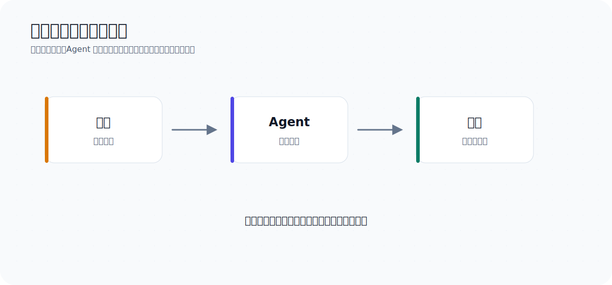
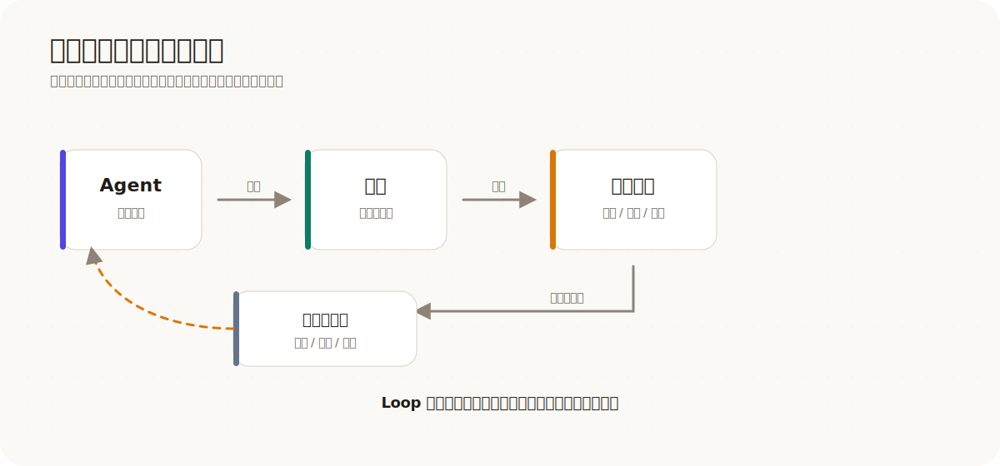
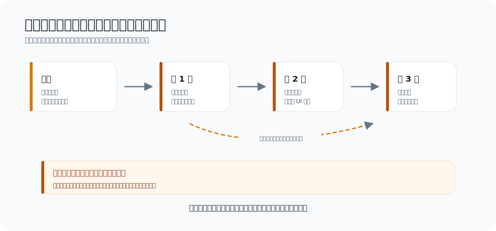
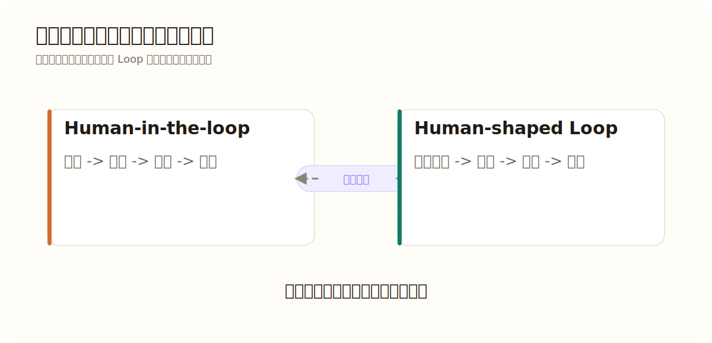
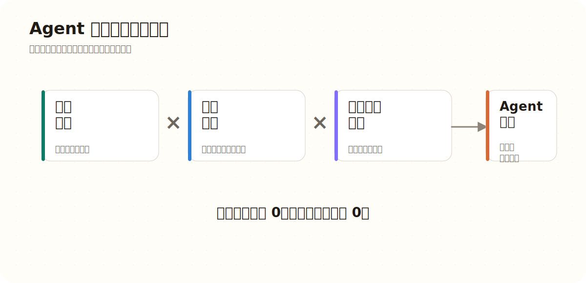
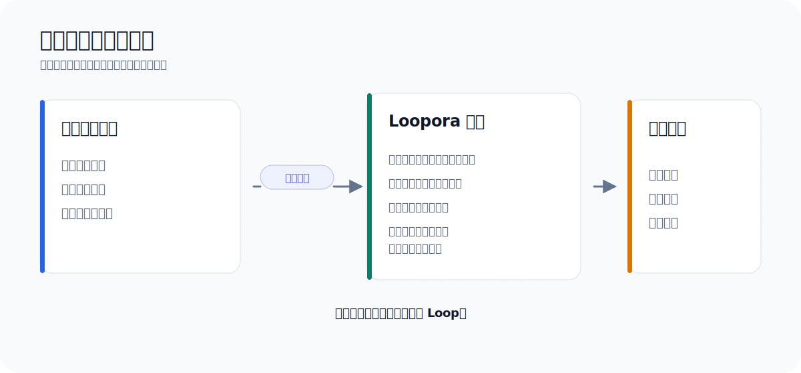

# Human-Shaped Loop：Loopora 的判断力哲学

**简体中文** | [English](./human-shaped-loop.md)

Loopora 的出发点很直接：偷懒。

更准确地说，是不想一直守在电脑前面，等 Agent 做完一轮，指出哪里不对，再催它赶紧改。

理想状态很朴素：早上上班前，把一个长期任务交给 Agent。晚上回来时，任务已经做得大差不差了。它应该自己多做一点，多考虑一些异常场景；它可以有误差，但不能偏得太远；它可以留下残余风险，但不能把没有证明的东西包装成已经完成。

这里的“偷懒”不是不想判断结果，而是不想把同一类判断重复做十几遍。

真正想省掉的，是长任务里那些反复出现、每一轮都要人回来做一遍的纠偏、取证、验收和阻断。

要理解这件事，先不要急着讲 Loopora。先看一个故事。

## 1. 一个案例：看起来完成，仍然不能交付

### 1.1 “很适合 Agent 的任务”

想象一家 B2B SaaS 公司，客服每天都要处理大量退款工单。

团队决定做一个退款自助流程：客户管理员打开账单页，看到某笔订单符合退款条件，即可提交退款请求，并得到清楚的结果。如果某个订单有风险，流程就转交给客服处理。

这看起来很适合交给 Coding Agent：

- 有产品界面要做。
- 有业务规则要编码。
- 有测试要补。
- 有边界情况要发现。
- 工作量足够大，一轮很可能不够。

于是用户说：

> 做一个退款自助流程：客户管理员可以在账单页申请符合条件的订单退款；有风险的订单转交客服。做得安全一点，补上测试，迭代到可以作为正式功能交付为止。

### 1.2 第一轮交回了页面、表单和测试

第一轮结果看起来不错：页面有了，表单有了，状态提示有了，退款资格判断用了几组模拟规则，主路径测试也都通过了。

于是 Agent 说：

> 已经完成了！我达成了目标！

打开这个程序一看，它有一个漂亮的界面，所有按钮看上去都能点击，并且有一套很像样的工作流。

如果这只是一个 demo，故事可能到这里就结束了。

但如果要作为正式产品交付，真正的问题现在才开始。

### 1.3 问题藏在看起来完整之后

这个结果第一眼给人的感觉是完整。页面在，按钮在，流程也能走通。

但如果把它当成正式产品看，缺口很快露出来：

- 它没有证明只有授权客户管理员可以发起退款。
- 退款资格判断只是几组模拟规则，不是可靠的业务路径。
- 主路径测试通过了，但没有覆盖部分退款、争议订单、拒付、超出退款窗口、财务关账这些情况。
- 它没有说明支付服务商执行失败时，系统记录、账务状态和客服接管该怎么处理。
- 它也没有证明审计日志足以让客服、财务或合规事后还原发生了什么。

这时人类 reviewer 面对的不是一个抽象问题，而是一个很具体的上线判断：这个东西现在能不能交付？

答案是还不能。

### 1.4 第二轮更像产品，也更难发现问题

于是人类说：

> 这还不能交付。先证明权限、退款资格、支付失败和审计链路，再考虑继续打磨 UI。

Coding Agent 第二轮补充了更完整的确认状态，扩展了模拟数据，也补了更多主路径测试，顺便改进了 UI。结果看起来比第一轮更像产品了。

但业务风险几乎没有减少，仍然有许多异常场景没被考虑到：

这个流程仍然没有证明只有授权管理员可以发起退款。它没有说明订单已部分退款、存在争议或拒付、超过退款窗口，或关联发票已被财务关账时会发生什么。它没有说明应用已经记录退款请求后，支付服务商执行失败该怎么处理。它也没有说明审计日志是否足以让客服、财务或合规事后还原发生了什么。

Agent 不是“什么都没做”。它做了很多事情：页面更完整，状态更多，测试数量也变多了。

麻烦就在这里：它把一个站不住脚的完成故事补得更圆了。危险没有消失，只是藏进了更像产品的界面和更自信的总结里。

### 1.5 多跑几轮后的完成幻觉

如果人类没有意识到这些问题，让 Agent 继续沿着这个方向跑，它可能不是突然跑偏，而是每一轮都“合理地”往偏处走一点。

第一轮把“页面能提交”当成核心完成；第二轮顺着这个误解继续打磨界面；第三轮补的测试也围绕容易通过的主路径；最后，结果看起来更完整，但退款安全仍然没有被证明。

到第三轮，Agent 可能继续补更多页面状态、更多确认文案、更多主路径测试。到第四轮，它可能开始整理代码、补 README、把最终总结写得更漂亮。

这时结果会越来越像一个正式功能。但在安全问题上，它仍然没有给出足够证据。

故事讲到这里可以先停住。这并不是因为 Agent 不够勤奋，也不是轮次不够多，而是长期 Agent 工作流遇到了更深的瓶颈。

**这个瓶颈不是 loop 本身，而是 loop 里缺少能被 Agent 继承的判断结构。** 只要这个结构缺席，跑再多轮也只是重复同一个误差。

## 2. 问题不在循环，而在循环里没有正确判断

### 2.1 直线是从什么时候变成循环的？

回头看，第一轮之前，事情确实像一条直线：用户提出目标，Agent 执行，交回结果。

<p align="center">
  
</p>

但只要第一次结果需要人类复盘，这条直线就闭合了。第一轮结果触发人类判断，人类判断变成第二轮指令；第二轮结果继续触发新的判断，再变成第三轮指令。长期 Agent 任务从第一次复盘开始，就自然变成了循环：

<p align="center">
  
</p>

所以问题不是“要不要 loop”。loop 天然就存在于 Agent 的长期工作流中。

真正的问题是：这个循环里，哪里必须有人类判断，哪里可以交给 Agent 自主执行？

### 2.2 人一离开，判断标准就会漂移

普通循环里，判断力体现在人类每一轮的复盘之中。人一离开或分心，Agent 就会用自己更容易满足的标准填补这个空位。它会继续做事，也会继续解释自己为什么做得不错，但它未必还在沿着人类真正关心的标准前进。

在退款故事里，人类每一轮真正要判断的是：

- 任务已经真正完成了吗？
- 它证明的是退款业务安全，还是只证明页面能提交？
- 测试覆盖了关键风险，还是只挑了最容易通过的路径？
- Agent 有没有为了让测试变绿，把真实问题绕过去？
- 哪些风险可以接受，哪些风险必须阻断收口？
- 下一轮应该继续扩展、先补证据、收窄范围，还是停下？

这些判断才是人类在工作流里最重要的贡献。它们决定 Agent 接下来应该沿着什么方向走，也决定一个结果能不能被相信。

如果每一轮都需要人类回来回答这些问题，Agent 工作流的自治程度就会卡在这里。Agent 可以探索得更深、跑得更久，但人仍然得守在旁边，负责及时纠偏和裁决。

这就是传统 human-in-the-loop 工作流：人类判断力不可或缺，所以人被迫留在循环里。

### 2.3 普通 loop 只是多开几次盲盒

现在已经有很多方式可以让 Agent 多跑几轮：`/goal`、ralph-loop、反复调用同一个 Agent、让模型自己审自己、给它 checklist 再继续。

这些方法当然有价值。尤其是当任务有清晰的外部校验能力时，它们很有效：

- benchmark 能稳定打分。
- contract test 能明确通过或失败。
- schema、lint、type check 能给出确定反馈。
- proof harness 能反复验证同一件事。

当判断力已经被外化成这些工具，简单循环就够了。Agent 可以不断尝试，外部系统负责纠偏。

但退款流程更麻烦，因为它的判断不是一个稳定分数。测试很重要，但主路径测试通过，不等于业务流程安全。漂亮 UI 也很重要，但它可能掩盖一个事实：退款权限、审计、支付服务商失败和客服接管都没有被证明。

所以关键不在于循环本身，而在于循环里有没有能约束它的判断和证据结构。

没有治理的 loop 像开盲盒。它让 Agent 多次行动，却没有稳定回答这些问题：

- 这次任务什么才算真的完成？
- 什么结果看起来完成，但其实是假完成？
- 哪些证据足够硬？
- 哪些风险可以带着走，哪些风险必须阻断？
- 如果下一轮只能改一件事，应该优先改什么？
- 什么时候该继续，什么时候该停下？

这些问题没有被稳定回答时，早期误差就会被后续轮次继承、加工，最后变成一个更完整、更自洽的完成故事。

<p align="center">
  
</p>

注意，这些问题并不是“需求细节”。它们是循环能不能可靠运行的判断结构。

**要回答循环里缺了什么判断，最好回到那个退款案例，看看人类 reviewer 每次真正在拒绝的是什么。**

### 2.4 人真正交给 Agent 的是判断方式

当人类拒绝第二轮结果时，有价值的不只是这句话：

> 这还不能交付。

真正有价值的是这句话背后的判断。

对退款流程来说，人类其实在说：

| 人类卡住的点 | 落到这次任务里的判断 |
| --- | --- |
| 别只给我一个能点的页面 | 合格订单要能从申请、校验、执行到记录，安全走完退款业务路径 |
| 别用模拟数据把风险糊过去 | 权限、退款资格、支付服务商失败、审计轨迹和客服接管都要有证据 |
| 先别继续美化界面 | 粗糙但证明过的路径，优先于漂亮但没证明的路径 |
| 有些尾巴可以留 | 罕见支付服务商边界可以变成残余风险，但必须可见、有人接管 |
| 有些漏洞不能留 | 越权退款、重复退款、审计缺失必须阻断运行收口 |

这不是实现细节 checklist，而是一套局部判断方式：这次先信什么，先怕什么，哪些证据算硬，哪些风险不能放过。

换成其他任务，同类判断会长得不一样：

- 原型功能少一点，但核心闭环真的跑通了，比堆满假入口更接近目标。
- 课程工具页面很好看，但学生走不完一轮学习，那就还没完成。
- 重构后测试绿了，但只是把复杂度搬到另一个模块，不能算好。
- bug 在演示路径上消失了，但没有证明根因被解决，不能收口。
- 性能还有一个小尾巴，如果已经量化、有 fallback、有后续 owner，可以接受。
- 权限、安全、付费、数据迁移这类风险，如果没证据，就必须挡住。

取舍顺序只是这套判断方式里最显眼的一层。人类并不总是在说“方案 A 82 分，方案 B 79 分”。人类常常在说：

- 真正跑通，比看起来漂亮更重要。
- 硬证据，比顺耳总结更重要。
- 摊开的小尾巴，比藏起来的问题更可接受。
- 方向对但没做完，有时好过局部完成但方向错。
- 可维护地慢慢推进，有时好过一把通过但全靠侥幸。

这类判断很难 benchmark 化，但可以结构化。

## 3. Loopora：把未来纠偏提前

### 3.1 把判断力放在运行之前

到这里，Loopora 才真正该出场。

它不是“更好的 retry loop”，不是“更多 roles”，不是“更长 prompt”，也不是“让 Agent 跑久一点”。

更底层的动作，是把判断发生的时间往前挪：

> 把未来的人类纠偏提前到执行之前，再让它变成可运行结构。

在传统 human-in-the-loop 里，人类通常只在 Agent 产出中间结果之后才介入：纠正方向、拒绝弱证据、要求换一条证明路径，或者判断某个风险是否可接受。

Loopora 问的是：这些纠偏能不能被提前预判？人类能不能在任务开始前说明，什么样的结果是假完成，哪些证据可信，哪些取舍更重要，哪些风险必须阻断？

如果可以，这份判断就能塑造 loop 的形状。

<p align="center">
  
</p>

所以，human-shaped Loop 比 human before the loop 更准确。人类并不只是更早地给出指令，而是在塑造运行结构本身：Agent 如何行动、如何观察、如何修复、如何停止。

所以这里的关键不是把人提前安排到某个时间点，而是让人的判断在运行开始前进入结构。Loopora 不承诺消灭误差；它要做的是让误差更早暴露、更难伪装成完成，并在下一轮证据中受到约束。

### 3.2 同一个退款任务变成 human-shaped Loop

现在重新运行这个退款任务，但把这份判断提前。

到这里，Loop 不是突然出现的一个圈。它就是前面那条多轮人机工作流的真实形状：Agent 做一轮，系统或人检查一轮，再决定下一轮。Loopora 改变的是循环里的位置关系：人不再需要在每一轮被拉回来补判断，而是在运行开始前把判断交给 Loopora；Loopora 再把它编译成 Agent 后续每一轮都要遵守的结构。

<p align="center">
  
</p>

运行开始前，用户不需要手写一大份 workflow spec。但系统应该帮助用户暴露那些本来会在未来以纠偏形式出现的判断：

- **真实完成**：授权客户管理员可以提交符合条件的退款，系统记录决策，客服或财务能追溯结果。
- **假完成**：页面、按钮、模拟资格判断和主路径测试都存在，但退款安全没有被证明。
- **可信证据**：权限检查、退款资格用例、支付服务商行为、审计记录和客服接管材料。
- **阻断风险**：越权退款、重复退款、缺失审计、支付服务商静默失败，或核心账单路径被破坏。
- **可接受残余风险**：罕见支付服务商边界、延后的财务导出、需要人工处理的客服例外，但必须可见且有人接管。

这些判断是 loop 的输入。接下来，Loopora 把它们编译成运行结构：

- Builder 围绕退款业务路径构建，而不只是围绕页面构建。
- Inspector 尝试证明或推翻权限、资格判断、审计、支付服务商失败和客服接管。
- 修复轮次基于证据收窄下一次改动。
- GateKeeper 只能基于证据收口，或者给出明确的残余风险裁决。

人类不是在监督每一次点击。人类塑造了这个 loop，规定了它必须把什么当作真实、什么当作虚假、什么具有说服力、什么有风险、什么必须阻断。

这样，退款任务不再是 Agent 独自连续地补一套完成故事，而是每一轮都被同一组判断牵引：围绕真实退款路径构建，围绕关键风险取证，基于证据修复，最后围绕可见的缺口和残余风险裁决。

### 3.3 自治程度取决于“三位一体”

这里可以用一个不严谨但很有解释力的公式来理解 Loopora：

```text
Agent 自治程度
≈ 判断结构质量 × 证据反馈质量 × 误差暴露速度
```

退款故事说明了为什么这三个变量更像相乘。

如果判断结构很差，Agent 根本不知道退款安全才是真目标。证据再多，也可能只是在证明页面能跑，而跑通的恰恰不是退款安全本身。

如果证据反馈很弱，workflow 再漂亮也只是角色表演，GateKeeper 最后只能凭感觉放行。

如果误差暴露太慢，长任务会把早期偏差写进后续上下文。循环越久，错误故事越自洽，也越难纠正。

Loopora 真正想提高的是：

- **判断结构质量**：系统是否知道这次任务到底如何被判断，什么是真完成，什么是假完成，什么风险可以接受，什么风险必须阻断。
- **证据反馈质量**：每一轮是否留下足够硬、足够可追溯、足够贴近任务目标的证据，而不是只留下自然语言总结。
- **误差暴露速度**：方向错了、证据弱了、标准漂移了、结果假完成了，能否尽早被 Inspector、GateKeeper、benchmark、artifact 或用户复盘暴露出来。

<p align="center">
  
</p>

这三个变量更像相乘，而不是相加。任何一个接近零，自治程度都会塌掉。

所以 Loopora 不是“多跑几轮”的工具。它的目标是让每一轮更难自欺：判断先成形，证据能回流，误差早点暴露。

也可以换一种说法：

> Benchmark 让 Agent 优化答案；Loopora 让 Agent 继承一部分人的判断方式。

当判断已经可以被 benchmark 表达，Loopora 应该遵循 benchmark，并围绕它固定证据路径。当判断还不能被稳定打分，Loopora 就要把它变成判断协议：哪些东西优先、哪些东西阻断、哪些证据可信、哪些残余风险在被看见后可以接受。

## 4. 把人的判断力编译成可运行结构

Loopora 的本质可以这样说：

> Loopora 是一个 task-scoped judgment compiler。

它把用户对当前任务的隐性判断力，编译成可运行、可观察、可裁决的 Loop。

<p align="center">
  
</p>

Loopora 把这份判断力落到四个面上：

| 结构面 | 直观含义 | 退款流程例子 |
| --- | --- | --- |
| `spec` | 这次到底要证明什么，什么不能算完成 | 安全退款路径、假完成风险、阻断型业务失败 |
| `roles` | 谁负责构建，谁负责怀疑，谁负责取证，谁负责裁决 | Builder、Inspector、可选修复 Guide、GateKeeper |
| `workflow` | 判断发生的顺序，以及什么时候继续或停止 | 构建 -> 检查证据 -> 修复 -> 最终证据裁决 |
| `evidence` | 每一轮留下的证据、缺口、阻断和残余风险 | 权限结果、资格判断用例、审计轨迹、支付失败记录 |

但要形成这四个面，首先得把用户脑子里隐性的判断方式提取出来。Loopora 不是让用户手写配置，而是通过一段对话来完成这件事。

对用户来说，体验应该很简单：描述任务，回答少量会改变 Loop 的问题，预览 Loop，运行任务，再看证据和裁决。Loopora 引入的概念都服务于同一个目的：让人类判断力真正约束 Agent，而不是停留在一段 prompt 里。

### 4.1 Alignment 问的是判断方式

用户的判断力往往是隐性的。Loopora 要做的第一件事，就是通过 alignment conversation 把它提取出来。但它不是普通需求澄清。

普通需求澄清问：

- 你要做什么？
- 用什么技术？
- 什么时候完成？

Loopora alignment 问：

- 什么结果看着像完成，但你其实不会收？
- 哪类证据最能让你放心？
- 两个方案都不完美时，你会拒绝哪一个？
- 这次更怕做慢，还是更怕做糙？
- GateKeeper 太严格，会不会挡住你想要的探索？
- GateKeeper 太务实，会不会放过假完成？

这是一种帮助用户看见自己判断方式的机制。用户不需要一开始说清全部规则；Loopora 用案例和对比让判断成形。

<p align="center">
  
</p>

好的 alignment 不应该急着生成配置，而是先形成 working agreement：

- 这次任务试图达成什么？
- 什么算真实进展？
- 什么是假完成？
- 用户最信什么证据？
- 角色应该如何分工？
- workflow 为什么这样安排？
- 哪些残余风险可以接受？
- 哪些阻断风险必须挡住？

然后，才把 working agreement 编译成 Loop，进入预览、运行和证据裁决。

当这些判断在 alignment 中成形后，Loopora 就把它们编译成可运行的结构——也就是前面所说的四个面。

### 4.2 判断必须跟着任务走

Loopora 不试图学习一个永久的用户人格。一次任务里的判断往往是局部的、临时的、可争议的：

- 这次退款流程必须保守，不代表每个产品任务都要保守。
- 这个原型可以接受视觉粗糙，不代表所有原型都可以。
- 这个 benchmark 可信，不代表所有 benchmark 都可信。
- 这次可以接受某个残余风险，不代表它是长期偏好。

这些判断不适合静默写进模型权重，也不适合变成长期人格记忆。它们更适合存在于 Agent 的运行框架或 Loop 层：显式、局部、可预览、可修改、可导出、可废弃。

> 模型学习通用能力，Loop 学这次任务的判断方式。

### 4.3 Prompt 留不住这类判断

Loopora 不只是让用户说出偏好，也不是只把偏好写进 prompt。Prompt 会被遗忘，会被上下文稀释，也可能被模型理解成风格偏好，而不是运行约束。

Loopora 要把判断力编译成运行结构：

- 任务契约里写清什么算完成、什么是假完成。
- 角色分工里写清谁构建、谁怀疑、谁取证、谁裁决。
- 流程里写清什么时候判断、什么时候继续、什么时候停止。
- 证据里记录每一轮到底证明了什么、没证明什么。

### 4.4 为什么不能直接让模型长期记住？

很自然会问：既然判断力这么重要，为什么不直接让模型学？

答案是：这是两种不同的学习。

模型应该学习通用能力：语言、代码、规划、工具使用、推理模式和广泛审美。这些能力应该跨用户、跨任务复用。

Loopora 学的是更窄、更具体的东西：这次任务应该如何被判断。

这类判断经常具备一些特征，让它更适合留在 Loop 层：

| 特征 | 为什么更适合 Loop 层 |
| --- | --- |
| 局部 | 一个任务里的正确判断，换个任务可能就是错的 |
| 临时 | 一个项目今天需要严格，明天可能需要探索 |
| 可争议 | 用户看到例子后可能会改变判断 |
| 可审计 | 团队应该能看到是什么规则让运行收口 |
| 可逆 | 错误判断应该可编辑、可丢弃，而不是被隐藏 |
| 绑定证据 | 规则应该连接 artifact 和 verdict，而不只是风格偏好 |

这也是治理边界。如果模型悄悄学走了用户当前任务的判断，用户就会失去所有权。如果 Loop 学会它，用户就能预览、修改、导出、复用或删除。

Agent 能变得更自治，不是因为人类消失了，而是因为人类的局部判断进入了执行环境。

### 4.5 Loopora 是外部 harness

Loopora 更像一个外部运行框架，而不是模型内部的一段记忆、一段更长的 prompt，或某个 Agent 的自我检查习惯。

这件事很重要。判断力如果只藏在 prompt 里，长任务跑着跑着就会被上下文稀释；如果藏进模型长期记忆里，用户又很难看见、修改和审计它；如果完全交给 Agent 自己宣布完成，最危险的假完成反而最容易被包装过去。

把 Loopora 放在 Agent 外部，意味着这次任务的判断方式可以被显式看见：

- 用户可以预览这次 Loop 到底在追求什么。
- Inspector 和 GateKeeper 可以围绕证据，而不是围绕自信总结工作。
- 每一轮的缺口、阻断和残余风险可以留下记录。
- 换一个 Agent、模型或工具，任务的判断结构仍然可以保留。
- 判断错了，可以修改 Loop，而不是猜模型到底记住了什么。

所以 Loopora 的外部性不是实现细节，而是一种协作哲学：模型负责提升通用能力，Agent 负责执行任务，Loopora 负责让这次任务的判断标准留在可见、可改、可运行的位置上。

## 5. 真正适合 Loopora 的任务

### 5.1 什么样的任务适合 Loopora？

不要从任务类型本身去判断它是否适合 Loopora。

任务类型本身不是决定因素。决定因素是：这件事里是否存在值得提前外化的人类判断，以及下一轮是否会产生新证据。

更好的判断方式是问：

1. **人类会不会在关键轮次后反复回来判断？**  
   如果一次 Agent 执行加一次人工评审就够了，不需要 Loopora。

2. **下一轮会不会产生新证据？**  
   如果下一轮只是让模型继续编故事，没有新的证明路径、artifact、handoff、观察结果或裁决上下文，不要开 Loop。

3. **判断是否难以压成一个稳定 benchmark？**  
   如果可以稳定 benchmark 化，先用 benchmark。Loopora 可以围绕 benchmark 做治理，但不要用复杂 Loop 替代简单 proof。

4. **是否存在假完成风险？**  
   如果结果很容易“看起来完成”，但核心闭环、根因、契约、证据或风险没有站住，Loopora 更有价值。

5. **判断方式是否值得延续到一次聊天之后？**  
   如果这套判断只用一次，直接聊天就好。如果它应该被运行继承、被证据检验、被导出复用，才值得编译成 Loop。

6. **如果走偏，系统能不能暴露偏差？**  
   如果没有 Inspector、GateKeeper、外部证据或用户可审计 artifact，Loop 也可能只是更长的漂移。

用这个标准看，一些任务“有时适合，有时不适合”：

| 场景 | 不太需要 Loopora | 更适合 Loopora | 原因 |
| --- | --- | --- | --- |
| 创意探索 | 让 Agent 一次性给 30 个活动主题，人工挑几个继续聊 | 让 Agent 连续探索一套品牌活动，每轮都要按新颖性、可执行性、品牌气质和避免套路来判断转向 | 左边只需要一次生成和人工挑选；右边的判断会反复出现，而且每轮探索都会产生新材料。 |
| 产品原型 | 做一个给内部讨论用的一次性 demo，能表达大概意思就够 | 做一个退款自助流程原型，必须防止页面好看但核心路径不真实，并让证据驱动下一轮 | 左边的假完成成本较低；右边如果核心路径不真实，越迭代越容易被漂亮界面掩盖。 |
| 架构重构 | 把一个小工具函数拆开，目标明确，评审一次即可 | 重构账单权限模块，需要多轮权衡公开契约、回归风险、迁移路径和残余风险 | 左边边界清楚；右边每轮都要重新判断风险、证据和兼容性。 |
| 调试 / 根因定位 | 某个按钮点击报错，堆栈清楚，直接修即可 | 支付回调偶发丢失，症状跨服务、容易猜错层，需要先取证再行动 | 左边证据路径直接；右边需要多轮假设、观测和排除。 |
| 模糊需求对齐 | 和 Agent 短聊几轮，把一个页面文案改顺 | 把“做得更适合新手用户”变成长任务约束，让澄清出的判断方式被后续设计、实现和验收继承 | 左边判断只服务一次对话；右边判断要被后续长任务继承。 |

所以 Loopora 不是“复杂任务都该用”的意思。它适合那些人类判断会重复出现、证据会逐轮变化、假完成风险值得阻断的长期任务。

## 6. 让 Agent 继承判断，而不是替代判断

未来 AI 与人类的协作，不只会沿着“模型更聪明”这一条线演进。

模型会继续变强，但复杂任务仍然需要人类判断：

- 判断什么值得做。
- 判断什么算真实完成。
- 判断证据是否可信。
- 判断风险是否可接受。
- 判断何时继续、何时停止、何时换方向。

真正的高阶协作，不是每一步都把人拉回，也不是假装人可以完全离开，而是让人类判断力以更合适的时间形态参与任务。

Human-in-the-loop 把人类放在执行过程里。

Human-shaped Loop 把人类判断力提前塑造成执行结构。

Loopora 的长期方向，就是让更多任务在合适的时候用上这种 Loop：

- 对可量化任务，把证据路径钉牢。
- 对不可完全量化任务，让判断结构成形。
- 对长期任务，让误差传播得更慢。
- 对用户，把未来会反复发生的纠偏提前。
- 对 Agent，把“如何判断”从一句 prompt 变成可运行的治理结构。

如果一句话总结：

> Loopora 不是让 Agent 多做几轮，而是让 Agent 在继承人类判断力的 Loop 中不再走自我欺骗的捷径。

回到开头说的“偷懒”——Loopora 想帮用户省掉的，从来不是判断本身，而是把同一类判断重复做十几遍的疲惫。当人的判断方式被编译进 loop，人就不必守在每一次循环旁边，但人的判断力仍然约束着每一轮的方向。

这就是 human-shaped Loop。
