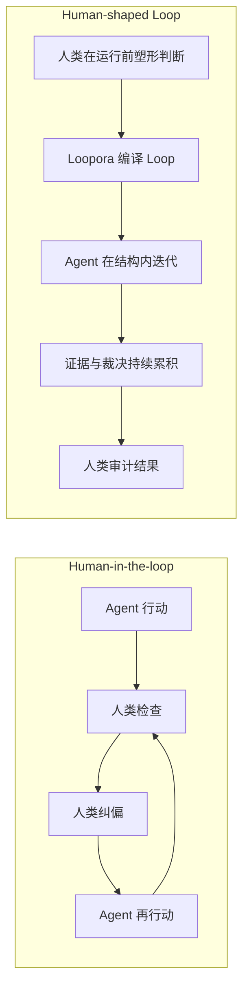
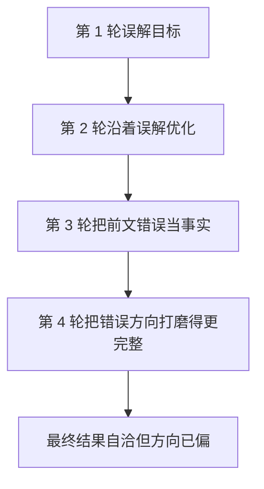
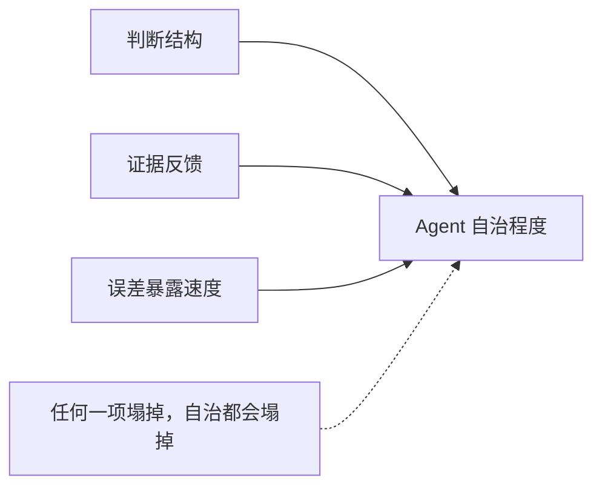
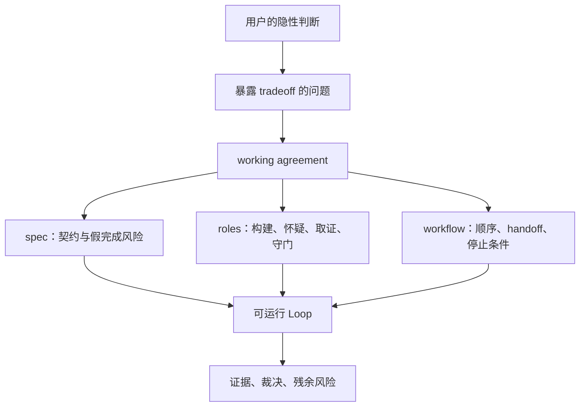

# Human-Shaped Loop：Loopora 的判断力哲学

**简体中文** | [English](./human-shaped-loop.md)

Loopora 的出发点很朴素：偷懒。

理想状态是，早上上班前丢一个任务给 Agent，晚上回来时，任务已经比较完整地达成。它可以有误差，但不能差太多；它可以留下残余风险，但不能把没有证明的东西包装成已经完成。

但这里的“偷懒”不是偷工减料。真正想省掉的，不是人类对结果的判断，而是人类在长任务里反复被拉回来做同一种判断。

很多时候，我们并不是在反复告诉 Agent “做什么”，而是在反复问：

- 这轮到底证明了什么？
- 结果是真的完成，还是局部看起来合理？
- 它是不是换了一个更容易的验收标准？
- 它是不是为了通过测试写了一个脆弱 hack？
- 下一轮该继续、停下、收窄范围，还是换方向？
- 这份证据我能不能信？
- 这个 residual risk 是否可以接受？

如果每一轮都要人类回来回答这些问题，Agent 的自治程度就会被卡住。Loopora 想做的，是把这些未来本来会发生的人类纠偏、质疑、取证、验收和阻断，提前编译成一个可运行的 Loop。

这就是 human-shaped Loop。



## 1. 核心动作：沟通的时空转换

如果从实现开始理解 Loopora，很容易误解它。

它不是“更好的 retry loop”，不是“更多角色”，不是“更长 prompt”，也不是“让 Agent 跑久一点”。

更底层的动作是一种时空转换：

> 把未来的人类纠偏提前到执行之前，再让它变成可运行结构。

在传统 human-in-the-loop 里，人类通常是在 Agent 已经产出中间结果之后参与：纠正方向、拒绝弱证据、要求换一种 proof path，或者判断某个风险是否可接受。

Loopora 问的是：这些未来的纠偏能不能提前被预判？人类能不能在任务开始前说明什么样的结果是假完成、哪些证据可信、哪些 tradeoff 更重要、哪些风险必须阻断？

如果可以，这份判断就能成为 loop 的形状。

所以，human-shaped Loop 比 human before the loop 更准确。人类并不只是更早给指令，而是在塑造运行结构本身：Agent 如何行动、如何观察、如何修复、如何停止。

## 2. 普通循环为什么不够

现在已经有很多方式可以让 Agent 多跑几轮：`/goal`、ralph-loop、反复调用同一个 Agent、让模型自己 review 自己、给它 checklist 再继续。

这些方法当然有价值。尤其是当任务有清晰的外部校验能力时，它们很有效：

- benchmark 能稳定打分
- contract test 能明确通过或失败
- schema、lint、type check 能给出确定反馈
- proof harness 能重复验证同一件事

当判断力已经被外化成这些工具，简单循环就够了。Agent 可以不断尝试，外部系统负责纠偏。

问题出现在另一类长期任务里：判断标准存在，但很难压成一个稳定分数。它们不一定更“高级”，也不一定天然更适合 Loopora；只是它们更容易让普通循环走偏。

普通循环延长的是时间。时间变长后，如果没有治理结构，早期误差会被后续轮次继承、放大、合理化。



所以关键区别不是有没有循环，而是循环有没有治理结构。

> 没有治理结构的 loop 是开盲盒；有治理结构的 Loop 是误差减速器。

Loopora 不承诺消灭误差。长期任务一定会累积误差，我们能做的是降低误差累积速度，让误差更早暴露、更难伪装成完成、更容易被下一轮纠正。

## 3. 自治问题的本质是判断力外化

如果要提高 Agent 自治程度，真正的问题不是：

> 如何让 Agent 多做几轮？

而是：

> 人类判断力如何从实时干预，变成一个可运行的治理结构？

当判断力可量化，答案很简单：做成 benchmark、test、metric、schema、lint。Agent 自己迭代，外部系统打分。

但复杂判断通常不是一个分数。它更像这些话：

- A 功能少一点，但路径是真的；B 看起来完整，但核心闭环没跑通。所以 A 比 B 更接近完成。
- 这个结果 UI 漂亮，但学习者没有完成一轮学习，所以必须拒绝。
- 这个重构测试过了，但把复杂度搬到了另一个模块，不能算好。
- 这个 bug 表面消失了，但没有证明根因被解决，不能收口。
- 这个 residual risk 可以接受，因为它被标出且有后续路径。
- 那个 residual risk 必须阻断，因为它影响权限、安全、核心用户旅程或公开契约。

这种判断不是标量，而是偏序。人类并不总是在说“方案 A 82 分，方案 B 79 分”。人类常常在说：

- 真实闭环优先于漂亮假完成。
- 强证据优先于乐观叙事。
- 被说明的残余风险优先于被隐藏的风险。
- 方向正确但未完成，有时优先于局部完成但方向错误。
- 可维护的慢进展，有时优先于脆弱的快通过。

这类判断很难 benchmark 化，但可以结构化。它可以被拆成：

- 什么算完成？
- 什么是假完成？
- 哪些证据最可信？
- 哪些风险可以接受？
- 哪些风险必须阻断？
- 谁负责构建？
- 谁负责怀疑？
- 谁负责取证？
- 谁负责裁决？
- 判断应该发生在实现前、实现后、并行检视后，还是第二轮修复后？

Loopora 的机会就在这里。

## 4. Agent 自治程度的乘法公式

这里可以用一个不严格但很有解释力的公式来理解 Loopora：

```text
Agent 自治程度
≈ 判断结构质量 × 证据反馈质量 × 误差暴露速度
```

简单循环主要增加的是尝试次数。它让 Agent 多跑几轮，但不一定提高这三个变量。

Loopora 真正想提高的是：

- **判断结构质量**：系统是否知道这次任务到底如何被判断，什么是真完成，什么是假完成，什么风险可以接受，什么风险必须阻断。
- **证据反馈质量**：每一轮是否留下足够硬、足够可追溯、足够贴近任务目标的证据，而不是只留下自然语言总结。
- **误差暴露速度**：方向错了、证据弱了、标准漂移了、结果假完成了，能否尽早被 Inspector、GateKeeper、benchmark、artifact 或用户复盘面暴露出来。



这三个变量更像相乘，而不是相加。任何一个接近零，自治程度都会塌掉。

如果判断结构很差，Agent 不知道什么该被证明，证据再多也可能证明错东西。

如果证据反馈很弱，workflow 再漂亮也只是角色表演，GateKeeper 最后只能凭感觉放行。

如果误差暴露太慢，长任务会把早期偏差变成后续上下文，循环越久越自洽，越难纠正。

所以 Loopora 不是“多跑几轮”的工具。它的目标是让每一轮更难自欺：判断先成形，证据能回流，误差早点露头。

也可以换一种说法：

> Benchmark 让 Agent 优化答案；Loopora 让 Agent 继承一部分人的判断方式。

当判断已经可以被 benchmark 表达，Loopora 应该尊重 benchmark，并围绕它固定证据路径。当判断还不能被稳定打分，Loopora 就要把它变成判断协议：哪些东西优先、哪些东西阻断、哪些证据可信、哪些残余风险可以被看见后接受。

## 5. Loopora 是 task-scoped judgment compiler

Loopora 的本质可以这样说：

> Loopora 是一个 task-scoped judgment compiler。

它把用户对当前任务的隐性判断力，编译成可运行、可观察、可裁决的 Loop。



这里有两个关键词。

第一个是 **task-scoped**。Loopora 不试图学习一个永久的用户人格。一次任务里的判断往往是局部的、临时的、可争议的：

- 这次要严格，不代表每次都要严格。
- 这个项目必须保守，不代表所有项目都要保守。
- 这个 benchmark 可信，不代表所有 benchmark 都可信。
- 这次可以接受某个 residual risk，不代表它是长期偏好。

这些判断不适合静默写进模型权重，也不适合变成长期人格记忆。它们更适合存在于 Agent harness / Loop 层：显式、局部、可预览、可修改、可导出、可废弃。

> 模型学习通用能力，Loop 学当前任务的判断方式。

第二个是 **compiler**。Loopora 不只是让用户说出偏好，也不只是把偏好写进 prompt。Prompt 会被遗忘，会被上下文稀释，会被模型解释成语气，而不是运行约束。

Loopora 要把判断力编译成运行结构：

- 任务契约里写清什么算完成、什么是假完成。
- 角色分工里写清谁构建、谁怀疑、谁取证、谁裁决。
- 流程里写清什么时候判断、什么时候继续、什么时候停止。
- 证据里记录每一轮到底证明了什么、没证明什么。

这也是为什么 Loopora 不是 YAML 生成器。YAML 只是交换格式；真正重要的是 YAML 背后的判断结构。

## 6. 为什么是 Agent 层学习判断，而不是模型学习？

很自然会问：既然判断力这么重要，为什么不直接让模型学？

答案是：这是两种不同的学习。

模型应该学习通用能力：语言、代码、规划、工具使用、推理模式和广泛审美。这些能力应该跨用户、跨任务复用。

Loopora 学的是更窄、更具体的东西：这次任务应该如何被判断。

这类判断经常具备一些特征，让它不适合进入模型权重：

| 特征 | 为什么更适合 Loop 层 |
| --- | --- |
| 局部 | 一个任务里的正确判断，换个任务可能就是错的 |
| 临时 | 一个项目今天需要严格，明天可能需要探索 |
| 可争议 | 用户看到例子后可能会改变判断 |
| 可审计 | 团队应该能看到是什么规则让 run 收口 |
| 可逆 | 错误判断应该可编辑、可丢弃，而不是被埋起来 |
| 绑定证据 | 规则应该连接 artifact 和 verdict，而不只是风格偏好 |

这也是治理边界。如果模型“无形地学会”用户当前任务判断，用户会失去所有权。如果 Loop 学会它，用户就能预览、修改、导出、复用或删除。

Agent 变得更自治，不是因为人类消失了，而是因为人类的局部判断进入了执行环境。

## 7. 问答系统：帮助用户自省自己的判断力

Loopora 的核心机制之一，是 alignment conversation 或 Skill。

但它不是普通需求澄清。

普通需求澄清问：

- 你要做什么？
- 用什么技术？
- 什么时候完成？

Loopora alignment 问：

- 哪种结果看起来完成但你不会接受？
- 哪个证据最能让你相信？
- 两个都不完美的方案里，你会拒绝哪一个？
- 这次更怕做慢，还是更怕做糙？
- 如果 GateKeeper 很严格，会不会挡住你想要的探索？
- 如果 GateKeeper 太务实，会不会放过假完成？

这是一种帮助用户自省判断力的机制。用户不需要一开始说清全部规则；Loopora 用案例和对比让判断显影。


好的 alignment 不应该急着生成配置，而是先形成 working agreement：

- 这次任务试图达成什么？
- 什么算真实进展？
- 什么是假完成？
- 用户最信什么证据？
- 角色应该如何分工？
- workflow 为什么这样安排？
- 哪些 residual risk 可以接受？
- 哪些 blocker 必须阻断？

然后，才把 working agreement 编译成 Loop，进入预览、运行和证据裁决。

## 8. 什么任务适合 Loopora

不能简单说“创意、原型、重构、debug、模糊对齐都适合 Loopora”。这种说法太粗，会误导用户。

任务类型本身不是决定因素。决定因素是：这件事里是否存在值得提前外化的人类判断，以及下一轮是否会产生新证据。

更好的判断方式是问：

1. **人类会不会在关键轮次后反复回来判断？**  
   如果一次 Agent 执行加一次人工 review 就够了，不需要 Loopora。

2. **下一轮会不会产生新证据？**  
   如果下一轮只是让模型继续编故事，没有新的 proof、artifact、handoff、观察或裁决上下文，不要开 Loop。

3. **判断是否难以压成一个稳定 benchmark？**  
   如果可以稳定 benchmark 化，先用 benchmark。Loopora 可以围绕 benchmark 做治理，但不要用复杂 Loop 替代简单 proof。

4. **是否存在假完成风险？**  
   如果结果很容易“看起来完成”，但核心闭环、根因、契约、证据或风险没有站住，Loopora 更有价值。

5. **判断方式是否值得活过一次聊天？**  
   如果这套判断只用一次，直接聊天就好。如果它应该被 run 继承、被证据检验、被导出复用，才值得编译成 Loop。

6. **如果走偏，系统能不能暴露偏差？**  
   如果没有 Inspector、GateKeeper、外部证据或用户可审计 artifact，Loop 也可能只是更长的漂移。

用这个标准看，一些任务“有时适合，有时不适合”：

| 场景 | 不太需要 Loopora | 更适合 Loopora |
| --- | --- | --- |
| 创意涌现 | 只是发散原始点子 | 多轮探索，且每轮要按新颖性、可执行性、风格或反俗套判断转向 |
| 产品原型 | 一次性 demo 或草图 | 要防止页面好看但核心路径不真实，并让证据驱动下一轮 |
| 架构重构 | 小范围、目标明确、review 一次即可 | 需要多轮权衡契约、结构、回归和残余风险 |
| debug / 根因定位 | bug 明确，直接修即可 | 症状混杂、容易猜错层，需要先取证再行动 |
| 模糊语义对齐 | 只是短问答澄清 | 澄清出的判断方式要被长任务继承和检验 |

所以 Loopora 不是“复杂任务都该用”。它适合那些人类判断会重复出现、证据会逐轮变化、假完成风险值得阻断的长期任务。

## 9. Loopora 如何落地

到这里，才需要一点点技术概念。

Loopora 把判断力落到四个面上：

| Surface | 面向初学者的理解 |
| --- | --- |
| `spec` | 这次到底要证明什么，什么不能算完成 |
| `roles` | 谁负责做，谁负责怀疑，谁负责取证，谁负责裁决 |
| `workflow` | 判断发生的顺序，以及什么时候继续或停止 |
| `evidence` | 每一轮留下的证据、缺口、阻断和残余风险 |

这些概念不是用户一开始必须手写的配置。默认路径应该是：描述任务、回答少量会改变 Loop 的问题、确认 Loop、运行、看证据。

高级字段、并行 Inspector、证据路由、workflow controls、bundle YAML，都应该服务于同一个目的：让人类判断力真正约束 Agent，而不是停留在一段 prompt 里。

## 10. Loopora 必须拒绝什么

为了守住这个范式，Loopora 必须持续拒绝几种退化：

- 它不是 prompt pack。更长的提示词不能替代运行期证据。
- 它不是 role zoo。更多角色如果没有不同证据责任，只会增加表演感。
- 它不是 loop script。重复执行命令不等于判断被治理。
- 它不是 benchmark 刷分器。benchmark 是强证据路径，不是产品全部。
- 它不是长期人格记忆系统。task-scoped judgment 不应变成全局人格定律。
- 它不是通用聊天界面。聊天只是取得或调整 Loop 的场景。
- 它不是让 Agent 自己宣布完成的包装器。GateKeeper 必须回到 evidence。

Loopora 可以越来越强，但必须守住这个边界：它服务于“编排 Loop -> 运行 Loop -> 自动迭代并收集证据 -> 输出运行状态、Loop 裁决与结果”，而不是服务于把所有东西都变成自动化平台。

## 11. 愿景：未来 AI 协作的更高阶模式

未来 AI 与人类的协作，不只是在“模型更聪明”这条线上演进。

模型会继续变强，但复杂任务仍然需要人类判断：

- 判断什么值得做。
- 判断什么算真实完成。
- 判断证据是否可信。
- 判断风险是否可接受。
- 判断何时继续、何时停止、何时换方向。

真正的高阶协作，不是每一步都让人类回来，也不是假装人类可以完全离开，而是让人类判断力以更合适的时空形态参与任务。

Human-in-the-loop 把人类放在执行过程里。

Human-shaped Loop 把人类判断力提前塑造成执行结构。

Loopora 的长期方向，就是让更多任务在合适的时候用上这种 Loop：

- 对可量化任务，把证据路径钉牢。
- 对不可完全量化任务，把判断结构显影。
- 对长期任务，把误差传播变慢。
- 对用户，把未来会反复发生的纠偏提前。
- 对 Agent，把“如何判断”从一句 prompt 变成可运行的治理结构。

如果一句话总结：

> Loopora 不是让 Agent 多做几轮，而是让 Agent 在继承人类判断力的 Loop 中少走自我欺骗的捷径。

这就是 human-shaped Loop。
